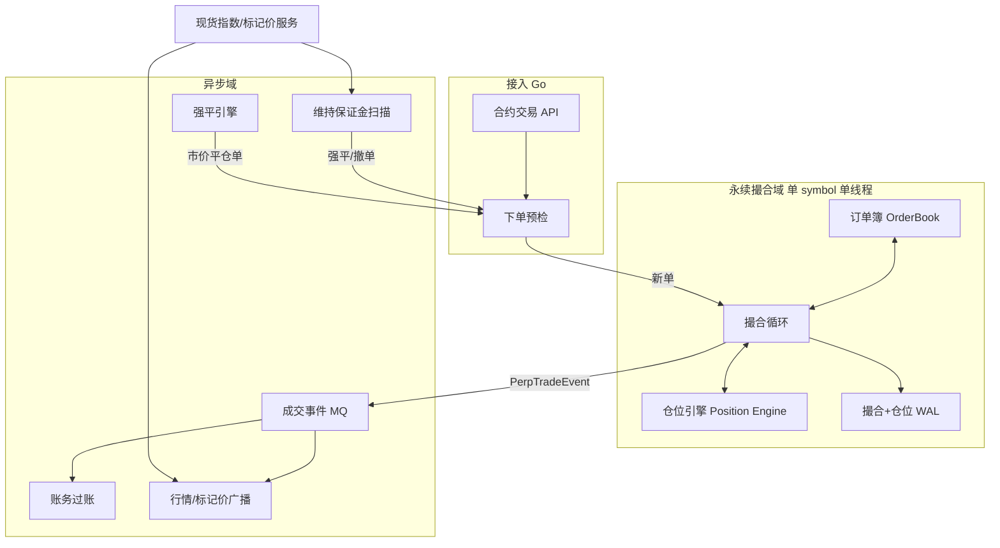
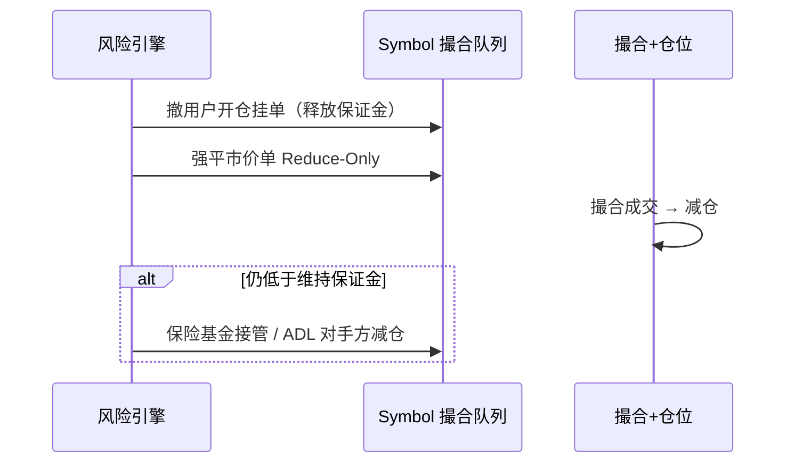
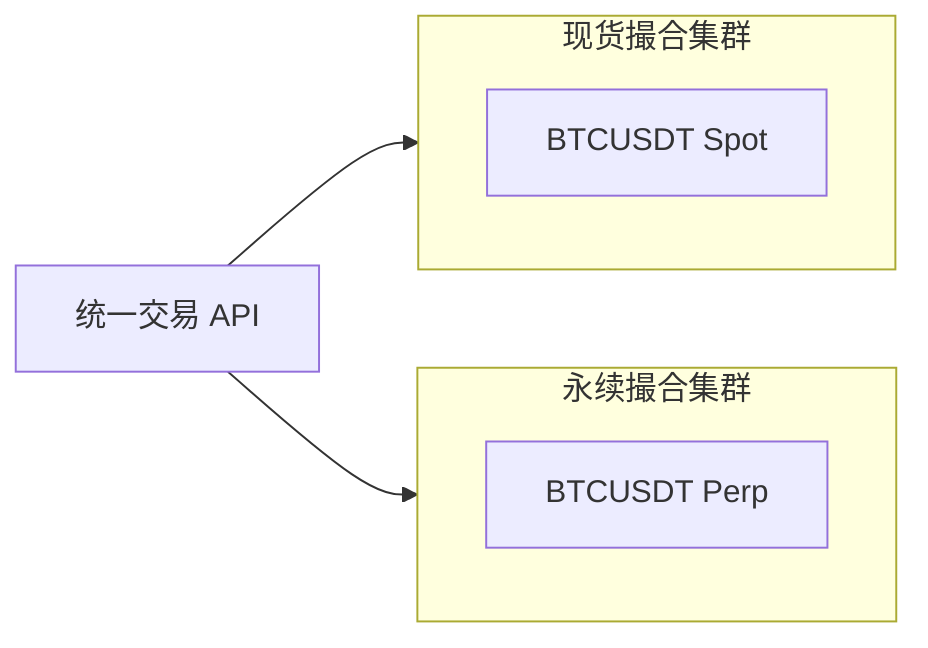

# 永续合约撮合与仓位引擎架构

## 30 秒版（开场）

> **永续撮合** 与现货共用 **订单簿 + 价格时间优先**，但成交后必须 **同步更新仓位、冻结保证金、已实现盈亏**——因此主流实现是 **「撮合 + 仓位引擎」同 symbol 单写者**，与现货 **分实例/分队列**。关键语义：**单向/双向持仓、开平仓、Reduce-Only、强平单插队**。标记价 **不参与撮合定价**，只服务风控与盈亏（[S-EXCH-04](./S-EXCH-04-futures-margin-liquidation.md)）。

## 3 分钟版（一面深度）

1. **是什么**：永续合约的链下订单簿撮合，以及成交后对 **仓位（Position）** 的原子更新与保证金占用计算。
2. **为什么**：只讲现货撮合（[S-EXCH-01](./S-EXCH-01-cex-matching-engine.md)）不够；合约面试必问 **开平仓、只减仓、双向持仓、撮合与仓位一致性**。
3. **怎么做**：独立 Perp Matching 集群；下单前 **初始保证金校验 + Reduce-Only 校验**；撮合循环内维护 `OrderBook + PositionMap`；成交写 WAL → 发 `PerpTradeEvent` 驱动账务（[S-EXCH-03](./S-EXCH-03-account-ledger.md)）。

## 10 分钟版（原理 + 图示）

### 与现货撮合的差异

| 维度 | 现货撮合 | 永续合约撮合 |
|------|----------|--------------|
| 成交结果 | 币币交割 | **仓位增减** + 保证金占用变化 |
| 账户模型 | 可用余额 | **钱包余额 + 仓位 + 订单冻结保证金** |
| 订单语义 | Buy/Sell | **Open/Close**（双向模式）或 单向自动判断 |
| 定价来源 | 订单簿成交价 | 订单簿成交价；**标记价仅用于 PnL/强平** |
| 实例隔离 | 现货集群 | **永续独立集群**（同 symbol 仍单写者） |
| 特殊单 | Post-only 等 | **Reduce-Only、强平单、ADL 减仓单** |

### 端到端架构



**设计要点**：`Match` 与 `PE` **同线程、同临界区**更新，避免「成交已发生但仓位未变」的中间态外泄。

### 持仓模式（必考）

#### 单向持仓（One-way / 买卖模式）

| 用户意图 | 方向 | 有反向仓位时 | 无反向仓位时 |
|----------|------|--------------|--------------|
| 开多 | BUY | 先平空再开多（净仓） | 开多 |
| 开空 | SELL | 先平多再开空 | 开空 |

- 同一 symbol **只有一个净仓位**（正=多，负=空）
- 订单 **不需** `positionSide`；交易所根据净仓自动判断开/平

#### 双向持仓（Hedge / 对冲模式）

| positionSide | side | 效果 |
|--------------|------|------|
| LONG | BUY | 开多 / 加多 |
| LONG | SELL | 平多 / 减多 |
| SHORT | BUY | 平空 / 减空 |
| SHORT | SELL | 开空 / 加空 |

- 同一 symbol 可 **同时** 持有多仓与空仓（两条独立仓位记录）
- 订单必须带 **`positionSide`**；撮合/仓位引擎按 side 分桶

### Reduce-Only（只减仓）

- 语义：订单 **只能减少** 指定 `positionSide` 的仓位绝对值，**不得反向开仓或加仓**
- 预检（在进撮合前）：
  - 单向模式：SELL 单不能使净多仓增加；BUY 单不能使净空仓增加
  - 双向模式：LONG+SELL、SHORT+BUY 才可能通过；否则拒单
- 若当前仓位为 0，Reduce-Only **直接拒绝**
- 与 **Close Position** 区别：Close 是 UI/语义；Reduce-Only 是 **硬约束标志位**

### 撮合主循环（单 symbol 伪代码逻辑）

```text
loop:
  1. 处理入队新单（预检已通过）
  2. 与订单簿对手盘匹配，生成 fills
  3. 对每个 fill 调用 PositionEngine.ApplyFill:
       - 更新 positionQty / entryPrice(加权) / realizedPnL
       - 更新订单冻结保证金、可平数量
  4. 剩余挂单写入 OrderBook（限价）
  5. 写 WAL: [order_delta, fill, position_snapshot]
  6. 异步刷 TradeEvent 到 MQ
```

### 仓位更新与均价（准确性）

**加仓（同向）** — 加权平均开仓价：

\[
\text{newEntry} = \frac{\text{oldEntry} \times |\text{oldQty}| + \text{fillPrice} \times |\text{fillQty}|}{|\text{oldQty}| + |\text{fillQty}|}
\]

**减仓（反向成交）** — 已实现盈亏（多仓示例）：

\[
\text{realizedPnL} = (\text{fillPrice} - \text{entryPrice}) \times \text{closedQty}
\]

- `closedQty = min(|position|, |fillQty|)` 在减仓方向上的分量
- 减仓 **不改变** 剩余仓位的 `entryPrice`（行业通用；与加仓加权不同）
- 使用 `decimal` / 整数最小单位，**禁止 float**

**合约面值**：若产品以「张」计价，内部统一换算为 `baseQty = contracts × contractSize`，撮合与仓位全程用 `baseQty`。

### 保证金与撮合的边界

| 阶段 | 检查内容 | 失败处理 |
|------|----------|----------|
| 下单预检 | 初始保证金 + 手续费缓冲 | 拒单 |
| 撮合中 | Reduce-Only、价格精度、最小名义 | 拒单或部分成交 |
| 成交后 | 维持保证金率（异步 Risk） | 强平/撤开仓单 |
| 资金费率 | 定时账务结算 | **不经撮合** |

- **初始保证金**：按 **订单价格 × 数量 / 杠杆** 冻结（限价单常用委托价；市价用标记价估算上限）
- **维持保证金**：由 [S-EXCH-04](./S-EXCH-04-futures-margin-liquidation.md) 风险引擎扫描；触发后强平单 **回到同一撮合队列**

### 强平单、ADL 与撮合优先级



- 强平单通常是 **市价 + Reduce-Only**，插队优先级各所有差异（面试说明「可配置优先级」即可）
- **ADL（自动减仓）**：不经过订单簿竞价，直接按规则减仓盈利对手方仓位——属于 **风控子系统**，与正常撮合并列

### 订单类型（永续特有）

| 类型 | 说明 |
|------|------|
| Limit / Market | 同现货；撮合规则一致 |
| IOC / FOK / Post-only | 同现货语义 |
| Stop / Take Profit | **条件单**：触发后生成 **普通限价/市价单** 进撮合队列 |
| Trailing Stop | 触发价随行情移动；触发后同样 **转普通单** |
| Reduce-Only | 标志位，非独立订单簿类型 |

条件单引擎 **独立服务** 订阅标记价/最新价，触发后 **写入同一 symbol 撮合队列**，保证单写者。

### 成交事件（下游账务）

```go
type PerpTradeEvent struct {
    TradeID      string
    Symbol       string
    Price        decimal.Decimal
    Quantity     decimal.Decimal // base 数量
    TakerSide    string          // BUY / SELL
    TakerPosSide string          // LONG / SHORT / BOTH（单向模式用 BOTH）
    MakerUserID  int64
    TakerUserID  int64
    RealizedPnL  decimal.Decimal // 本次 fill 已实现盈亏
    PositionQty  decimal.Decimal // 成交后 taker 仓位快照（审计）
    MarginDelta  decimal.Decimal // 保证金占用变化
    IsLiquidation bool
    Ts           int64
}
```

账务消费 **幂等** `tradeId`（[S-ARCH-04](../03-system-design/S-ARCH-04-idempotency.md)）；仓位真相源在 **撮合 WAL**，DB 为副本。

### 持久化与恢复

| 数据 | 恢复策略 |
|------|----------|
| 订单簿 | WAL 重放 或 快照 + 增量 |
| 仓位 | **必须与订单簿一致重放**；禁止只恢复订单簿 |
| 用户挂单冻结保证金 | 随订单簿恢复重算 |

崩溃恢复顺序：**加载快照 → 重放 WAL → 校验 position 与 open orders 一致 → 开放接单**。

### 与现货撮合部署关系



- **不要** 现货与永续共用一个 OrderBook（资产模型不同）
- 可共用 **行情、用户、账务** 服务；撮合 **物理隔离** 便于独立扩缩容与故障隔离

## 生产场景

- **极端波动**：仅允许 Reduce-Only + 取消条件开仓单；调高维持保证金率
- **插针**：强平用标记价；条件单触发价源需可配置（标记价/最新价）
- **自成交**：STP 模式（取消 taker/maker/两者）— 合约与现货共用规则
- **上市新合约**：空订单簿启动；首批做市商 Post-only 挂单

## 排查与工具

| 现象 | 排查 |
|------|------|
| 用户称平仓仍加仓 | 查 `reduceOnly` 标志与 positionSide；单向模式净仓方向 |
| 仓位与 UI 不一致 | 以撮合 WAL 为准对账 DB |
| 强平后仍穿仓 | 标记价延迟；保险基金/ADL 是否触发 |
| 市价单滑点过大 | 深度不足；是否应拆单 IOC |

Metrics：`perp_match_latency`、`position_apply_errors`、`liquidation_queue_depth`、`mark_price_staleness`

## 架构取舍

| 方案 | 优点 | 代价 |
|------|------|------|
| 撮合+仓位同线程 | 强一致、无竞态 | 单 symbol 吞吐上限 |
| 撮合与仓位分服务 RPC | 独立扩展 | 分布式事务难；**不推荐** |
| 全仓保证金 | 资金利用率高 | 风险传染；预检需读全账户 |
| 逐仓保证金 | 风险隔离 | 预检仅看单仓位；实现略简单 |

## 追问链

1. **永续和交割合约撮合有区别吗？** → 撮合环相同；交割有 **结算/交割日** 仓位下线，永续无到期 + 有 **资金费率**。
2. **市价单按什么价格成交？** → **对手盘订单簿**；保护价（市价单 max/min price）防极端滑点。
3. **标记价更新频率？** → 指数成分现货加权，通常秒级；**不驱动撮合**，驱动 Risk/Unrealized PnL。
4. **双向模式下能否同时开多开空？** → 可以；两条 position 记录独立保证金（逐仓）或共享钱包（全仓）。
5. **Go 能实现永续撮合吗？** → 中高频足够；核心仍是 **单写者 + WAL**；纳秒级可用 Rust 内核 + Go 网关。
6. **与 S-EXCH-01 关系？** → 01 讲通用订单簿；本题讲 **仓位语义与永续专属预检/部署**。

## 反模式与事故

- **成交后异步 goroutine 更新仓位** → race，双仓、保证金错
- **现货与永续共订单簿** → 资产结算模型混乱
- **Reduce-Only 仅在 UI 限制** → API 绕过加仓
- **恢复只加载订单簿不加载仓位** → 重启后用户仓位归零或翻倍
- **用最新成交价算强平且用于撮合** → 与标记价职责混淆（见 S-EXCH-04 反模式）

## 代码示例

```go
// 单向模式：根据当前净仓判断 fill 是开仓还是平仓
func (pe *PositionEngine) ApplyFillOneWay(pos *Position, side Side, qty, price decimal.Decimal) {
    signed := qty
    if side == Sell {
        signed = qty.Neg()
    }
    newQty := pos.Qty.Add(signed)

    if pos.Qty.IsZero() || pos.Qty.Sign() == signed.Sign() {
        // 加仓：加权均价
        pos.EntryPrice = weightedEntry(pos.Qty, pos.EntryPrice, signed, price)
    } else {
        // 减仓：已实现盈亏
        closed := minAbs(pos.Qty, signed)
        pe.RealizedPnL = pe.RealizedPnL.Add(calcPnL(pos.Qty.Sign(), pos.EntryPrice, price, closed))
    }
    pos.Qty = newQty
}
```

## 延伸阅读

- [S-EXCH-01 现货撮合引擎](./S-EXCH-01-cex-matching-engine.md)
- [S-EXCH-04 保证金、强平、资金费率](./S-EXCH-04-futures-margin-liquidation.md)
- [S-EXCH-03 复式记账](./S-EXCH-03-account-ledger.md)
- [S-EXCH-13 CEX 端到端架构](./S-EXCH-13-cex-end-to-end-architecture.md)
- [Binance 永续合约交易规则 FAQ](https://www.binance.com/en/support/faq/perpetual-futures-trading-rules)
