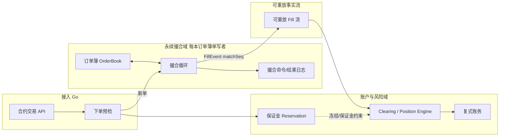
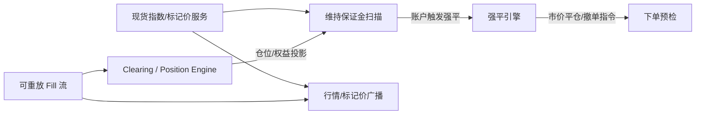
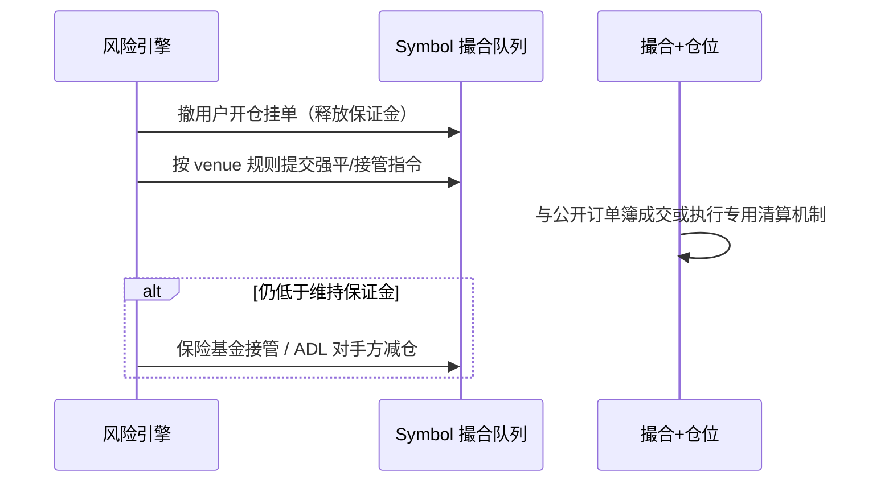
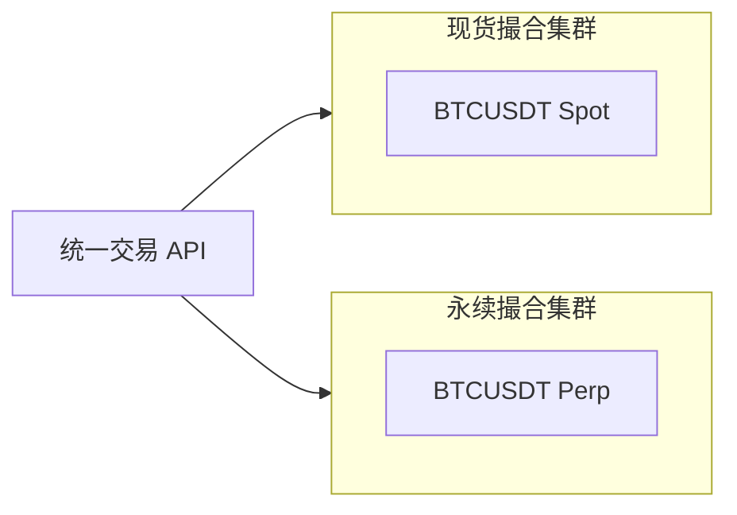

# 永续合约撮合与仓位引擎架构

## 30 秒版（开场）

> 永续订单簿可以沿用价格/时间优先，但 fill 还要驱动仓位、保证金、已实现盈亏和
> 清算。关键不是强行“撮合 + 仓位同线程”，而是定义两个权威顺序域：
> **order book 按 market 全序，账户/风险按 account 或 margin unit 串行并可恢复**。
> 隔离保证金、单市场系统可共置状态机；跨多个 symbol 的全仓账户不能由任一
> symbol 线程单独掌握完整风险。标记价通常不决定普通订单的成交价，但用于风险、
> 未实现盈亏和强平触发（[S-EXCH-04](./S-EXCH-04-futures-margin-liquidation.md)）。

## 3 分钟版（一面深度）

1. **是什么**：永续合约的订单执行、账户 clearing/仓位更新，以及保证金和清算规则。
2. **为什么**：只讲现货撮合（[S-EXCH-01](./S-EXCH-01-cex-matching-engine.md)）不够；合约面试必问 **开平仓、只减仓、双向持仓、撮合与仓位一致性**。
3. **怎么做**：下单前在账户风险单元中原子 reserve；撮合引擎只按订单规则产生
   带 `matchSeq` 的 fills。Clearing/position 状态机按可恢复顺序应用 maker/taker
   两侧、费用与 reservation 变化，并发布 PositionUpdate/Journal
   （[S-EXCH-03](./S-EXCH-03-account-ledger.md)）。是否共进程取决于保证金模型。

## 10 分钟版（原理 + 图示）

### 与现货撮合的差异

| 维度 | 现货撮合 | 永续合约撮合 |
|------|----------|--------------|
| 成交结果 | 资产交割 posting | fill 驱动 **仓位增减、PnL、费用和保证金 reservation** |
| 账户模型 | 可用余额 | **钱包余额 + 仓位 + 订单冻结保证金** |
| 订单语义 | Buy/Sell | **Open/Close**（双向模式）或 单向自动判断 |
| 定价来源 | 订单簿成交价 | 订单簿成交价；**标记价仅用于 PnL/强平** |
| 实例隔离 | 可独立部署 | 通常独立风险/产品边界；同一本 order book 仍保持单写者 |
| 特殊单 | Post-only 等 | **Reduce-Only、强平单、ADL 减仓单** |

### 端到端架构

#### 下单、撮合与清算事实链



#### 标记价、风险扫描与强平回路



**设计要点**：

- order book 的 fill 一旦对外确认，必须已进入 durable log
- clearing 可以与撮合共置，也可以独立，但必须以 fill id/sequence 幂等、可重放，
  并对外暴露“execution 已发生、account posting 尚在追赶”的状态
- 全仓账户跨多个 market 时，以账户/风险单元为权威边界；每个 symbol 私有
  `PositionMap` 会产生跨市场超额开仓竞态

### 持仓模式（必考）

#### 单向持仓（One-way / 买卖模式）

| 用户意图 | 方向 | 有反向仓位时 | 无反向仓位时 |
|----------|------|--------------|--------------|
| 开多 | BUY | 先平空再开多（净仓） | 开多 |
| 开空 | SELL | 先平多再开空 | 开空 |

- 同一 symbol **只有一个净仓位**（正=多，负=空）
- 订单 **不需** `positionSide`；交易所根据净仓自动判断开/平

#### 双向持仓（Hedge / 对冲模式）

| positionSide | side | 效果 |
|--------------|------|------|
| LONG | BUY | 开多 / 加多 |
| LONG | SELL | 平多 / 减多 |
| SHORT | BUY | 平空 / 减空 |
| SHORT | SELL | 开空 / 加空 |

- 同一 symbol 可 **同时** 持有多仓与空仓（两条独立仓位记录）
- 订单必须带 **`positionSide`**；撮合/仓位引擎按 side 分桶

### Reduce-Only（只减仓）

- 语义：订单 **只能减少** 指定 `positionSide` 的仓位绝对值，**不得反向开仓或加仓**
- 接单预检：
  - 单向模式：SELL 单不能使净多仓增加；BUY 单不能使净空仓增加
  - 双向模式：LONG+SELL、SHORT+BUY 才可能通过；否则拒单
- 若当前可减仓位为 0，通常拒绝或立即取消；具体 error/cancel 语义按 venue API 定义
- 与 **Close Position** 区别：Close 是 UI/语义；Reduce-Only 是 **硬约束标志位**

只在接单时检查不够：多个 Reduce-Only 挂单可能合计超过当前仓位，仓位也会被其他
订单/强平改变。venue 必须定义 reservation、优先级和动态处理规则，例如按接受顺序
保留可减数量，或在 fill 前缩量/取消超额订单，确保任何成交都不会反向开仓。

### 撮合主循环（单 symbol 伪代码逻辑）

```text
loop:
  1. 处理已完成账户 reservation 的新单
  2. 与订单簿对手盘匹配，生成 fills
  3. 在执行边界再次校验 Reduce-Only/自成交保护等会随状态变化的约束
  4. 剩余挂单写入 OrderBook（限价）
  5. durable log: [command/order_delta/fill]，分配 matchSeq
  6. 发布 FillEvent；Clearing 幂等更新 maker/taker 仓位、PnL、fee 与 reservation
```

若产品采用单 market 隔离保证金，可把第 6 步的 position 状态与撮合共置并在同一
复制状态机提交；但这是一种部署选择，不应推广到跨市场全仓账户。

### 仓位更新与均价（准确性）

**线性、以报价资产结算的合约：加仓（同向）加权均价示意**

\[
\text{newEntry} = \frac{\text{oldEntry} \times |\text{oldQty}| + \text{fillPrice} \times |\text{fillQty}|}{|\text{oldQty}| + |\text{fillQty}|}
\]

**同一线性合约：减仓已实现盈亏（多仓示意）**

\[
\text{realizedPnL} = (\text{fillPrice} - \text{entryPrice}) \times \text{closedQty}
\]

- `closedQty = min(|position|, |fillQty|)` 在减仓方向上的分量
- 仅部分减仓时，剩余同向仓位通常保留 entry price；若一次 fill 穿过 0 并形成反向
  仓位，超出 closedQty 的剩余部分应以本次成交价建立新的 entry price
- 反向/币本位合约的 PnL 公式不同；费用、资金费、quanto/portfolio margin 也不能
  套上面的线性公式
- 热路径优先使用带 scale 的定点整数并定义舍入；禁止 `float64`

**合约面值**：必须先定义 linear/inverse/quanto、contract multiplier、结算资产和
数量单位。`baseQty = contracts × contractSize` 只适用于相应产品定义，不能作为
所有合约的统一换算公式。

### 保证金与撮合的边界

| 阶段 | 检查内容 | 失败处理 |
|------|----------|----------|
| 下单预检 | 在 account/margin unit 内计算最坏执行后的增量风险、费用与现有 reservations | 原子 reserve 或拒单 |
| 撮合中 | 价格/数量规则、STP、Reduce-Only 动态约束 | 按公开规则拒绝、缩量或取消；不能产生后再撤销外部可见 fill |
| 成交后 | Clearing 立即应用 fill；Risk 随 mark/account 变化持续重算维持保证金 | 取消可释放订单、限制开仓、进入清算 |
| 资金费率 | 定时账务结算 | **不经撮合** |

- `notional / leverage` 只适合解释简单线性、隔离保证金示例。生产还要考虑风险档位、
  全仓抵扣、现有仓位、未成交单、费用、价格带、组合风险与资产折扣
- 市价单 reservation 应基于可执行深度/保护价或风险定义的 worst-case price，
  不能只用当前 mark 价
- 风险检测可由 mark price 事件、账户变更队列和优先级结构驱动，周期扫描作兜底；
  清算订单进入该 market 的统一命令序列，但触发与账户冻结属于风险域

### 强平单、ADL 与撮合优先级



- 强平实现可能使用受保护市价/IOC、清算引擎接管、拍卖或 backstop liquidity。
  是否拥有命令优先级必须是公开、可审计的 venue 规则；不能随意“插队”
- **ADL** 是部分平台在保险基金/清算机制不足时按规则减少对手方仓位的最后手段，
  排序指标和执行价格均依产品规则；不能描述为所有永续平台的统一流程

### 订单类型（永续特有）

| 类型 | 说明 |
|------|------|
| Limit / Market | 同现货；撮合规则一致 |
| IOC / FOK / Post-only | 同现货语义 |
| Stop / Take Profit | **条件单**：触发后生成 **普通限价/市价单** 进撮合队列 |
| Trailing Stop | 触发价随行情移动；触发后同样 **转普通单** |
| Reduce-Only | 标志位，非独立订单簿类型 |

条件单引擎 **独立服务** 订阅标记价/最新价，触发后 **写入同一 symbol 撮合队列**，保证单写者。

### 成交事件（下游账务）

```go
type PerpFillEvent struct {
    TradeID      string
    MatchSeq     uint64
    ContractSpecVersion uint32
    Symbol       string
    Price        decimal.Decimal
    Quantity     decimal.Decimal // base 数量
    TakerSide    string          // BUY / SELL
    MakerOrderID string
    TakerOrderID string
    MakerPositionSide string
    TakerPositionSide string
    MakerReduceOnly bool
    TakerReduceOnly bool
    MakerUserID  int64
    TakerUserID  int64
    IsLiquidation bool
    Ts           int64
}
```

FillEvent 只陈述撮合事实，不应让撮合引擎替 maker/taker 两个账户猜测 realized PnL、
margin delta 或最终 position snapshot。Clearing 应按账户模式、合约规格和费用规则
生成独立的 `PositionUpdated` 与 journal，并以 `tradeId + side/account` 幂等
（[S-ARCH-04](../03-system-design/S-ARCH-04-idempotency.md)）。

### 持久化与恢复

| 数据 | 恢复策略 |
|------|----------|
| 订单簿 | WAL 重放 或 快照 + 增量 |
| 仓位/账户 | 从 clearing journal/快照 + fill offset 重放；记录已应用的 match epoch/sequence |
| 用户挂单保证金 | 以权威 reservation ledger 为准，并与 open orders 对账；不能只靠订单簿“猜回” |

恢复时分别恢复 order-book owner 与 account/clearing owner，核对：
`last durable matchSeq`、`last published fillSeq`、`last applied clearingSeq`、
open orders 与 reservations。确认旧主已被 fencing 后再开放接单。

### 与现货撮合部署关系



- **不要** 现货与永续共用一个 OrderBook（资产模型不同）
- 可共用 **行情、用户、账务** 服务；撮合 **物理隔离** 便于独立扩缩容与故障隔离

## 生产场景

- **极端波动**：按预先公布规则进入 reduce-only/cancel-only、收紧价格带或暂停新开仓；
  临时上调维持保证金会影响既有仓位，应有通知、生效时间和治理/风控流程
- **插针**：强平触发与未实现 PnL 通常使用标记价，实际平仓仍受订单簿/清算机制价格
  影响；条件单触发价源需明确为标记价、指数价或最新价
- **自成交**：STP 模式（取消 taker/maker/两者）— 合约与现货共用规则
- **上市新合约**：空订单簿启动；首批做市商 Post-only 挂单

## 排查与工具

| 现象 | 排查 |
|------|------|
| 用户称平仓仍加仓 | 查 `reduceOnly` 标志与 positionSide；单向模式净仓方向 |
| 仓位与 UI 不一致 | 对比 fill sequence、clearing journal、position projection 与 WS/API 版本；撮合 WAL 只权威记录执行，不单独决定跨市场账户状态 |
| 强平后仍穿仓 | 标记价延迟；保险基金/ADL 是否触发 |
| 市价单滑点过大 | 深度、保护价/价格带、错误数量单位和流动性分层；拆单也不能替代最大可接受价格 |

Metrics：`perp_match_latency`、`position_apply_errors`、`liquidation_queue_depth`、`mark_price_staleness`

## 架构取舍

| 方案 | 优点 | 代价 |
|------|------|------|
| 单 market 撮合 + 仓位共置状态机 | 隔离保证金/单市场模型可一次提交执行与仓位 | 难处理跨 symbol 全仓风险，状态量和故障域扩大 |
| 撮合与 account clearing 解耦，以 durable fill 流连接 | 适合跨市场账户、独立扩展和可重放 | 必须设计 reservation、lag 阈值、账户序号、幂等与故障可见性；不能用无状态同步 RPC 拼接 |
| 全仓保证金 | 资金利用率高 | 风险传染；预检需读全账户 |
| 逐仓保证金 | 风险隔离 | 预检仅看单仓位；实现略简单 |

## 追问链

1. **永续和交割合约撮合有区别吗？** → 撮合环相同；交割有 **结算/交割日** 仓位下线，永续无到期 + 有 **资金费率**。
2. **市价单按什么价格成交？** → **对手盘订单簿**；保护价（市价单 max/min price）防极端滑点。
3. **标记价更新频率？** → 由产品和数据源 SLO 决定，携带 event time、version 与
   stale 状态；通常不决定普通订单的限价匹配，但会驱动 risk/unrealized PnL，
   某些条件单触发源也可配置为 mark。
4. **双向模式下能否同时开多开空？** → 可以；两条 position 记录独立保证金（逐仓）或共享钱包（全仓）。
5. **Go 能实现永续撮合吗？** → 可以，但要用目标订单类型、持久化复制、GC 和
   极端行情回放证明 P99/P999；不能用“中高频足够”替代容量证据。
6. **与 S-EXCH-01 关系？** → 01 讲通用订单簿；本题讲 **仓位语义与永续专属预检/部署**。

## 反模式与事故

- **成交后用无序、无持久化、无幂等的 goroutine 更新仓位** → race、丢 fill、
  重复 PnL；独立异步 clearing 本身不是错误，前提是有 durable ordering 和安全 lag 策略
- **现货与永续共订单簿** → 资产结算模型混乱
- **Reduce-Only 仅在 UI 限制** → API 绕过加仓
- **恢复只加载订单簿不加载仓位** → 重启后用户仓位归零或翻倍
- **用最新成交价算强平且用于撮合** → 与标记价职责混淆（见 S-EXCH-04 反模式）

## 代码示例

```go
// 单向、线性合约示意：真实实现还需合约 multiplier、scale/rounding、fee/funding。
func (pe *PositionEngine) ApplyFillOneWay(
    pos *Position, side Side, qty, price decimal.Decimal,
) {
    signed := qty
    if side == Sell {
        signed = qty.Neg()
    }

    if pos.Qty.IsZero() || pos.Qty.Sign() == signed.Sign() {
        // 加仓：加权均价
        pos.EntryPrice = weightedEntry(pos.Qty, pos.EntryPrice, signed, price)
        pos.Qty = pos.Qty.Add(signed)
        return
    }

    // 反向成交：先平掉 existing position。
    closed := minAbs(pos.Qty, signed)
    pe.RealizedPnL = pe.RealizedPnL.Add(
        calcLinearPnL(pos.Qty.Sign(), pos.EntryPrice, price, closed),
    )

    newQty := pos.Qty.Add(signed)
    switch {
    case newQty.IsZero():
        pos.EntryPrice = decimal.Zero
    case newQty.Sign() == pos.Qty.Sign():
        // 仅部分减仓，剩余仓位保留原 entry price。
    default:
        // fill 穿过 0，超出 closed 的部分建立反向新仓。
        pos.EntryPrice = price
    }
    pos.Qty = newQty
}
```

## 延伸阅读

- [S-EXCH-01 现货撮合引擎](./S-EXCH-01-cex-matching-engine.md)
- [S-EXCH-04 保证金、强平、资金费率](./S-EXCH-04-futures-margin-liquidation.md)
- [S-EXCH-03 复式记账](./S-EXCH-03-account-ledger.md)
- [S-EXCH-13 CEX 端到端架构](./S-EXCH-13-cex-end-to-end-architecture.md)
- [Binance 永续合约交易规则 FAQ](https://www.binance.com/en/support/faq/perpetual-futures-trading-rules)
