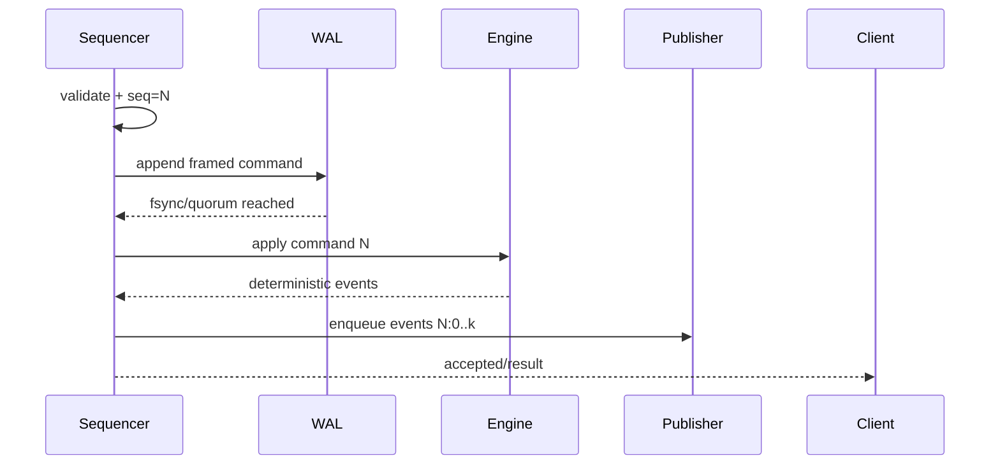

# 撮合 WAL、快照与确定性回放：崩溃一致性实战

## 30 秒版（开场）

> 撮合恢复先要选定唯一事实：记录 **已排序命令**，或记录 **确定性结果事件**，不能两套都声称权威。
> 本例采用命令日志：结构校验与分配序号后，先追加带长度、版本和校验和的 WAL，并达到声明的
> fsync/复制策略，再应用确定性状态机，最后发布事件与响应。重启时读取校验快照，跳过快照水位，
> 连续重放 WAL 后缀；只允许显式修复不完整尾记录，完整记录校验和错误必须停机调查。

## 3 分钟版（一面深度）

```text
validate envelope
  -> assign/verify sequence
  -> append WAL + durability barrier
  -> apply deterministic state
  -> enqueue derived events
  -> acknowledge externally
```

1. **写前日志**：不能先改内存，再异步“尽力写盘”，却对外声称订单已经不可撤销。
2. **记录 framing**：`length + versioned payload + CRC32C`，才能区分完整记录、撕裂尾部和内容损坏。
3. **快照原子性**：临时文件写完并 fsync，rename 后再 fsync 目录；快照包含最后应用序号。
4. **恢复连续性**：只重放 `seq > snapshotSeq`，且第一条及后续都必须连续。
5. **发布独立水位**：状态恢复水位和 MQ 发布水位不是一回事；恢复可能重新产生事件，下游必须幂等。

## 10 分钟版（原理 + 图示）



### 命令日志与结果日志

| 方案 | 优点 | 风险 |
|------|------|------|
| 已排序命令日志 | 可重建状态、便于规则回放 | 状态机必须确定；规则/schema 要版本化 |
| 结果事件日志 | 下游事实清晰，恢复无需再次撮合 | 事件必须足以重建完整订单簿，写放大更大 |

二者都可行。错误做法是：命令和结果分别写入两个不能原子协调的系统，却无法回答故障后
以谁为准。

### 尾部撕裂不等于任意损坏

- header/payload/checksum 只写了一部分：属于 **torn tail**，可在人工或受控恢复流程中截到最后完整 offset。
- 完整 frame 的 checksum 不匹配：可能是介质、内存或软件损坏，不能自动截断后继续交易。
- 中间序号缺口：不是“跳过坏消息”，而是权威历史不完整，应停止该分区。

### 快照与日志截断

快照只有在持久化完成且可校验后，才允许推进可截断 WAL 水位。生产还要考虑：

- 至少保留一份已验证旧快照和对应 WAL；
- 快照 schema/撮合规则版本迁移；
- 跨机器复制与恢复演练；
- 截断前确认发布器、审计和异地副本的保留要求。

### `fsync` 到底保证什么

`Write` 成功通常只表示数据进入内核缓存，不等于掉电后仍在。单机 `fsync`、批量 group
commit、同步副本 quorum 的延迟和 RPO 不同。讲解时应说清 **确认点对应哪一种持久性**，
不要笼统说“有 WAL 所以零丢失”。

## 生产场景

- 低延迟场景可 group commit，但必须给出批次窗口、尾延迟和客户端确认语义。若所有请求仍在
  共享 fsync/quorum 完成后才 ACK，group commit 本身不会扩大**已确认请求**的 RPO；
  若为了更低延迟在 durability barrier 前 ACK，那是异步提交，必须单独声明确认后数据损失窗口。
- 主备复制要同时 fencing 旧主，防止两边继续分配同一序号。
- 每次发布都保存稳定事件 ID；Kafka 重试或灾备重放不应重复入账。
- 定期执行“生产快照 + WAL 副本”离线恢复，并比较最终状态 hash。

## 排查与工具

先只读扫描 WAL，报告最后完整 offset、首个 checksum 错误、sequence 缺口和 schema 版本。
不要让恢复程序自动修改唯一副本。复制原文件后再做尾部修复，并保留审计记录。

可运行测试：

```bash
go test -race ./examples/senior/walreplay/...
```

测试覆盖快照后缀重放、尾部撕裂显式修复、checksum 损坏拒绝和非法命令不落 WAL。

## 架构取舍

每条记录 fsync 容易解释但延迟高；group commit 用一次 barrier 承担多条提交，通常提升吞吐，
但会引入等待凑批/排队的延迟与同批故障域。只有 barrier 前提前 ACK 才会扩大已确认数据的
丢失窗口。同步复制提高节点故障容忍度但不能替代一致的 leader fencing。选择必须从业务可接受
的 RPO/RTO、P99 延迟和故障模型反推。

## 深挖问答

1. **业务拒单要写 WAL 吗？** → 若命令已进入权威全序，拒绝结果也应可确定重放。
2. **快照完成后能立即删全部旧 WAL 吗？** → 不能默认；先验证快照、复制与所有恢复/审计水位。
3. **发布 Kafka 失败怎么办？** → 状态不回滚；从持久化发布水位重试，消费者按事件 ID 幂等。
4. **Apply 在 WAL 成功后失败怎么办？** → 视为状态机 invariant breach，停分区；不能跳到下一条。
5. **CRC 是安全证明吗？** → 不是密码学认证，只用于发现意外损坏。

## 反模式与事故

- 内存撮合成功并响应后才异步写日志。
- 把 `Write` 返回 nil 等同于已经落盘。
- 把 group commit 与“落盘前提前 ACK”混为一谈。
- 遇到任意 checksum 错误都自动 truncate。
- 快照没有 sequence/schema/checksum，恢复时猜测边界。
- 状态重放正确，却忘记事件发布水位，导致漏账或重复账。

## 代码示例

```go
func (p *Processor) Apply(cmd matchingengine.Command) ([]matchingengine.Event, error) {
    if err := matchingengine.ValidateCommand(cmd, p.Engine.LastSequence()+1); err != nil {
        return nil, err
    }
    if err := p.WAL.Append(cmd); err != nil {
        return nil, err
    }
    return p.Engine.Apply(cmd)
}
```

完整实现见 `examples/senior/walreplay/`。示例用本地文件说明崩溃边界，不等价于生产级
复制日志、磁盘隔离、leader 选举或异地灾备。

## 延伸阅读

- [S-EXCH-17 可运行确定性撮合引擎](./S-EXCH-17-runnable-deterministic-matching-engine.md)
- [S-EXCH-15 清结算、对账与高可用](./S-EXCH-15-settlement-ha-disaster-recovery.md)
- [PostgreSQL WAL introduction](https://www.postgresql.org/docs/current/wal-intro.html)
