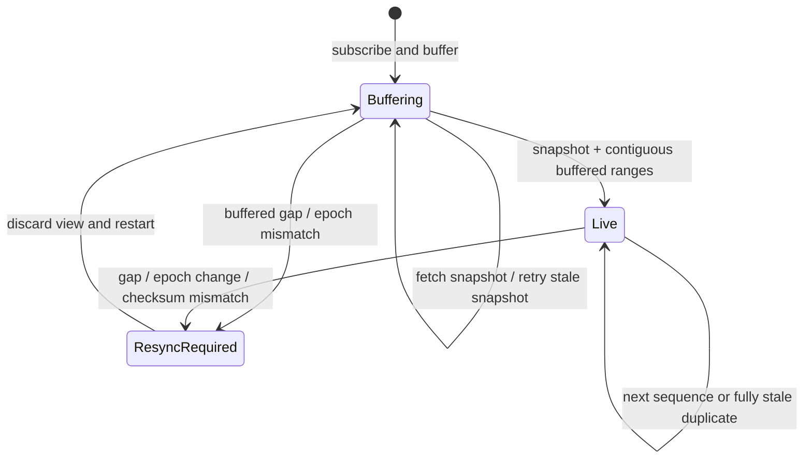

# 行情序号、快照桥接与 Gap Recovery

## 30 秒版（开场）

> 本地订单簿不能“先拉快照再订阅”，否则两者之间会漏更新。正确流程通常是先订阅并
> 缓冲 delta，再拉带 sequence 的 snapshot，丢弃完全早于快照的事件，并要求第一个
> 有效事件覆盖 `snapshotSeq+1`，之后每个范围连续。发现 gap、feed epoch 变化或 checksum
> 不一致时，本地视图已经不可证明正确，应停止对外发布并重新走 snapshot bridge；
> 不能跳过缺口继续算 BBO。不同交易所的 `sequence/U/u/pu` 语义不同，必须由 venue
> adapter 映射，不能照搬一套比较公式。

## 3 分钟版（一面深度）

1. **订阅优先**：先建立增量流并缓冲，避免 snapshot 请求期间产生盲区。
2. **快照水位**：snapshot 必须带该产品/分区的权威序号；epoch 可以是 venue 字段，
   也可以是 adapter 为一次订阅/恢复流程生成的本地 generation。
3. **桥接条件**：丢弃 `last <= snapshotSeq` 的旧事件；首个新事件必须覆盖下一期望序号。
4. **在线推进**：只应用连续范围，absolute quantity 为零时删除价格档。
5. **Fail closed**：gap 后清空可交易视图，若场所支持 replay 则精确回补，否则重新拉快照。

可运行实现：

```bash
go test -race ./examples/senior/marketdatarecovery/...
```

## 10 分钟版（原理 + 图示）



### 通用模型与场所适配

示例将每个事件归一为：

```text
epoch, [first_sequence, last_sequence], absolute level quantities
```

这里的 absolute quantity 表示该范围处理完成、即 `last_sequence` 时该价格档的值；同时
假设 adapter 向 book builder 保序交付。同一套核心状态机不能同时兼容“相对加减量”或
乱序 datagram，后两者必须先在 adapter/replay 层恢复成这个契约。

若当前已应用 `S`：

- `last <= S`：该事件完全陈旧，可幂等忽略。
- `first <= S+1 <= last`：事件覆盖下一期望序号，可以应用并推进到 `last`。
- `first > S+1`：确认存在 gap，进入 resync。
- `epoch != currentEpoch`：引擎重启或 feed generation 改变，旧序号空间失效。

这是 **归一后的契约**。例如 Binance diff depth 使用 `U/u` 等字段，其他 venue 可能是
单消息 sequence、前序 sequence、packet sequence 或单独 replay channel。adapter
必须按官方协议验证，不应看到两个整数就套用上述字段含义。

### 为什么 snapshot 和 delta 都不能单独相信

| 只做什么 | 会出什么问题 |
|----------|--------------|
| 只消费 delta | 不知道订阅前的完整订单簿 |
| 先 snapshot 后订阅 | 请求与订阅之间存在漏数窗口 |
| 订阅后不缓冲 | snapshot 返回前的 delta 被丢弃 |
| 有 gap 仍继续 | BBO、深度、滑点和风控输入都可能错误 |
| 只看 TCP/WebSocket 顺序 | 连接重建、服务端丢消息、慢消费者仍会造成业务序号缺口 |

TCP 提供单连接字节有序，不提供“交易所从未丢过某条业务事件”的证明。业务 sequence
才是完整性证据。

### Absolute update 与增量加减

很多 depth feed 发送“该价格档的新绝对数量”，不是 `+3/-2`。绝对更新更容易幂等，
同一事件重复应用不会重复累加；数量为零表示删除。若 venue 真的是相对 delta，则必须
有更严格的 exactly-once/sequence 处理，不能复用 absolute update 的重复容忍逻辑。

### 慢消费者与背压

行情连接的发送队列满时，不应随机丢一个 book delta 后继续：

- 对只关心最新 ticker 的流，可按产品 coalesce 最新值。
- 对维护订单簿的 delta，必须保序完整；队列溢出就断开该消费者并要求 snapshot/resync。
- 内部主行情构建器与外部 WebSocket fan-out 分离，慢客户端不能阻塞权威 book。
- 记录 last sent/acked sequence，让客户端知道自己从哪里恢复。

### 多分区与 epoch

sequence 通常只在 symbol、channel、matching partition 或 session 内有意义。将不同产品
的序号放进一个全局计数比较会制造假 gap。撮合引擎重启、主备切换或 replay generation
变化时，应携带 epoch/session ID；“新 epoch 的 sequence 变小”不是普通重复消息。
若 venue 不提供 epoch，adapter 应在每次重连/重新订阅时生成 generation，并确保 REST
snapshot 与当前流属于同一次恢复流程；不能声称这是交易所原生字段。

## 生产场景

- 建立 raw feed recorder，将原始 packet/event 与接收时间、venue sequence 一起留存。
- 权威 book builder 单写者处理；下游消费 snapshot + delta，不共享可变 map。
- 监控每产品 `last_sequence`、gap 次数、resync 耗时、snapshot age、checksum failure。
- 交易风控在行情 stale/resync 状态下降额、扩大保护价或暂停市价单。
- 多 venue 聚合时分别维护完整性，不能用另一个交易所的最新价填补本 venue 的 book gap。

## 排查与工具

保存 gap 前后的原始事件、snapshot sequence、epoch 和 adapter 版本。判断是服务端缺失、
本地队列丢弃、断线重连、解析失败还是消费暂停。若只保存最终 BBO，事后无法证明哪个
sequence 首先分叉。

## 架构取舍

从 replay service 精确补缺口可减少全量 snapshot 压力，但需要服务端保存可寻址日志；
没有此能力时重新 snapshot 更安全。更深快照提高完整度但增加延迟和带宽，应按策略声明
可见深度边界。

## 追问链

1. **为什么不是先拉 snapshot？** → snapshot 请求期间仍有成交和改单，必须先缓冲流。
2. **重复 delta 可以忽略吗？** → 只有其整个 sequence range 已应用，且 payload 契约允许时。
3. **发现 gap 能否只等下一条？** → 下一条无法证明缺失状态；需要 replay 或重新 snapshot。
4. **WebSocket 有序为何还会 gap？** → 业务生产、网关队列、慢消费者和连接重建都可能丢事件。
5. **行情 stale 时交易系统怎么办？** → 进入显式风险状态，不以错误 book 继续正常报价/风控。

## 反模式与事故

- 用消息到达时间代替 venue sequence。
- gap 后只打一条 warning，继续向客户端发布 BBO。
- 对 order-book delta 使用“丢旧保新”队列策略。
- 不区分产品/分区/epoch，看到 sequence 变小就永久忽略。
- 把有限深度 snapshot 当作全量订单簿。

## 代码示例

```go
book := marketdatarecovery.New()
book.BeginResync()

_ = book.OnDelta(deltaFromWebSocket) // snapshot 返回前先缓冲
if err := book.InstallSnapshot(snapshotFromREST); err != nil {
    // ErrGap / ErrEpochChanged：丢弃视图并重新订阅、拉快照
}
```

完整实现见 `examples/senior/marketdatarecovery/`，覆盖 snapshot bridge、范围重叠、
陈旧重复、gap、epoch 切换，以及非法更新清空可发布视图并进入 resync-required。

## 延伸阅读

- [Binance WebSocket depth synchronization](https://developers.binance.com/docs/binance-spot-api-docs/web-socket-streams)
- [Coinbase Exchange WebSocket channels](https://docs.cdp.coinbase.com/exchange/websocket-feed/channels)
- [S-EXCH-11 WebSocket 行情 Hub](./S-EXCH-11-websocket-market-hub.md)
