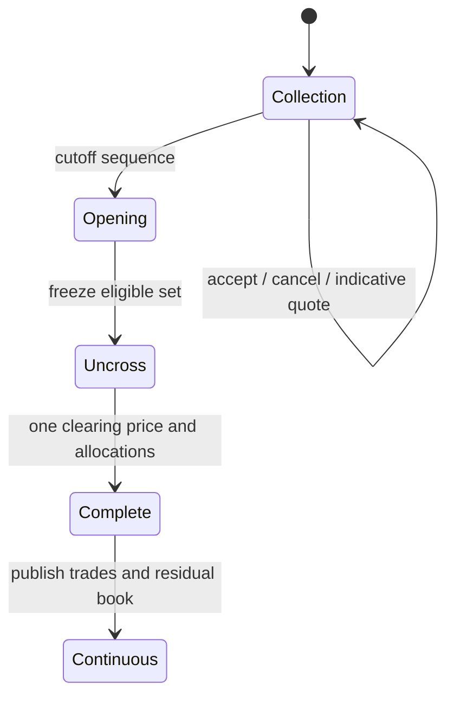

# 集合竞价与撮合性能验证：清算价、分配和 Benchmark

## 30 秒版（开场）

> 集合竞价先在 collection 阶段积累订单，再在一个确定性时点统一 uncross，所有成交使用
> 同一 clearing price。一个常见价格优先级是：最大成交量、最小不平衡、最接近参考价，
> 但候选价格、market/limit 订单、price collar 和最终 tie-break 都是 venue-specific，
> 不能只说“取成交量最大价格”就认为结果唯一。性能验证也不能只跑空簿 QPS：先用规则
> 向量证明竞价/连续撮合正确，再固定订单簿深度、交叉率、订单类型和持久化边界，报告
> p50/p99/p999、allocs、GC 和端到端延迟，并用多次 benchmark + benchstat 比较。

## 3 分钟版（一面深度）

1. **阶段状态机**：Collection 接单/撤单但不连续成交；Opening/Uncross 冻结或排队新命令；
   Complete 后切回连续交易。
2. **清算价格**：遍历合法候选价，按版本化规则比较 executable quantity、imbalance、
   reference distance 和最终 tie-break。
3. **分配**：优于清算价的订单优先，再处理清算价订单的 time/pro-rata 等 venue 规则。
4. **可审计性**：保存 indicative price、最终输入水位、规则版本、clearing result 和订单分配。
5. **性能**：区分状态机 CPU microbenchmark、WAL/fsync、网络和下游发布的端到端 benchmark。

可运行示例：

```bash
go test ./examples/senior/callauction/...
go test ./examples/senior/matchingengine -run '^$' -bench . -benchmem -count 10
```

## 10 分钟版（原理 + 图示）



### 清算价不是一句公式

教学实现按以下顺序选择：

1. 最大化可成交量 `min(cumulativeBuy, cumulativeSell)`。
2. 最小化绝对不平衡 `abs(cumulativeBuy-cumulativeSell)`。
3. 最小化与 reference price 的距离。
4. 若仍相同，执行显式配置的 lower/higher final tie-break。

Nasdaq 官方材料也使用“最大成交、最小 imbalance、最接近 inside bid-ask midpoint”的
层级，但真实规则还涉及特定订单类型、inside price、阈值和监管规则。示例是
**limit-order-only 教学策略**，不会冒充 Nasdaq/Coinbase 的完整实现。

### 候选价与 indicative quote

- 候选价格可能来自订单限价、参考价、tick、price collar 和 venue 特定边界。
- Collection 期间的 indicative open price/size 只是当前订单集的结果，新订单和撤单会改变它。
- 最终 uncross 必须绑定一个输入 cutoff sequence；“最后一次每秒广播的 indicative quote”
  不一定等于实际 opening price。
- 若没有可交叉 interest，应进入明确 no-cross/cancel/转连续交易规则，不能生成零量成交。

### 订单分配

示例按价格优先、同价 FIFO 分配：

- Buy：价格高于 clearing price 的优先，再到 at-price。
- Sell：价格低于 clearing price 的优先，再到 at-price。
- 两侧各分配 exactly executable quantity，所有 trade 使用 clearing price。

有的 venue 在清算价使用 pro-rata、size priority、imbalance-only 等规则；规则必须显式，
并用固定订单向量验证“总成交量守恒、订单不超量、单一成交价、分配确定”。

### 性能验证分层

| 层 | 测什么 | 不包含什么 |
|----|--------|------------|
| 数据结构 microbenchmark | add/cancel/match、档位深度、allocs/op | 网络、WAL、调度排队 |
| 状态机 benchmark | 完整命令与事件生成、STP/FOK/auction | fsync 和外部发布 |
| 单机 pipeline | sequencer → WAL → apply → event journal | 跨机网络与客户端 |
| 端到端 | gateway → ACK/trade/market data，故障与背压 | 不能用平均值掩盖尾延迟 |

### 工作负载必须声明

至少固定：

- 初始 book levels、每档订单数、热 symbol 数和 price distribution。
- add/cancel/amend/cross 比例，平均/尾部成交笔数。
- GTC/IOC/FOK/Post-only/STP/auction 比例。
- single writer 是否绑核、`GOMAXPROCS`、CPU、内存、NUMA 和 Go 版本。
- WAL batch、fsync policy、网卡/内核参数与下游 backpressure。

“本机 100 万 QPS”如果没有这些条件，对架构判断没有价值。

### Go Benchmark 的正确用法

```bash
go test ./examples/senior/matchingengine \
  -run '^$' -bench . -benchmem -count 10 > before.txt

# 修改后在同一环境运行到 after.txt
benchstat before.txt after.txt
```

再用 `-cpuprofile/-memprofile`、`go tool pprof`、runtime trace 和操作系统 profiler 找证据。
Benchmark 中排除 fixture setup 可以看 hot path，但必须明确它不是端到端结果；不要为通过
任意阈值而删除正确性检查。工作负载还必须固定：不能让订单簿随 `b.N` 持续增长，再把
这个非平稳结果当成“单次挂单延迟”。示例因此使用固定 1,024 单 batch。

## 生产场景

- collection/opening 切换由权威 sequence 驱动，新命令在 cutoff 后排队到下一状态。
- 保存每次 indicative calculation 与最终 uncross 的 input hash/state hash。
- 开盘峰值前预热内存与连接，监控 command queue、WAL latency、GC pause 和 publication lag。
- 用 shadow replay 比较新旧规则的 clearing price、fills 和最终 residual book。
- 性能回归门禁使用统计比较和可解释阈值，硬件/Go 版本变化时重新建立 baseline。

## 排查与工具

竞价结果争议先重放同一 cutoff 前的命令，核对 eligible order、candidate prices、
reference、rule version 和 allocation。性能抖动则按 queueing、CPU、allocation/GC、
fsync、network、downstream 分层，不要只看总 QPS。

## 架构取舍

更复杂的数据结构可降低理论复杂度，却可能增加 pointer chasing、cache miss 和 GC；
连续价格数组缓存友好但占空间并受价格范围约束。应以真实分布 benchmark 和 profile 决策，
同时保持规则层与存储结构解耦。

## 深挖问答

1. **最大成交量是否一定唯一价格？** → 不一定，还需 imbalance、reference 和最终 tie-break。
2. **集合竞价是否按订单到达就成交？** → collection 阶段通常不连续撮合，统一在 uncross 时处理。
3. **Indicative price 是否可承诺？** → 不是；输入集在最终 cutoff 前仍可能变化。
4. **Benchmark 无分配是否代表生产无 GC？** → 不代表；网络解码、事件、日志和外围服务仍会分配。
5. **平均 10µs 是否达标？** → 需看 p99/p999、工作负载、排队和端到端持久化边界。

## 反模式与事故

- 只实现“成交量最大”，多个价格并列时依赖 map 遍历。
- collection 期间部分订单偷偷按连续撮合成交。
- 最终成交价与对外 indicative quote 没有 sequence 关联。
- 用空订单簿、无 WAL 的 microbenchmark 宣称端到端交易延迟。
- 只优化 QPS，未验证规则结果、尾延迟和恢复一致性。

## 代码示例

```go
result, err := callauction.Uncross(orders, callauction.Policy{
    ReferencePrice: 10000,
    FinalTieBreak:  callauction.LowerPrice, // 明确的产品规则
})
```

`examples/senior/callauction/` 覆盖价格选择层级、显式最终 tie-break、价格时间分配与
no-cross；`examples/senior/matchingengine/engine_benchmark_test.go` 提供带边界说明的
microbenchmark。

## 延伸阅读

- [Nasdaq Opening and Closing Cross FAQ](https://www.nasdaqtrader.com/content/ProductsServices/Trading/Crosses/openclose_faqs.pdf)
- [Coinbase auction channel](https://docs.cdp.coinbase.com/exchange/websocket-feed/channels)
- [Go testing benchmarks](https://pkg.go.dev/testing)
- [Go performance analysis tools](https://pkg.go.dev/golang.org/x/perf)
- [S-EXCH-17 可运行确定性撮合](./S-EXCH-17-runnable-deterministic-matching-engine.md)
