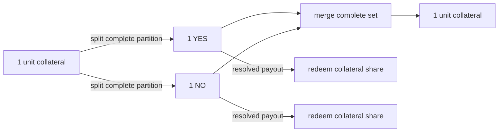
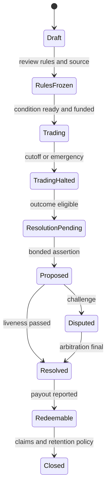

# 预测市场 CTF、Outcome Token 与市场生命周期

<a id="oral-card"></a>

## 要点卡

[返回模块索引](./index.md)

!!! abstract "30 秒回答"

    CTF 是 Conditional Token Framework：它把“由某个 oracle 回答的问题”编码为 condition，
    再把 collateral 与 outcome collection 组合成 ERC-1155 position。完整 outcome set
    可以由抵押物 split 出来，也可以 merge 回抵押物；结果写入 payout vector 后，持仓按比例
    redeem。它解决的是条件资产的铸造、合并和兑付，不负责市场规则是否清晰、订单如何撮合、
    预言机是否诚实或运营是否合规。架构上必须先冻结题面、数据源、截止时间和异常规则，再把
    market、condition、position、order、resolution 分开建模。

**3 分钟展开**

1. **三个 ID**：`conditionId` 绑定 oracle、questionId、outcomeSlotCount；collection 绑定
   condition 与 index set；position 再绑定 collateral，三者不可混用。
2. **资产闭环**：split 锁抵押物并铸造完整 outcome set，merge 销毁完整 set 并释放抵押物，
   resolve 后按 payout vector redeem。
3. **生命周期**：Draft → RulesFrozen → Trading → Halted → ResolutionPending →
   Disputed/Resolved → Redeemable；交易截止不等于事件已经可结算。
4. **事实边界**：链上 condition/payout/余额是协议事实；标题、联赛信息、搜索与行情是索引投影。

| 记忆槽 | 内容 |
|--------|------|
| 三个不变量 | split/merge/redeem 必须守恒；题面与 resolution policy 必须版本化冻结；未最终 resolve 不得提前兑付 |
| 手画图 | `collateral ⇄ complete outcome set → trading → oracle payout → redeem` |
| 项目落点 | 用二元体育市场说明规则冻结、CTF 资产闭环、交易暂停与争议结算；不把外部协议设计说成自己的生产实现 |
| 一个取舍 | 通用 CTF 组合能力强，但 position/index-set 心智和审计复杂；产品可限制为浅层二元市场降低风险 |

**错误表达**

- ❌ “YES 价格就是精确概率；CTF 自己负责判断比赛结果并保证多个市场互斥。”
- ✅ “价格是受流动性、费用和风险影响的市场报价；CTF 消费 oracle 的 payout，跨市场互斥还需要额外机制。”

**自测追问**：为什么 `questionId`、`conditionId` 和 `positionId` 不能使用同一个业务主键？

## 10 分钟版（原理 + 架构）

### 先拆五个领域对象

| 对象 | 负责什么 | 不应该承载什么 |
|------|----------|----------------|
| Event | 比赛、选举或现实事件及数据源标识 | 不直接等于可交易市场 |
| Market | 题面、规则版本、交易窗口、费用、可见性 | 不直接等于 CTF condition |
| Condition | oracle、questionId、outcome slot 和 payout vector | 不存订单簿状态 |
| Position | collateral + outcome collection 对应的 ERC-1155 资产 | 不代表某用户的订单 |
| Resolution | 提案、证据、挑战、仲裁与最终 payout | 不用覆盖撮合成交状态 |

一个事件可以派生多个市场，例如“主队获胜”“总进球大于 2.5”；它们的题面和
condition 都可能不同。反过来，多个展示页面也可能引用同一个 condition。

### CTF 标识关系

```text
conditionId = H(oracle, questionId, outcomeSlotCount)
collectionId = f(parentCollectionId, conditionId, indexSet)
positionId = H(collateralToken, collectionId)
```

- `questionId` 的解释由集成方定义，通常应绑定不可变或内容寻址的 resolution rules。
- `indexSet` 是 outcome slot 的位图；例如二元市场可用 `0b01`、`0b10` 表示两个结果。
- position 必须包含 collateral 维度；同一个 collection 由不同抵押物支持时不是同一资产。
- CTF 支持嵌套和组合条件，但“能表达”不等于“产品应该默认开放”。

### 资产流与守恒



对二元互斥且完备市场，直觉上 `YES + NO` 是一套完整仓位。一般 CTF 的 payout 是分数：

```text
payout(outcome i) = amount × payoutNumerator[i] / payoutDenominator
payoutDenominator = Σ payoutNumerator[i] > 0
```

实现与测试至少保证：

- partition 非空、互不重叠，且符合本次 split/merge 的父集合；
- 铸造、销毁与抵押物转移在同一交易中原子完成；
- payout vector 只能由指定 oracle 路径写入，且 condition 不能二次改写；
- 定点除法的向下取整策略明确，累计兑付不能超过可分配抵押物；
- 非标准 collateral、转账税 token、回调和 ERC-1155 receiver hook 进入威胁模型。

### 市场生命周期不是一个 `active` 布尔值



各状态要定义允许的命令，而不是只写展示文案：

| 状态 | 可做 | 禁止或受限 |
|------|------|------------|
| Draft | 编辑题面、模拟 payout | 接单、铸造正式 position |
| RulesFrozen | prepare condition、开放做市准备 | 静默修改 source/end time/edge case |
| Trading | 下单、撤单、撮合、split/merge | 越过风险限额或已暂停用户 |
| TradingHalted | 撤单、取消待结算、对账 | 新撮合；是否允许链上旧单成交要由协议定义 |
| ResolutionPending/Disputed | 提交证据、挑战、监控 bond | 提前把某 outcome 当最终余额 |
| Redeemable | redeem、账本和资产对账 | 改写 payout |

### 题面是经济合约

上线前至少冻结：

- 明确问题、事件实体、时区、截止时间和“何时可以开始 resolve”；
- 权威 resolution source 及 source 不可用时的回退顺序；
- 延期、腰斩、取消、重赛、加时、点球、判罚变更等 edge cases；
- `invalid/unknown/too-early` 是否存在、如何编码 payout；
- 版本、内容 hash、创建人、审阅人和治理/升级边界。

“比赛在 20:00 开始”不是完整规则；体育数据的 `scheduled`、`live`、`final`、
`official`、`corrected` 也不能当作同一状态。

### Binary、multi-outcome 与 neg-risk

- 普通二元市场只保证本 condition 内两个 slot 的 payout 关系。
- 多 outcome condition 可原生表达多个结果，但订单簿、深度和 UI 成本更高。
- 将多个独立二元市场组织成“只有一个赢家”的 neg-risk 市场，需要额外 adapter/
  conversion 与完整性约束；不能从“标题看起来互斥”推导链上可无风险转换。
- CTF 的组合条件能力也不会自动解决相关性风险、组合爆炸和 oracle 题面歧义。

## 生产场景

- **事件延期**：交易策略可暂停或延长，但 resolution rule 不能由运营临时口头修改。
- **数据源先报 final 后更正**：只有满足冻结规则和 oracle 流程的最终 payout 才能兑付；
  索引器先看到的比分不能直接触发资金结算。
- **同一标题重复建市**：使用独立 market ID，并检查 question/rules hash 和 condition
  映射，避免 UI 合并了不同资产。
- **市场下架**：隐藏页面不等于撤销链上 token；仍需保留余额查询、撤单、resolve 和 redeem 路径。

## 排查与工具

从 `market_id → rules_hash → oracle/questionId → conditionId → collectionId →
positionId → payout vector` 建立可审计链路。遇到“无法兑换”时依次核对 condition 是否已
resolve、index set、collateral/adapter 地址、持仓余额、approval、父 collection 和
取整结果，不能只看前端 market status。

## 架构取舍

使用成熟 CTF 可复用资产守恒与组合表达，但会引入 ERC-1155、adapter、复杂 ID 和外部
oracle 集成。自研简化 outcome token 的心智更低，却要重新证明 collateral、mint/burn、
payout、组合与升级不变量。无论选择哪种，都应先限制产品范围，再逐步开放组合能力。

## 深挖问答

1. **CTF 是什么？** → Conditional Token Framework，把条件、outcome collection 和抵押物组合成可拆分、合并、兑付的 position。
2. **YES + NO 永远等于 1 吗？** → 只在同一完备二元 condition、同一 collateral 和忽略费用/取整的完整 set 语境成立；盘口价格之和不保证恰好为 1。
3. **交易截止后能立即兑付吗？** → 不能据此推断；还要满足 resolution eligibility、挑战/仲裁和链上 payout 写入。
4. **为什么不让后端比分服务直接调用 `reportPayouts`？** → 数据 feed、规则解释和资金授权应分层，需受 oracle/争议流程与权限约束。
5. **CTF 能保证跨市场互斥吗？** → 单 condition 内可定义互斥 slot；独立 condition 之间需要额外机制，不能只依赖文案。

## 反模式与事故

- 把 market ID、condition ID、token ID 混成一个字段，升级后资产映射错位。
- 题面可编辑但 question/rules hash 不变，用户签名时看到的规则与结算规则不同。
- 事件 `final` webhook 到达就先给赢家入账，争议后形成资金缺口。
- 只暂停前端和 API，旧签名订单仍可被 operator 在链上结算。
- 误称 CTF 或 oracle “保证现实世界结果绝对正确”。

## 延伸阅读

- [Gnosis Conditional Tokens Developer Guide](https://gnosis-conditional-tokens.readthedocs.io/en/latest/developer-guide.html)
- [ConditionalTokens.sol](https://github.com/gnosis/conditional-tokens-contracts/blob/master/contracts/ConditionalTokens.sol)
- [Polymarket CTF Overview](https://docs.polymarket.com/trading/ctf/overview)
- [Polymarket Resolution](https://docs.polymarket.com/concepts/resolution)
- [S-EXCH-24 CLOB、EIP-712 与链上结算](./S-EXCH-24-prediction-market-clob-eip712-settlement.md)
