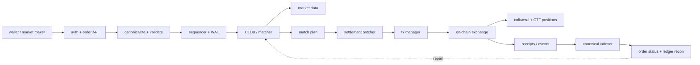
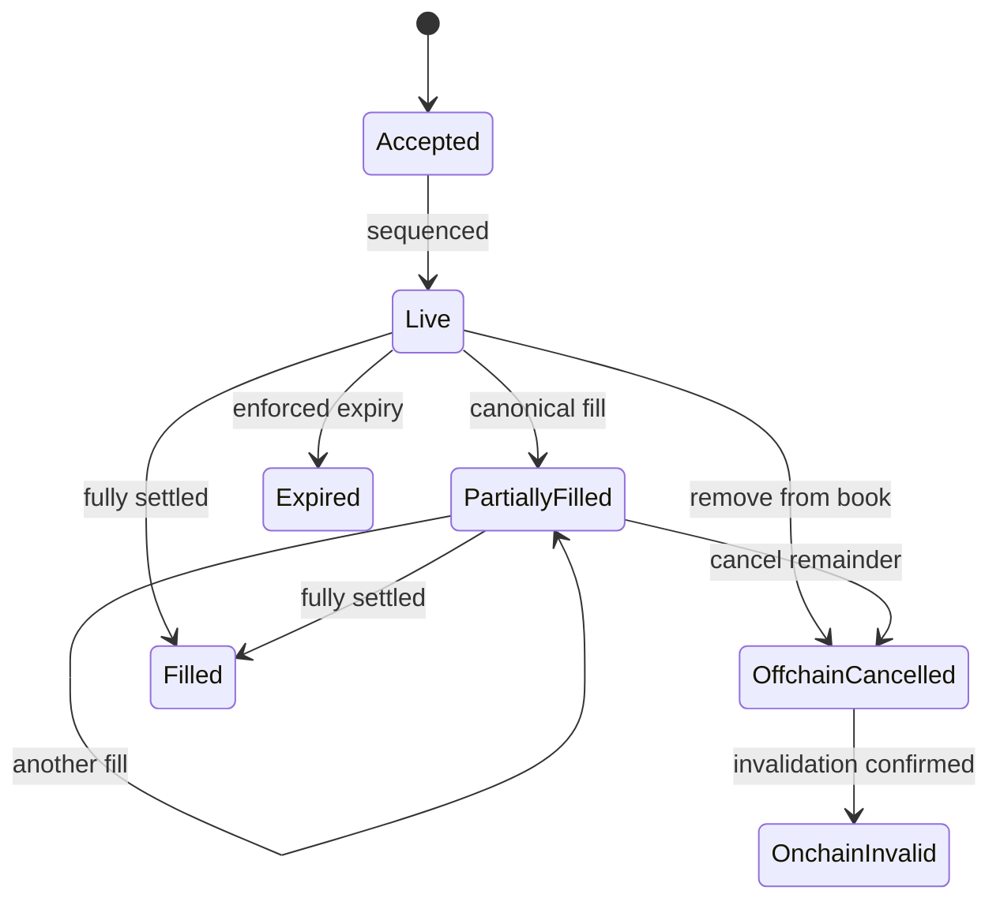

# CLOB-first 预测市场：EIP-712 订单与链上结算

<a id="oral-card"></a>

## 口述卡（高频必背）

[返回模块索引](./index.md)

!!! abstract "30 秒回答"

    CLOB-first 预测市场把接单、排序、撮合和行情放在低延迟链下，把资产所有权、签名验证、
    订单成交上限、费用/价格约束和 ERC-20/ERC-1155 交割放在链上。用户签 EIP-712
    order intent，operator 只能在签名边界内撮合；链下 `matched` 只是计划，链上交易达到
    约定 finality 才是结算事实。EIP-712 只定义结构化签名，不自带 replay protection，
    必须用 domain、order hash、filled/cancelled 状态以及 deadline、nonce/epoch 等协议机制
    组合防重放。取消也要区分“从订单簿移除”和“链上已不可成交”。

**3 分钟展开**

1. **链下**：API 鉴权、pre-trade validation、sequencer、order book、matcher、行情、
   settlement batcher、tx manager 和 indexer。
2. **链上**：EIP-712/EOA/ERC-1271 验签、fill/cancel 状态、价格/费用不变量、资产转移、
   CTF mint/merge、权限和暂停。
3. **防重放**：domain 绑定 chainId/verifyingContract/version；应用层再记录 order hash
   的 filled/cancelled，必要时使用 salt、deadline、nonce bitmap 或 minimum nonce。
4. **恢复**：按 `accepted → matched → submitted → included → finalized` 追踪；未知交易结果
   先查链和 order status，不能直接重提并假设幂等。

| 记忆槽 | 内容 |
|--------|------|
| 三个不变量 | 不超签名数量；成交价格不劣于用户 limit；链下成交不冒充链上 final settlement |
| 手画图 | `signed order → sequencer/CLOB → match plan → settlement tx → canonical receipt → ledger/market data` |
| 项目落点 | 用 Go 单写者订单簿/WAL 说明链下确定性，再讲 EVM 结算状态、重组和对账；明确哪些是设计、哪些有真实项目证据 |
| 一个取舍 | 链下撮合低延迟且便宜，但引入 operator 可用性、公平性与审查信任；链上约束要限制其作恶空间 |

**错误表达**

- ❌ “用了 EIP-712 就不会重放；撮合服务返回 filled 就已经最终成交。”
- ✅ “EIP-712 让签名语义可读且域分离，重放仍由协议状态处理；最终成交要以 canonical 链上结算为准。”

**自测追问**：链下 cancel API 返回成功后，为什么旧签名仍可能在链上有效？

## 10 分钟版（边界 + 状态机）

### 链上与链下边界



| 逻辑 | 默认放置 | 原因 |
|------|----------|------|
| 价格时间优先、订单簿、行情 | 链下 | 低延迟、高吞吐、可恢复 |
| API rate limit、账户风控、市场状态预检 | 链下 | 快速拒绝，但不是链上安全边界 |
| 签名、资产 owner/approval、fill 上限 | 链上 | operator 不能越过用户授权 |
| 最差成交价格、合法 token/condition、费用上限 | 链上 | 防恶意或出错的 matcher/settler |
| GTC/GTD/FOK/FAK 等 book 语义 | 主要链下 | 是否需要链上强制取决于 trust model |
| cancellation | 链下 + 可选链上失效 | 用户体验与抗 operator 风险的取舍 |
| canonical settlement/finality | 链上观察 + 对账 | receipt 与 canonical block lineage 是证据 |

“链下负责业务、链上负责资金”太粗。任何一条用户必须无条件获得的保护，都要么进入
签名内容/链上验证，要么明确写成对 operator 的信任假设。

### Order intent 要先 canonicalize

通用设计可包含：

```text
maker, signer, tokenId, side,
makerAmount, takerAmount,
salt, deadline,
feeOrFeeCap,
signatureType
```

具体协议可不同，但必须做到：

- 地址、整数、token ID、side 和 amount 使用唯一编码；不签 JSON 文本或浮点价格；
- 展示层 price/size 必须可无歧义还原为签名的 maker/taker amount；
- 用户签名前展示 market/rules、资产方向、最大支出、最小获得、费用和有效范围；
- SDK、API、合约共用 golden vectors，验证 type hash、domain separator、digest 和 recovered signer；
- `maker`（资产账户）与 `signer`（授权签名者）分离时，链上验证授权关系。

### EIP-712 不等于 replay protection

EIP-712 规范明确不包含 replay protection。防重放要分层：

| 维度 | 典型控制 |
|------|----------|
| 跨链 | domain `chainId` |
| 跨合约 | domain `verifyingContract` |
| 跨协议/升级 | domain `name/version`，升级时迁移或显式兼容 |
| 同合约重复执行 | `orderHash → filled/cancelled/status` |
| 批量撤单 | per-user minimum nonce、nonce bitmap 或 order epoch |
| 时效 | signed deadline/expiration，或明确由 operator 执行的 book 过期 |
| 唯一性 | salt/nonce/timestamp 等；唯一字段本身不代表已取消或已过期 |

支持智能合约钱包时使用 ERC-1271 类验证，并注意**合约签名的有效性可能随区块状态变化**。
因此 settlement 时必须重新验证，不能永久缓存“昨天验证通过”。EOA 验签还要使用经过审计的
ECDSA 实现，处理低 `s`、合法 `v` 和零地址等边界。

### 取消语义必须说清



- `OffchainCancelled`：matcher 承诺不再选择该单；如果只有可信 operator 能调用 settlement，
  这是可用但带信任的方案。
- `OnchainInvalid`：合约状态已使剩余数量不可成交；需要 gas、确认时间，并处理取消与成交竞态。
- 若 signed struct 不含 deadline，API 的 GTD 只可能是 operator/book 规则，不能宣传为
  trustless on-chain expiration。
- 取消和成交并发时，以 sequencer 水位和最终链上状态决定结果；客户端必须接受
  “cancel requested 但已有一笔成交在途”的明确状态。

### 撮合与三种结算形态

对于以 collateral 支撑互补 outcome 的系统，match plan 不一定只有转账：

| 组合 | 结算动作 | 直觉 |
|------|----------|------|
| BUY 对 SELL | 直接交换 collateral 与 position | 已有仓位转手 |
| 两侧都是互补 outcome 的 BUY | split collateral / mint outcome | 两个买方共同形成完整 set |
| 两侧都是互补 outcome 的 SELL | merge outcome / release collateral | 两个卖方共同销毁完整 set |

Polymarket CTF Exchange V2 将其称为 `COMPLEMENTARY`、`MINT`、`MERGE`。这是一个
具体实现的术语，不应说成所有预测市场的唯一结算模式。

无论哪种模式，链上要验证：

- 每个 order 的累计 fill 不超过签名 amount；
- maker/taker 的资产方向正确，成交比率不劣于签名 limit；
- amount、fee、rounding 全用整数和有界运算，交叉相乘的溢出范围已证明；
- 所有 transfer/mint/merge 失败时原子回滚；
- operator、pause、admin、adapter、collateral 和 signature type 都在允许版本内。

### 结算状态与未知结果

```text
MATCH_PLANNED
  -> SUBMITTING
  -> SUBMITTED(tx_hash)
  -> INCLUDED(block_hash)
  -> FINALIZED
  -> REORGED / REVERTED / EXPIRED
```

- 广播超时是 **unknown outcome**，先按 sender/nonce、tx hash、order hash 和事件查证。
- 替换交易必须保持同一授权意图，不能换 nonce 后生成经济含义不同的 batch。
- receipt 出现不代表业务完成；还要等待产品定义的 finality，并让 indexer 处理 removed log/reorg。
- matcher 的 WAL 负责恢复链下决定，链上 `OrderStatus`/事件负责证明实际 fill；两者通过
  match ID、order hash、tx attempt 和 block lineage 对账。

### 版本边界：不要混背 Polymarket V1/V2

截至本文资料版本，公开的 CTF Exchange V2 与 V1 有重要差异：

- V2 使用统一 `matchOrders`，订单按 hash 的 `OrderStatus` 跟踪，移除了 V1 NonceManager。
- V2 signed order 移除 `taker/expiration/nonce/feeRateBps`，增加
  `timestamp/metadata/builder`；`timestamp` 用于唯一性，不是 expiration。
- GTD 的 `expiration` 仍可出现在 API wire body，但不属于 V2 EIP-712 signed struct。
- domain version、verifying contract、collateral adapter 和 SDK 也随迁移变化。

所以面试应先讲**通用不变量**，再说“某协议某版本如何取舍”。不要拿旧 SDK 字段拼成
“当前 Polymarket order struct”，也不要把 V2 的 operator trust model 当成行业标准。

## 生产场景

- **盘口已成交、链上 revert**：回滚 tentative fill，按订单剩余量和 sequencer 规则重新入簿；
  不得仅删除 tx row。
- **结算交易重组**：撤销 canonical projection，恢复 order remaining；重新结算前核对旧交易
  是否在新 canonical chain 已执行。
- **合约钱包签名失效**：settlement 时 ERC-1271 返回失败，应隔离该订单并发布状态，不循环重试。
- **暂停市场**：链下停止新 match 之外，链上 operator/market/user 级保护要按预案触发，
  同时保留撤单和资产退出路径。

## 排查与工具

一笔订单应能串起：原始 typed data、domain、digest、signature、API request、sequencer
sequence、WAL command、book events、match plan、settlement calldata、tx attempts、
receipt/block hash、canonical status 和 ledger projection。日志可记录 digest 与必要字段，
不记录私钥、API secret 或未经脱敏的身份数据。

## 架构取舍

单 operator 能提供严格排序和快速结算，却带来宕机、审查、公平性与密钥风险；多 operator
降低单点但会引入共享订单状态、双花式 overfill 和排序共识。起步阶段可用单 sequencer +
链上强约束 + 可退出/可撤单 + 完整审计，再根据产品目标评估去中心化 sequencer，而不是
一开始宣称“链上结算所以系统完全去中心化”。

## 追问链

1. **EIP-712 自带防重放吗？** → 不带；它定义 typed data hashing/signing，应用要维护 domain 和 order state。
2. **FOK 应由合约强制吗？** → 看承诺边界；若只属于 CLOB 执行策略可链下保证，若用户要求无条件保护就要签名并链上验证。
3. **取消成功为什么还会成交？** → 可能已有 match/tx 在途，或取消只发生在链下；API 必须表达 requested/offchain/onchain 状态。
4. **为什么链上不能只验签？** → 合法签名仍可能被 overfill、以更差价格或错误资产执行，还要验证经济不变量。
5. **receipt 成功为什么不立刻通知最终成交？** → receipt 所在块可能重组，需按 finality policy 和 canonical indexer 更新状态。
6. **如何支持 Safe 等钱包？** → 使用 ERC-1271/协议指定 signature scheme，并在执行时验证当前有效性。

## 反模式与事故

- EIP-712 domain 缺 chainId/verifyingContract，测试网订单可跨域执行。
- 用 `float64` 比较价格或计算 fee，产生边界错配和可利用取整。
- 先给用户账本记 final fill，再异步尝试链上交割，revert 后无法守恒。
- matcher 重启只恢复订单簿，不恢复已生成但状态未知的 settlement attempts。
- 混用 V1 nonce/expiration 与 V2 timestamp 字段，对外宣称是同一签名协议。

## 延伸阅读

- [EIP-712 Typed Structured Data](https://eips.ethereum.org/EIPS/eip-712)
- [EIP-1271 Contract Signatures](https://eips.ethereum.org/EIPS/eip-1271)
- [OpenZeppelin Cryptography](https://docs.openzeppelin.com/contracts/5.x/api/utils/cryptography)
- [Polymarket CTF Exchange V2](https://github.com/Polymarket/ctf-exchange-v2)
- [Polymarket V2 Migration](https://docs.polymarket.com/v2-migration)
- [S-EXCH-17 确定性撮合引擎](./S-EXCH-17-runnable-deterministic-matching-engine.md)
- [S-EXCH-18 撮合 WAL 与回放](./S-EXCH-18-wal-snapshot-replay.md)
