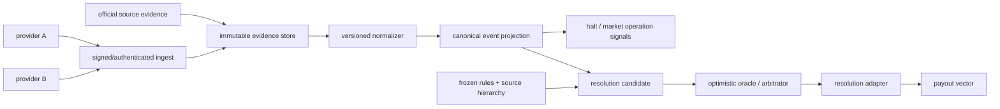
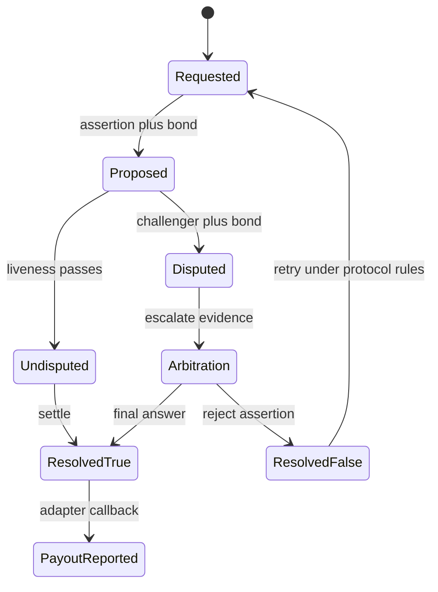

# 预测市场预言机、事件数据源与争议仲裁

<a id="oral-card"></a>

## 要点卡

[返回模块索引](./index.md)

!!! abstract "30 秒回答"

    预测市场要区分价格预言机、体育/电竞事件 feed 和最终 resolution oracle。数据供应商
    提供可验证的候选事实，不应直接拥有资金结算权限；冻结的市场规则决定采用哪个 source、
    何时可结算以及延期、取消、更正和歧义怎么处理。乐观预言机通常由提议者带 bond 提交结果，
    在 liveness 窗口内无人挑战才生效；有争议则升级到仲裁/backstop。系统要保存规则 hash、
    原始证据、供应商版本、提案/挑战和链上最终 payout，数据源宕机时宁可延迟结算，也不能
    猜一个结果。

**3 分钟展开**

1. **三层事实**：raw provider event → 规范化 candidate fact → oracle resolution；
   只有最后一层能授权 payout。
2. **规则先于数据**：source priority、end time、official/final 定义、延期/取消/更正规则
   在开盘前冻结，不能在看到结果后临时解释。
3. **乐观流程**：assert/propose + bond → liveness → undisputed final；若 dispute，则进入
   arbitration，再由 adapter 把最终结果报告给 condition。
4. **运营控制**：监控 source freshness、冲突、too-early proposal、challenge deadline、
   bond、dispute backlog 和 callback/链上写入。

| 记忆槽 | 内容 |
|--------|------|
| 三个不变量 | feed 不直接等于 payout；规则解释必须绑定冻结版本；争议未结束不得释放最终资金 |
| 手画图 | `providers → evidence store → normalizer → resolution request → propose/dispute → payout → redeem` |
| 项目落点 | 以体育赛事延期/官方更正为例说明 source lineage、规则版本、争议窗口和运营 runbook |
| 一个取舍 | 更长 liveness 和更高 bond 增强挑战激励，却降低用户兑付速度并提高资金成本 |

**错误表达**

- ❌ “接两家数据源做多数投票就可信；provider webhook 标记 final 后可以直接结算。”
- ✅ “多源只能提高可观测性，冲突仍要按预先冻结的 source hierarchy 和争议机制处理。”

**自测追问**：如果权威网站不可用、两家商业 feed 给出不同结果，你的系统由谁、依据什么做决定？

## 10 分钟版（数据链路 + 仲裁）

### 三类“预言机”不能混为一谈

| 类型 | 示例输入 | 典型用途 | 核心风险 |
|------|----------|----------|----------|
| Price oracle | 资产价格、指数、时间窗聚合值 | 风控、保证金、动态参数 | stale、操纵、decimal、deviation |
| Event data feed | 比分、赛程、选手、官方状态 | 展示、停盘、resolution evidence | 映射错、延期、更正、来源冲突 |
| Resolution oracle | 对冻结题面的最终回答 | 写入 outcome payout | too early、歧义、贿赂、无人挑战 |

价格 feed 也可能成为某类市场的 resolution source，但它必须按题面指定的资产、venue、
时间点、聚合方法和异常处理生成答案。不能因为同一服务叫 oracle，就复用一个
`latestPrice()` 解决所有现实事件。

### 事件数据接入模型



规范化记录至少保留：

```text
provider, provider_event_id, sport/league/season,
participants and stable IDs,
scheduled_at, effective_at, observed_at,
raw_status, normalized_status,
period/map/set, score, overtime/shootout,
provider_sequence or revision,
payload_hash, raw_evidence_uri,
normalizer_version
```

`observed_at` 是系统何时看到，`effective_at` 是数据声称何时生效，不能互换。重放历史时要使用
当时的 normalizer/rule version，不能用今天的映射静默改写过去。

### 体育/电竞最危险的是状态语义

- `ended` 可能只是现场比赛结束，不等于联赛官方结果不可更正。
- `postponed` 可能有新赛程；题面要定义延到何时仍属于同一市场。
- `cancelled/abandoned/no contest` 在不同运动和赛事规则下含义不同。
- 加时、点球、加赛、地图 handicap、best-of、选手替换是否计入，必须写进题面。
- 电竞供应商的 team/player ID、赛事层级和 map/set 结构易变化，不能用显示名关联资金市场。
- 时区、夏令时、跨午夜和赛程调整必须用带 offset 的时间与事件 revision 处理。

feed adapter 可以把状态规范化，但**不能越权补写题面没有定义的经济规则**。

### 乐观预言机生命周期



典型要素：

- **Claim/ancillary data**：必须足以定位 market、rules hash、outcome 和 resolution time。
- **Bond**：提高错误提案成本并激励 challenge；最低值不等于对高 TVL 市场足够。
- **Liveness**：给监控者取证和挑战的时间；窗口越短，快速兑付越好但漏判风险越高。
- **Dispute**：提交到协议指定的仲裁/backstop，例如 UMA DVM；不同 oracle 机制并不相同。
- **Callback/adapter**：只接受预期 oracle、预期 assertion/condition，且要幂等、防重入和可恢复。

官方示例里的 bond、默认 liveness 和结算耗时都是**协议版本/配置/示例相关值**。不要背成
“预测市场固定两小时结算”；应说参数依据市场价值、事实复杂度、监控覆盖和用户体验确定。

### 多源不是简单多数投票

三家 provider 可能复用同一上游，也可能一起错误映射赛事。更可靠的决策顺序是：

1. 市场规则指定 primary source 和精确查询对象。
2. secondary source 用于告警、取证或 primary unavailable 时的显式 fallback。
3. 冲突时进入人工/预言机 dispute，不让 normalizer 自行多数表决资金结果。
4. 保存每份 raw evidence、抓取时间、认证信息与内容 hash。
5. 任何 fallback 都必须是开盘前规则的一部分，或走有审计的治理/invalid 路径。

TLS、provider signature 和 payload hash 能证明“谁发送了什么”，不能证明现实事实必然正确。

### 市场规则如何绑定 resolution

建议把可读文档和机器字段一起内容寻址：

```text
rules_hash = H(
  normalized_question,
  outcomes,
  resolution_source_and_query,
  eligible_after,
  edge_cases,
  invalid_policy,
  rule_schema_version
)
```

`questionId`/oracle claim 应绑定该 hash 或不可变 URI。前端展示、API 下单、签名预览和
仲裁 evidence 都引用同一版本。若规则必须修订，应新建 market/condition 或执行预定义治理流程，
不能静默覆盖旧文档。

### 异常与降级

| 故障 | 默认动作 | 不能做 |
|------|----------|--------|
| provider stale | 告警，停止自动候选；按策略暂停新交易 | 沿用旧状态宣称 final |
| providers conflict | 记录 conflict，转人工/争议流程 | 自动取多数后兑付 |
| primary source unavailable | 等待或按冻结 fallback 取证 | 临时挑有利来源 |
| too-early proposal | watcher 立即 challenge | 因“看起来不会逆转”忽略窗口 |
| oracle callback 失败 | 保持已仲裁/待报告，幂等重试 | 重新创建语义不同的 condition |
| chain reorg | 回滚 payout projection，跟随 canonical state | 保留 orphan payout 为最终账本 |

“暂停交易”与“暂停 resolution”要分开。事件已确定但交易系统故障时可能仍应推进兑付；
数据不可信时则可能需要停盘并延迟 resolution。

## 生产监控与 Runbook

核心指标：

- provider freshness、revision lag、解析失败率、stable-ID 映射失败；
- 同一 event 的 source conflict 数、manual override 请求和规则缺失；
- proposal age、liveness remaining、bond adequacy、challenge 成功率、dispute backlog；
- oracle/adapter contract version、callback failure、payout report 与 redeem lag；
- 已结算市场的 late correction 数和用户/资金影响。

高价值市场应有独立 watcher，验证 proposal 是否满足 rules，而不是让 proposer 与
challenger 共用同一代码、同一账号、同一 provider 和同一故障域。

## 排查与工具

从 market 的 `rules_hash` 开始，拉出所有 raw provider payload、normalized revisions、
official evidence、proposal/assertion ID、bond、challenge deadline、dispute transaction、
arbitration result、adapter callback 和 CTF payout。每一步都保留 block hash 与 canonical
状态。人工操作只追加 case/decision，不改写原始证据。

## 架构取舍

单一权威源清晰但可用性和治理集中；多源增强监控却增加映射与冲突处理。乐观机制在多数
无争议市场中效率高，但安全性依赖经济参数、watcher 活跃度和 backstop。对复杂、主观或
低可验证事件，应提高 bond/liveness、缩小市场限额，甚至不开放，而不是用技术名词掩盖
不可裁决性。

## 深挖问答

1. **比分 provider 能直接结算吗？** → 不应；它提供 evidence/candidate，最终 payout 由冻结规则和 oracle 流程授权。
2. **两家数据源一致就够吗？** → 不够证明独立与正确；要看 source lineage、规则优先级和争议路径。
3. **乐观预言机为何安全？** → 依靠可挑战窗口、bond 激励、监控者和仲裁 backstop；参数不当或无人监控仍会失败。
4. **官方结果后续更正怎么办？** → 按开盘前规则判断 finality/correction window；链上已最终 resolve 后不能由后端静默改 payout。
5. **provider 宕机是否要停盘？** → 按 source freshness 与风险策略决定；至少停止自动 resolution，是否停交易取决于信息不对称风险。
6. **价格 oracle 和 event oracle 有什么差别？** → 一个通常回答可连续观测数值，另一个解释离散现实事件；数据模型、操纵面和仲裁方式不同。

## 反模式与事故

- 把 provider 的 `final=true` 直接映射为赢家 token 兑付。
- 用显示名和开赛时间匹配赛事，重赛或同名队伍导致串场。
- proposer 与 watcher 共用同一 provider/部署/私钥，单点错误无人挑战。
- 把测试示例的短 liveness 和零/低 bond 带到高价值主网市场。
- 规则文档可在线编辑但 questionId 不变，争议时无法证明用户交易时看到的版本。
- 只监控 oracle transaction 成功，不监控 challenge deadline、冲突和 callback 结果。

## 合规与供应商边界

体育/电竞数据可能受许可、再分发和地域条款约束；预测市场本身也可能受司法辖区限制。
本题只讨论技术架构与风险控制，不构成法律意见。上线前需由法务/合规确认数据权利、
产品准入、用户限制、市场类型和留存要求。

## 延伸阅读

- [Polymarket Resolution](https://docs.polymarket.com/concepts/resolution)
- [UMA Oracle Lifecycle](https://docs.uma.xyz/protocol-overview/how-does-umas-oracle-work)
- [UMA Bond and Liveness](https://docs.uma.xyz/developers/setting-custom-bond-and-liveness-parameters)
- [UMA OOV3 Data Asserter](https://docs.uma.xyz/developers/optimistic-oracle-v3/data-asserter)
- [S-EXCH-23 CTF 与市场生命周期](./S-EXCH-23-prediction-market-ctf-lifecycle.md)
- [S-BC-05 Indexer 与 Reorg](../12-blockchain-web3/S-BC-05-indexer-reorg.md)
