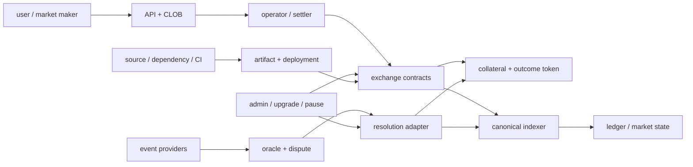
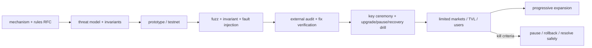

# 预测市场安全不变量、测试矩阵与主网上线

<a id="oral-card"></a>

## 口述卡（高频必背）

[返回模块索引](./index.md)

!!! abstract "30 秒回答"

    我不会从“列出重入和签名重放”开始，而是先写资金与状态不变量：抵押物和 outcome
    position 守恒，订单不超量、价格不劣化、费用不越界，取消/成交单调，resolution 只能按
    冻结规则通过授权 oracle 最终一次写入，重组不能留下孤块资金事实。然后按合约、CLOB、
    signer/operator、数据源/oracle、indexer、升级和运营后台建立威胁模型，用 unit、fuzz、
    invariant、差分模型、fork/localnet 故障注入、升级兼容、压测和安全演练逐层取证。审计是
    上线门禁之一，不是安全证明；主网还要限额灰度、独立密钥、监控、暂停/退出和事故预案。

**3 分钟展开**

1. **不变量优先**：资产守恒、order authorization、fill/cancel 单调、唯一 resolution、
   canonical settlement 和账本对账。
2. **攻击面分层**：恶意 token/hook、ECDSA/ERC-1271、operator 越权、oracle 早报/错报、
   admin/upgrade、RPC/indexer reorg、CI/供应链和后台账号。
3. **测试分层**：单测规则向量；fuzz 输入；stateful invariant；参考模型差分；fork/localnet
   重组、宕机、升级；外审和修复复验；演练 pause/rotate/recover。
4. **渐进上线**：冻结机制与权限矩阵，小 TVL/少市场 canary，指标和 kill criteria 达标后
   扩容；任何硬编码时间/限额都由风险评审得出，不背行业“标准值”。

| 记忆槽 | 内容 |
|--------|------|
| 三个不变量 | 资金守恒；签名授权不能被扩大；orphan/争议状态不能成为最终余额 |
| 手画图 | `rules/order/data → CLOB/operator → contracts/oracle → indexer/ledger`，每个边界标攻击者和恢复动作 |
| 项目落点 | 用 Launchpad 类 DEX 的合约审计、索引重组、对账和发布治理举例；明确预测市场部分是迁移设计而非既有生产履历 |
| 一个取舍 | 精细 market/user pause 缩小事故面但状态更复杂；global pause 简单却可能阻断撤单和用户退出 |

**错误表达**

- ❌ “通过两家审计且合约不可升级就安全了；链上结算不会出现重复或回滚。”
- ✅ “审计覆盖特定 commit 和范围；不可升级也会固化缺陷，链上仍有重组、治理、预言机和外围系统风险。”

**自测追问**：如果攻击者拿不到私钥和管理员权限，仍能通过哪些路径造成错误结算或资金损失？

## 10 分钟版（威胁模型 + 上线门禁）

### 先定义系统与攻击者



至少考虑：

- 普通用户、做市商、恶意 order signer、恶意 ERC-1271 wallet；
- 被入侵或作恶的 operator、oracle proposer/challenger、数据供应商；
- 被盗后台账号、admin/safe signer、CI/deployer；
- 不一致 RPC、重组链、审查/拥堵、恶意 collateral/ERC-1155 receiver；
- 内部误操作、版本漂移和事故中“带着旧状态重试”的自动化。

威胁模型要绑定代码 commit、部署拓扑、合约地址、oracle/adapter 和权限版本；架构变化后旧审计
不能自动覆盖新系统。

### 核心安全不变量

| 域 | 可测试不变量 |
|----|--------------|
| Collateral/CTF | split/merge/redeem 后总 claim 不超过有效抵押物；完整 set 守恒 |
| Order authorization | digest 唯一绑定 domain 与全部经济字段；执行 signer 当前有效 |
| Fill | `0 ≤ filled ≤ signed amount`；部分成交累计不 overfill |
| Price | 用户实际支出/获得不劣于签名 limit；不用浮点 |
| Fee | fee 非负且不超过签名/协议允许上限；取整方向显式 |
| Cancel/status | cancel、filled、resolved 等终态单调；重启/重放不能复活订单 |
| Resolution | 只接受绑定 rules/condition 的授权结果；payout vector 合法且只能最终写入一次 |
| Settlement | tentative match 不记最终资产；finalized projection 可由 canonical block lineage 证明 |
| Ledger | 每资产双分录守恒；reorg 用 reversal/compensation，不静默 UPDATE 历史 |
| Availability | pause 后禁止风险扩大，同时保留产品承诺的撤单、查询、redeem/退出路径 |

不变量应落成测试和监控。只写“防重入、做鉴权”无法判断一个修复是否真正守住资金边界。

### 主要攻击路径与控制

#### 1. 签名与订单

- domain/字段遗漏导致跨链、跨合约或“批 A 签 B”；
- salt/timestamp/nonce 唯一但 order status 未记录，仍可重复 fill；
- EOA malleability、错误 `ecrecover`；ERC-1271 验证结果随合约状态变化；
- amount/side/tokenId 编码或 SDK 与合约 type hash 不一致；
- partial fill、rounding、fee 和 batch 累加产生 overfill/价值泄漏。

控制：官方/审计密码库、golden vectors、链上 fill status、signed economic bounds、全组合
fuzz/invariant、SDK/合约跨语言差分测试。

#### 2. 资产与外部调用

- 恶意/非标准 ERC-20、转账税、回调、返回值异常；
- ERC-1155 receiver hook 或 adapter 外部调用引入重入和状态交错；
- approval 过大、adapter/collateral 地址替换、余额前后差异常；
- mint/merge 路径选错 condition/token，资产仍“守恒”但给错市场。

控制：checks-effects-interactions、最小允许资产集合、余额差验证、明确 callback/reentrancy
假设、condition-token registry/derivation 验证和 malicious-token harness。`onlyOperator`
减少入口但不能自动证明所有外部调用无重入风险。

#### 3. Operator、CLOB 与交易公平

- sequencer 双主、WAL/数据库恢复水位不一致，重复 match；
- operator 越过 price/fee/fill 限制，审查撤单，选择性延迟或抢跑；
- settlement key 被盗，批量提交合法格式的恶意计划；
- market data gap 使做市商在错误盘口交易。

控制：单写者/fencing、确定性 WAL 回放、链上经济约束、细粒度限额、独立 signer policy、
可审计 sequence、用户可取消/暂停/退出和市场数据 gap recovery。

#### 4. Oracle 与事件数据

- too-early/wrong proposal 无人 challenge；
- proposer 和 watcher 共享同一 provider/故障域；
- 题面/规则可变、source ID 映射错、赛事 correction 未处理；
- oracle callback 重放、错误 condition 或 adapter 升级错配。

控制：rules hash、独立 watcher、bond/liveness 风险参数、callback caller/assertion/condition
校验、一次性 resolution 和争议演练。

#### 5. Admin、升级与供应链

- proxy 未初始化/重复初始化、storage layout 冲突、升级后 domain/订单兼容错误；
- pause/upgrader/operator 权限过大或由同一密钥控制；
- 前端/SDK、合约 artifact、deployer 参数或依赖被投毒；
- 外审后的 commit 与实际上线 bytecode 不一致。

控制：初始化锁、storage layout/upgrade tests、timelock/multisig/职责分离、artifact digest 和
provenance、verified source/bytecode、部署参数复核、fork rehearsal 和旧订单迁移计划。

### 测试矩阵

| 层 | 覆盖内容 | 关键证据 |
|----|----------|----------|
| Unit / rule vector | hash、price、fee、fill、CTF、状态机、权限 | 明确输入输出和 revert reason |
| Fuzz | 任意 amount、partition、签名、batch、rounding | 不 panic/revert 泄漏 + 业务 invariant |
| Stateful invariant | 随机 split/match/cancel/resolve/redeem 序列 | 资产、fill、终态长期成立 |
| Differential model | Solidity 对照简化参考模型/Go matcher | 同一命令序列结果一致 |
| Fork/localnet | 真实依赖、恶意 token、reorg、RPC failover | canonical 恢复和 tx unknown outcome |
| Upgrade compatibility | storage、domain、旧订单、旧 position/adapter | 升级前后资产与订单迁移矩阵 |
| Load/soak | 热市场、批量 settlement、oracle 高峰、背压 | P99/P999、队列、gas、失败恢复 |
| Security exercise | key compromise、错误 proposal、pause、rollback | runbook 时间线与证据完整性 |
| External audit | 指定 commit/范围的独立审查和修复复验 | 报告、issue disposition、最终 commit |

覆盖率百分比不能替代状态空间。预测市场尤其要生成：

- 同一 order 多次部分成交、取消与结算并发；
- complementary/mint/merge 混合 batch；
- 极小金额、最大金额、边界 fee 与多次向下取整；
- resolution 前后 split/merge/redeem 的合法/非法调用；
- callback、恶意 token、pause、upgrade 与 reorg 交错序列。

### 主网上线门禁



上线前清单：

1. **机制冻结**：market types、CTF/neg-risk、order/fee/cancel、resolution 和 invalid policy。
2. **信任矩阵**：operator、oracle、admin、upgrader、pauser、signer、data provider 的能力和退出路径。
3. **资产范围**：允许 collateral、decimals、adapter、approval 和最大 exposure。
4. **代码证据**：测试、静态分析、fuzz/invariant、外审修复复验、deployed bytecode 对应 commit。
5. **密钥与发布**：独立环境、multisig/timelock、key ceremony、artifact digest、参数双人复核。
6. **运行手册**：provider stale、错误 proposal、operator key compromise、链拥堵/reorg、
   indexer lag、合约 pause、升级失败和用户沟通。
7. **Canary**：少量市场/抵押物/用户和明确限额；先验证完整 create→trade→resolve→redeem 闭环。
8. **退出与恢复**：暂停后用户还能做什么、未结算订单如何处理、争议如何继续、资产如何赎回。

### 指标与 kill criteria

不要等“已经损失”才暂停。可定义：

- order reject/signature failure/settlement revert 突增；
- fill ledger 与链上 `OrderStatus`/资产余额不一致；
- collateral coverage 或 position supply invariant 破坏；
- indexer finality lag、RPC disagreement、reorg 深度超出运行假设；
- event source stale/conflict、oracle challenge deadline 无 watcher；
- admin/operator/signer 异常调用、配置或 bytecode digest 漂移；
- P99 settlement、queue age、gas 或失败重试超过容量预算。

阈值由 TVL、链特性、流动性和恢复时间目标确定；正文不提供虚假的通用“安全数字”。

### 新链生态依赖不完善怎么办

建立 capability matrix：finality/reorg、RPC 方法、event/log、fee、nonce、simulation、
contract verification、multisig/timelock、indexer、fork/localnet 和 explorer。对缺口：

- pin SDK/node/compiler 版本和 checksums，保存签名/交易/事件 golden vectors；
- adapter conformance test 验证 chain ID、地址、decimal、receipt/finality 和错误分类；
- vendoring/fork 必须记录 upstream commit、patch、许可证和升级策略；
- 主网升级前在 fork/localnet 重放历史订单、结算和 resolution；
- 能力不满足安全不变量时缩小功能或不上线，不能用人工值守代替永久控制。

## 事故响应

优先停止风险扩大、保留证据和用户退出能力：

```text
detect → scope → precise pause → protect keys/funds
       → preserve chain/order/oracle evidence
       → reconcile canonical state
       → fix + independent review
       → controlled resume + postmortem
```

暂停粒度可包括 user、market、operator、oracle adapter、global trading；但每种 pause 对
撤单、在途 settlement、resolve 和 redeem 的影响必须预先测试。事故中不要升级未知代码、
删除原始账本或反复重发 unknown transaction。

## 架构取舍

不可升级减少治理攻击面，却可能无法修复已部署缺陷；可升级提高恢复能力，但引入 admin、
storage 和订单兼容风险。合理答案不是绝对选择，而是结合合约职责、TVL、退出能力、timelock、
审计和迁移路径说明残余风险。operator-only 也不是“安全结论”，只是一个必须公开的信任模型。

## 追问链

1. **安全审计通过是否可主网？** → 还需修复复验、部署一致性、密钥/权限、运行监控、灰度和事故演练。
2. **最重要的预测市场不变量是什么？** → 资金/position 守恒、订单授权不扩大、唯一合法 resolution、canonical 结算与账本一致。
3. **如何测试签名重放？** → 跨 chain/domain/contract/version、重复 order hash、部分成交、取消、epoch 和 ERC-1271 状态变化组合。
4. **暂停是否越快越好？** → 要快且精确；错误 global pause 可能阻断撤单/兑付，所有路径需预演。
5. **不可升级更安全吗？** → 减少 admin 面但固化缺陷；要结合资产退出和迁移能力评估。
6. **如何证明实际上线的是审计版本？** → source commit、构建环境、artifact digest、部署参数、bytecode 验证和治理交易形成证据链。

## 反模式与事故

- 只做 happy-path 单测和覆盖率统计，没有 stateful invariant。
- 把 `onlyOperator` 当成验签、价格、fee、重入和资产检查的替代品。
- 外审后继续改合约/编译器/依赖，却沿用旧报告宣传。
- 只暂停 API，旧签名和 operator 仍可链上执行。
- 升级改变 EIP-712 domain/order struct，却没有旧订单失效与迁移计划。
- indexer 把 orphan settlement 写成最终账本，之后靠人工 UPDATE 抹平。
- 数据源、oracle proposer 和 watcher 同故障域，错误结果无人挑战。

## 延伸阅读

- [Polymarket CTF Exchange V2 and Audits](https://github.com/Polymarket/ctf-exchange-v2)
- [Solidity Security Considerations](https://docs.soliditylang.org/en/latest/security-considerations.html)
- [OpenZeppelin Upgradeable Contracts](https://docs.openzeppelin.com/upgrades-plugins/writing-upgradeable)
- [OWASP Smart Contract Security Verification Standard](https://scs.owasp.org/SCSVS/)
- [S-SEC-01 Web3 威胁建模](../21-security-engineering/S-SEC-01-web3-threat-model-iam-trust-boundaries.md)
- [S-SEC-04 安全测试与事件响应](../21-security-engineering/S-SEC-04-security-testing-incident-response.md)
- [S-EXCH-25 预言机与争议仲裁](./S-EXCH-25-prediction-market-oracle-dispute-resolution.md)
