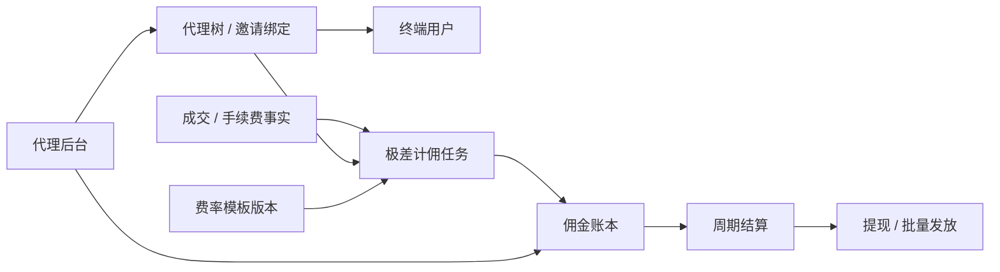

!!! tip "⭐ 重点专题"
    Web3 交易所 / 钱包方向可对照 [重点专题](../../web3-exchange-wallet-focus.md)；
    Launchpad 链上分账与提现见 [S-EXCH-12](./S-EXCH-12-token-launch-rebate.md)。

# CEX/DEX 多级代理：极差费率、计佣账本与后台隔离

## 要点速览 {#oral-card}

| 槽位 | 内容 |
|------|------|
| 一句话 | 多级代理的核心不是“抽成百分比”，而是 **代理树 + 极差费率 + 佣金账本 + 提现风控** |
| 计佣公式 | 每一级佣金来自正差：`rate(self) - rate(child)`，再乘约定基数（成交额或手续费口径） |
| 输入事实 | CEX 用成交/手续费 ledger；DEX 用 Indexer 的 canonical 成交/分账事件 |
| 四条链路 | 绑定关系 → 异步计佣 → 账本结算 → Admin subtree 隔离 |
| 失败边界 | 退费/撤单/reorg 必须跨级冲正；禁止用余额字段直接加减替代分录 |

## 30 秒版（开场）

> 多级代理极差分润 = 沿代理链向上，把每一级的 **有效费率差** 拆成多笔佣金分录。
> 计佣只消费已确认的成交/手续费事实，绑定 **费率模板版本** 与幂等键；结算进独立佣金账本，
> 再走提现风控。CEX 与 DEX 的差别主要在事实来源（撮合 ledger vs 链上事件 + reorg），
> 不在“要不要做账本”。生产关键词：**代理树、极差、规则版本、冲正、subtree 隔离**。

## 3 分钟版

1. **是什么**：邀请/代理关系形成有向树；用户成交后，系统按链路计算各级极差并入佣金账本。
2. **为什么**：增长渠道要可结算、可审计、可防刷；费率差价比固定层层抽成更容易与 VIP/活动费率共存。
3. **怎么做**：
   - **关系域**：绑定、改绑、深度上限、防自邀闭环
   - **计佣域**：消费 Trade/Fee 或 canonical Swap 事件，按模板版本拆分录
   - **账本域**：累计、周期结算、可提现、冲正、对账
   - **后台域**：代理只能查询自己 subtree 的成交与佣金

## 10 分钟版（架构与极差）



### 1. 代理树与绑定

| 规则点 | 工程含义 |
|--------|----------|
| 归因 | 注册时绑定邀请码/代理 UID；首次归因后是否允许改绑要产品化 |
| 深度 | 例如最多 N 级；超深截断或拒绝绑定 |
| 防闭环 | 禁止把上级绑到自己的下级，形成环 |
| 生效时间 | 绑定变更只影响变更后的新成交，或按成交时刻快照代理链 |

关系表建议保存：`user_id`、`parent_agent_id`、`bind_at`、`policy_scope`、`status`。
计佣时不要每次 DFS 现算整棵树：可对“成交时刻的代理链”做快照，或用物化路径。

### 2. 极差费率（Tiered Rate Spread）

设代理链从用户向上为 `A0(用户成交费率) ← A1 ← A2 ← A3`，每一级有 **有效费率**
`r1, r2, r3`（已叠加代理专属模板、VIP、活动后的结果）。

常见两种口径（必须写进规则版本，不能混用）：

| 口径 | 第 i 级佣金（示意） | 适用 |
|------|---------------------|------|
| 成交额 × 费率差 | `notional * max(r_i - r_{i-1}, 0)` | 现货/合约按名义成交额计佣 |
| 手续费差 | 与“平台实收手续费在费率维度上的差”对齐 | 更贴近毛利，需定义折扣/抵扣顺序 |

不变量：

1. **只发正差**：`delta = r_i - r_child`；`delta <= 0` 则该级为 0，不出现负佣金自动倒挂（除非产品明确支持且单独做负债科目）。
2. **费率栈有优先级**：代理专属费率、VIP、活动折扣的叠加顺序固定，并写入 `policy_version`。
3. **计佣与交易账本分离**：交易 ledger 记用户与平台手续费；佣金 ledger 记应付代理负债。不要在同一余额字段上“又扣手续费又加返佣”却无分录。

```go
// 示意：按代理链从近到远拆极差；金额使用定点整数。
func SplitTierSpread(notional int64, rates []int64 /* 1e8 = 100% */) []int64 {
    out := make([]int64, len(rates))
    child := int64(0) // 或从用户成交费率起算，按产品定义
    for i, r := range rates {
        if d := r - child; d > 0 {
            out[i] = notional * d / 1e8
        }
        child = r
    }
    return out
}
```

真实系统还要处理：maker/taker 不同费率、手续费币种、负 maker rebate、自成交剔除、
合约与现货模板是否隔离。

### 3. 计佣任务（异步）

推荐链路：

1. 输入：`trade_id` / `fill_id` 或 DEX 的 `(tx_hash, log_index)` + canonical 标记
2. 读取成交时刻的代理链快照与 `policy_version`
3. 计算各级佣金，生成确定性 `commission_id`（例如 hash(trade_id, agent_id, policy_version, leg)）
4. 同一事务写入 append-only 佣金分录；依赖唯一键做幂等
5. 退费、撤单部分成交、DEX reorg：发 **冲正分录**，禁止原地改历史金额

CEX 输入通常来自 [S-EXCH-03](./S-EXCH-03-account-ledger.md) 的手续费事实或 TradeEvent；
DEX 输入必须先过 [S-BC-05](../12-blockchain-web3/S-BC-05-indexer-reorg.md) 的确认/reorg，
再进入计佣，否则会把 orphan 成交计成应付佣金。

### 4. 佣金账本与结算

| 概念 | 说明 |
|------|------|
| 应付分录 | 计佣产生的负债，状态 `accrued` |
| 结算批次 | 按日/周切批，把 accrued 转为 `settled` |
| 可提现余额 | 结算后进入代理资金账户；提现另走状态机 |
| 对账 | 成交手续费池 vs 佣金合计 vs 平台留存；按资产、周期、policy_version 勾对 |

提现可复用钱包/Vault 能力：CEX 多为内部余额出金；DEX/Launchpad 常接
[S-EXCH-12](./S-EXCH-12-token-launch-rebate.md) 的 Withdrawal/批量发放。两者都要额度、
黑名单、双人复核或风控策略，见 [S-EXCH-05](./S-EXCH-05-risk-reconciliation.md)。

### 5. 代理后台隔离

- 授权模型按 **subtree**：代理 P 只能看 `descendant(P)` 的用户成交与佣金
- 列表接口强制 `agent_id IN subtree(P)`，禁止只靠前端隐藏
- 导出、Webhook、开放 API 同样带数据域；运营超管操作要审计留痕
- 下级代理不可见上级差价明细时，返回聚合佣金而非完整费率表

## CEX vs DEX 对照

| 维度 | CEX | DEX / Launchpad |
|------|-----|-----------------|
| 事实源 | 撮合成交、fee ledger、TradeEvent | Swap/SplitPayment 事件 + Indexer |
| 确认 | 成交即内部最终（仍可能冲正） | 需确认数；reorg 要回滚计佣 |
| 极差 | 代理有效手续费费率差 | 同样极差，但常绑产品分账比例/模板 |
| 出金 | 内部余额 / 提现单 | Vault、claim、Merkle、批量打款 |
| 服务边界 | Affiliate 靠近账务与用户中心 | Rebate 靠近 Indexer / Admin / 链上出金 |

## 生产场景

- **费率变更**：新模板只作用于生效后成交；在途结算批次冻结旧版本口径
- **改绑**：明确“变更后新生效”或“冷却期”；计佣始终读成交时刻快照
- **刷量/对倒**：关联账户、自成交、异常返佣率告警；必要时延迟结算
- **高峰**：计佣消费者按 trade 分区；积压时先保幂等与顺序，再扩容
- **对账不平**：先按资产与周期隔离，暂停该代理提现，不直接改成交账本“抹平”

## 排查与工具

- 单笔成交：`trade_id` → 代理链快照 → `policy_version` → 各腿 `commission_id`
- 代理投诉少发：核对该级有效费率是否被 VIP/活动压到无正差
- 重复到账：查唯一键冲突与“冲正 + 重计”是否成对
- DEX 多发：查 orphan 成交是否仍 canonical

## 架构取舍

| 方案 | 适用 | 代价 |
|------|------|------|
| 极差费率 | 多级 Partner、可配专属费率 | 费率栈与版本治理复杂 |
| 固定比例层层抽 | 规则简单 | 易与 VIP/活动冲突，毛利难控 |
| 纯链上分账 | 透明、少信任 | Gas、灵活性差，改规则贵 |
| 链下账本 + 批量出金 | 灵活、易对账 | 要强审计与提现风控 |

## 深挖问答

1. **极差和固定抽成差在哪？** → 极差发的是费率差价；下级费率上浮会压缩上级空间，而不是永远抽固定成。
2. **为什么计佣要异步？** → 成交热路径不应同步拆多级账；用事实事件 + 幂等消费者更稳。
3. **退费怎么处理？** → 按原 `commission_id` 关联发冲正分录，结算前扣减，已提现则进追回/挂账流程。
4. **DEX reorg？** → 先标记 orphan，冲正佣金，再按新 canonical 重放；不能只删余额。
5. **如何证明没漏隔级数据？** → Admin API 强制 subtree 谓词 + 集成测试覆盖越权查询。

## 反模式

- 用 `UPDATE agents SET balance = balance + x` 代替佣金分录
- 计佣时现场递归查库拼代理链，无成交时刻快照
- 活动折扣与代理费率叠加顺序未定义，导致佣金 > 平台毛利
- 把 Indexer 未确认事件直接计佣
- 代理后台只靠前端过滤 UID
- 冲正时物理删除历史分录

## 延伸阅读

- [S-EXCH-03 账户与复式记账](./S-EXCH-03-account-ledger.md)
- [S-EXCH-05 风控与对账](./S-EXCH-05-risk-reconciliation.md)
- [S-EXCH-12 Token 发行、分账与返佣提现](./S-EXCH-12-token-launch-rebate.md)
- [S-EXCH-14 Web3 交易所全栈](./S-EXCH-14-web3-exchange-fullstack-architecture.md)
- [S-BC-05 Indexer 与 reorg](../12-blockchain-web3/S-BC-05-indexer-reorg.md)
- [S-ARCH-04 幂等](../03-system-design/S-ARCH-04-idempotency.md)
- [S-RAB-01 / Kafka 交易事件总线](../middleware/rabbitmq/S-RAB-01-exchange-async-pipeline.md)
