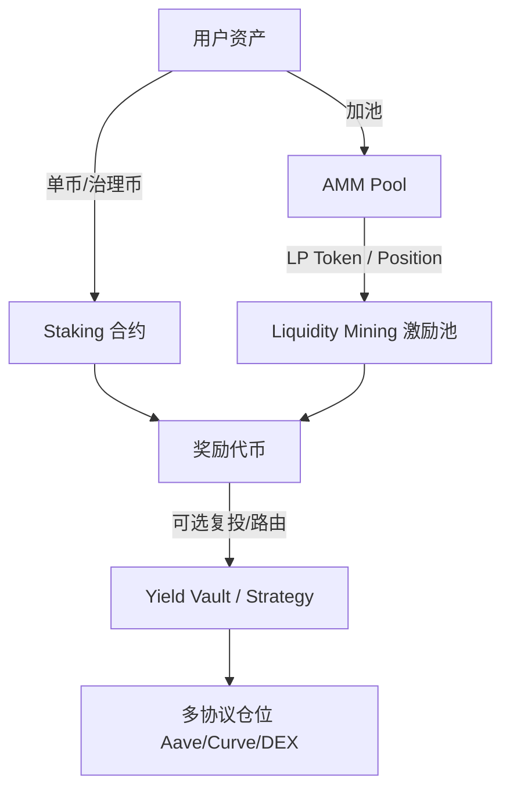
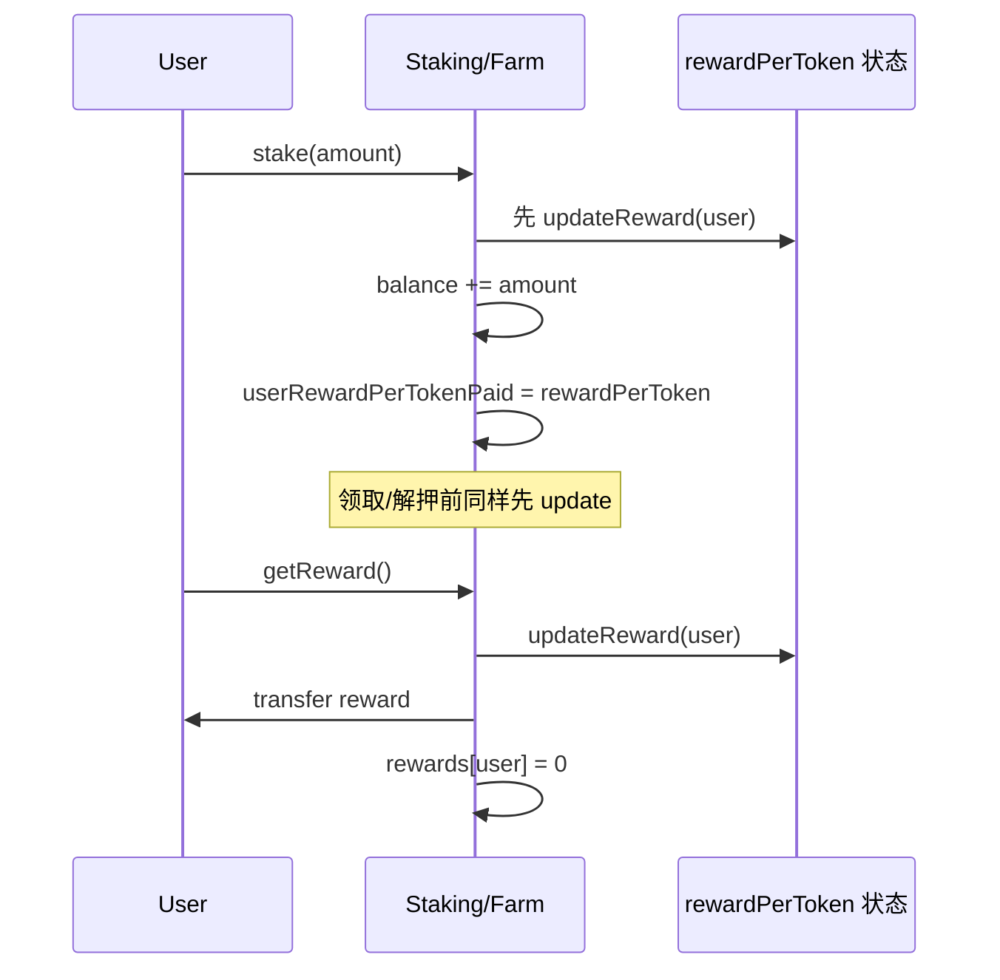
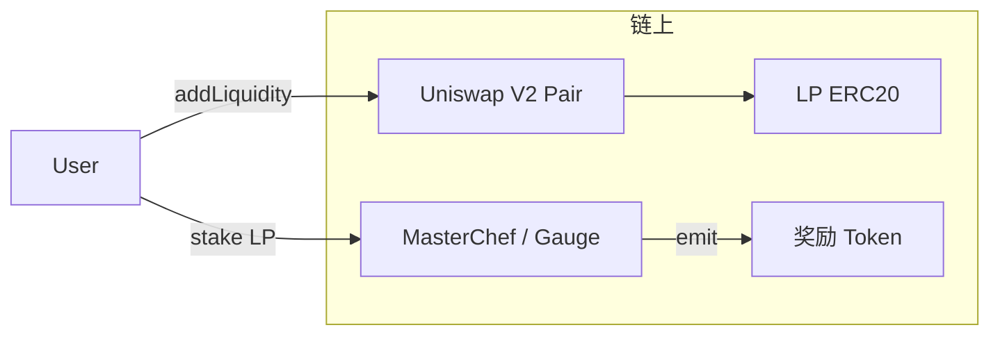

# DeFi Staking、流动性挖矿与 Yield Farming

<a id="oral-card"></a>

## 口述卡（高频必背）

[返回模块索引](./index.md)

!!! abstract "30 秒回答"

    DeFi 激励有三条常见路径，不要混为一谈：**Staking** 通常是把单币或 LP 份额锁进合约换取协议奖励；
    **Liquidity Mining** 是用 LP Token 证明你为某交易对提供了流动性，再按份额挖协议代币；
    **Yield Farming** 是更广的收益聚合：质押、借贷、再质押、自动复投，目标是提高资本收益率。
    Tech Lead 必须讲清：**奖励会计不变量、排放曲线、领取/复投安全、闪电贷刷量、与 AMM 的边界**。

**3 分钟展开**

1. **凭证**：单币 stake 用原生 token；流动性挖矿常用 **ERC-20 LP token**（V2）或 **position NFT**（V3，需额外适配）。
2. **会计**：主流是 **rewardPerToken 累计 + user debt**（Synthetix/MasterChef 风格），避免每块遍历所有用户。
3. **排放**：`rewardRate * time` 或按 epoch/block 发币；要定义开始/结束、总量帽、紧急暂停。
4. **攻击面**：重入领取、奖励膨胀、假 LP、闪电贷瞬时流动性刷积分、oracle 操纵加权 APR。
5. **产品边界**：链上权威是合约余额与奖励状态；后端 APR/TVL 只是投影，必须可重建。

| 记忆槽 | 内容 |
|--------|------|
| 一句话 | Stake=锁仓换奖励；LM=凭 LP 挖币；Farm=多策略收益组合 |
| 会计公式 | `earned = balance * (rewardPerToken - userRewardPerTokenPaid) / 1e18 + rewards` |
| Tech Lead 门禁 | 排放可暂停、领取 CEI、假池过滤、APR 标注口径 |
| 易错点 | 把 PoS 验证者 Staking 和 DeFi LP Staking 当成一回事 |

## 30 秒版（开场）

> DEX Tech Lead 面试里，「Staking / 挖矿 / Farming」考的不是背名词，而是：**奖励怎么公平累计、谁有资格领取、排放怎么停、如何防刷**，以及链下 Indexer 如何投影 APR 而不误导用户。

## 3 分钟版（一面深度）

1. **是什么**
   - **Staking（DeFi）**：用户把资产转入质押合约，按时间/份额拿奖励；可能有锁定期、解质押冷却。
   - **Liquidity Mining**：用户向 AMM 提供流动性，拿 LP 凭证再质押到激励合约，按 LP 份额分协议代币。
   - **Yield Farming**：在多个协议间组合收益（挖矿 → 卖币复投 → 借贷循环），常由 Vault/Strategy 封装。
2. **为什么**：DEX 冷启动要激励深度；治理代币分发；用户留存。错误设计会制造 **假 TVL、刷量、不可持续通胀**。
3. **怎么做**：链上用 **MasterChef / StakingRewards** 类合约；链下索引 `Deposit/Withdraw/RewardPaid`；前端展示 **APR 口径与风险提示**。

## 10 分钟版（原理 + 图示）

### 三者关系



| 概念 | 质押物 | 收益来源 | 典型风险 |
|------|--------|----------|----------|
| Staking | 单币 / 带锁仓凭证 | 协议排放、手续费分成 | 锁仓机会成本、奖励币砸盘 |
| Liquidity Mining | LP Token / V3 NFT | 排放 + swap fee | 无常损失、假池、刷量 |
| Yield Farming | Vault share | 多策略收益 | 策略合约风险、复杂敞口 |

> 注意：知识库 [S-NODE-03](../19-node-rpc-staking/S-NODE-03-validator-staking-slashing-keys.md) 讲的是 **PoS 验证者 Staking / Slashing**，本篇讲 **DeFi 应用层激励**，面试要先澄清语境。

### 奖励会计（面试必画）

目标：O(1) 更新，不遍历所有 staker。



**核心状态（简化）**

| 变量 | 含义 |
|------|------|
| `totalSupply` | 当前质押总量 |
| `rewardRate` | 每秒（或每块）奖励发放速率 |
| `rewardPerTokenStored` | 全局累计「每单位质押已发奖励」 |
| `user.balance` | 用户质押量 |
| `user.rewardPerTokenPaid` | 用户上次结算时的全局累计值 |
| `user.rewards` | 用户已结算未领取奖励 |

**伪代码**

```solidity
function rewardPerToken() public view returns (uint256) {
    if (totalSupply == 0) return rewardPerTokenStored;
    return rewardPerTokenStored
        + (lastTimeRewardApplicable() - lastUpdateTime)
          * rewardRate * 1e18 / totalSupply;
}

function earned(address account) public view returns (uint256) {
    return balanceOf(account)
        * (rewardPerToken() - userRewardPerTokenPaid[account]) / 1e18
        + rewards[account];
}
```

### 流动性挖矿与 AMM 的衔接



| V2 | V3 |
|----|----|
| LP 可替代，激励合约按 `balanceOf(LP)` 简单 | Position 是 NFT，需 **按 liquidity / in-range 时长加权** 或专用 Gauge |
| `Sync` 事件易索引 TVL | 需 tick + position 状态，APR 计算更重 |

详见 [S-EXCH-06](./S-EXCH-06-dex-amm-liquidity.md)、[S-EXCH-30](./S-EXCH-30-uniswap-v2-v3-protocol.md)。

### 排放曲线与治理

| 模式 | 说明 | Tech Lead 关注点 |
|------|------|------------------|
| 固定时长线性排放 | `rewardRate = total / duration` | 到期后如何续期、通知前端 |
| 按块减半 / epoch | 类似比特币式衰减 | 跨链块时间差异（BNB vs ETH） |
| Gauge 投票 | 用户锁治理币决定池权重 | 贿选、吸血鬼攻击、权重操纵 |
| Boost | veToken 提升个人挖矿系数 | 计算复杂度、前端展示公平性 |

### 攻击与安全清单

| 攻击 | 手法 | 防御 |
|------|------|------|
| 重入领取 | `getReward` 先转账再清零 | CEI、`nonReentrant` |
| 闪电贷刷积分 | 借入 → 大额 stake → 同块领奖/记账 → 还贷 | 同块限制、时间加权、snapshot、禁止瞬时份额 |
| 假 LP / 假池 | 自建无交易量池刷 TVL | Factory 白名单、init code hash、交易量门槛 |
| 奖励代币可被恶意回调 | fee-on-transfer / 恶意 ERC20 | 安全 transfer 包装、token 白名单 |
| 治理紧急提现误用 | owner 可抽走用户本金 | 权限分离：只能停排放，不能动用户 stake |

### 链下系统职责（Go / Indexer）

| 组件 | 职责 |
|------|------|
| Indexer | 索引 `Staked/Withdrawn/RewardPaid/PoolAdd`；处理 reorg |
| APR 服务 | `rewardRate * price / stakedTVL`；标注 **不含 IL / 含 IL** 口径 |
| 风控看板 | 单池排放占比、奖励解锁抛压、异常瞬时 TVL |
| 告警 | 排放合约余额不足、`rewardRate=0` 未续期 |

APR 是 **瞬时估计**，不是承诺收益；产品文案与合规口径要由 Tech Lead 拍板。

## 生产场景

| 场景 | 现象 | 处理 |
|------|------|------|
| 新池上线挖矿 | TVL 暴涨后第二天撤离 | 阶梯排放、锁仓、交易量门槛 |
| 奖励币价格崩 | 真实 APR 骤降 | 前端实时价、暂停错误高 APR |
| 跨链 Farm | 同逻辑多链部署 | 每链独立排放库存，禁止跨链重复计分 |
| Vault 策略 tip | 策略合约被盗 | 限额、timelock、多签、紧急暂停 |

## 排查与工具

| 工具 | 看什么 |
|------|--------|
| 合约 `earned` / `pendingCake` | 链上权威待领奖励 |
| Tenderly / Foundry fork | 模拟 stake→领取路径 |
| Dune / 自建 Indexer | 排放去向、巨鲸占比 |
| `GODEBUG`/日志不适用 | 这是链上会计问题，先对合约状态 |

## 架构取舍

| 方案 | 适用 | 不适用 |
|------|------|--------|
| 经典 StakingRewards | 单池、简单排放 | 多池权重投票 |
| MasterChef 多池 | DEX 多交易对挖矿 | 需要复杂 boost 时要扩展 |
| Gauge + veToken | 长期治理与深度激励 | 冷启动过重 |
| 纯链下积分 | 快速实验 | 用户不信任、难抗篡改 |

## 追问链

1. **Staking 和 Liquidity Mining 区别？** → 质押物不同：单币 vs LP；风险敞口不同。
2. **为何用 rewardPerToken？** → 避免每块遍历用户，O(1) 结算。
3. **如何防闪电贷刷挖矿？** → 时间加权、同块限制、snapshot、真实交易量门槛。
4. **V3 LP 怎么挖矿？** → NFT position，需专用激励或把 liquidity 包装成可质押份额。
5. **APR 为何和钱包实际收益不一致？** → 未计入 IL、价格波动、复投频率、领取 gas。
6. **排放停了用户本金呢？** → 本金仍在 stake 合约；停的是奖励速率。
7. **Farming 和借贷循环？** → 杠杆收益也是杠杆清算风险；Vault 需风险分层。
8. **和 CEX 返佣有何不同？** → 链上激励靠合约不变量；CEX 返佣靠账本（[S-EXCH-28](./S-EXCH-28-affiliate-tiered-rate-rebate.md)）。

## 反模式与事故

| 反模式 | 后果 |
|--------|------|
| 前端 APR 用过期价 | 误导用户、投诉与监管风险 |
| owner 可抽本金 | 信任崩盘 |
| 无 token 白名单 | 恶意 ERC20 卡死合约 |
| 把「高 APR」当护城河 | 不可持续通胀，吸血鬼攻击后死亡螺旋 |

## 延伸阅读

- [S-EXCH-06 DEX AMM 与 LP](./S-EXCH-06-dex-amm-liquidity.md)
- [S-EXCH-30 Uniswap V2/V3 协议](./S-EXCH-30-uniswap-v2-v3-protocol.md)
- [S-SOLID-07 DeFi 模式](../13-solidity-contracts/S-SOLID-07-defi-patterns.md)
- [S-SOLID-02 重入与权限](../13-solidity-contracts/S-SOLID-02-security-reentrancy.md)
- [S-NODE-03 验证者 Staking（对比）](../19-node-rpc-staking/S-NODE-03-validator-staking-slashing-keys.md)
