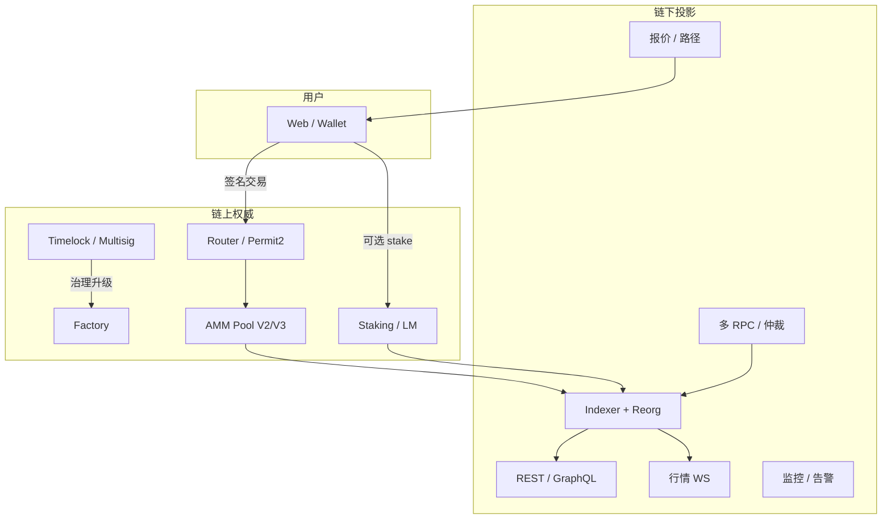
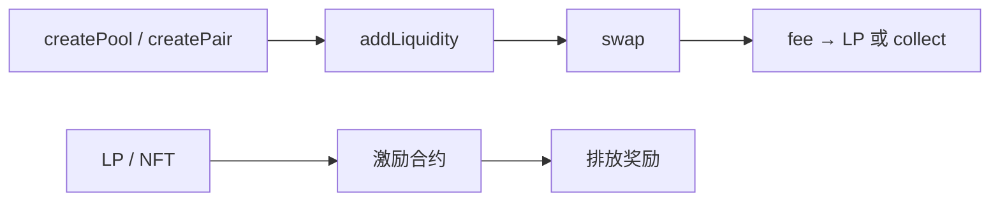
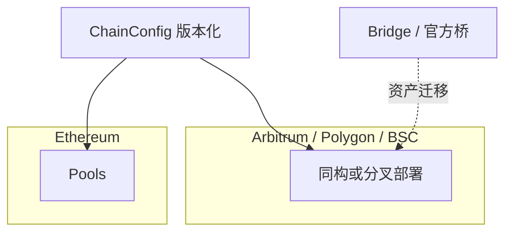
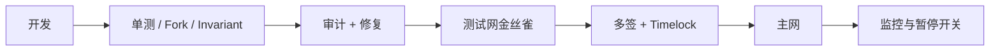

# DEX Tech Lead 45 分钟架构白板

## 要点卡

[返回模块索引](./index.md)

!!! abstract "30 秒回答"

    DEX Tech Lead 白板不是画一个 AMM 公式就结束。要按 **协议层 → 链下投影 → 产品 API →
    多链与运维 → 安全门禁 → 团队协作** 讲清信任边界：链上合约是资产与定价权威；
    Indexer/API 只是可重建投影。同时给出 **上线检查单、权限模型、事故熔断**，证明你能带队交付，
    而不只是会写 Solidity。

**45 分钟时间盒**

| 分钟 | 板块 | 产出 |
|------|------|------|
| 0–5 | 澄清需求 | 链、资产、AMM/CLOB、是否托管、目标 TPS/延迟 |
| 5–18 | 协议与资金流 | Factory/Router/Pool、LP、激励、权限 |
| 18–28 | 链下系统 | Indexer、报价、行情、再投/Farm 投影 |
| 28–36 | 多链 / L2 / 安全 | 部署矩阵、升级、审计、监控 |
| 36–42 | 组织与交付 | 规范、CR、里程碑、on-call |
| 42–45 | 风险与取舍 | 明确不做什么、下一阶段 |

## 30 秒版（开场）

> 我按 Tech Lead 视角拆一层：**链上协议负责正确性与资产托管边界，链下负责体验与可观测**。
> 先画资金与交易主路径，再讲 Indexer/reorg、多链配置版本、安全门禁和团队接口。
> 细节公式落在 [S-EXCH-30](./S-EXCH-30-uniswap-v2-v3-protocol.md)、激励落在 [S-EXCH-29](./S-EXCH-29-defi-staking-liquidity-mining-yield.md)。

## 3 分钟版（一面深度）

1. **是什么**：为「DEX 平台 Tech Lead」准备的 **45 分钟端到端架构叙事**，覆盖协议、后端、前端协作与安全。
2. **为什么**：JD 要求架构规划、带队、DeFi 核心模块、撮合/同步/性能、风险方案——单题 AMM 不够。
3. **怎么做**：用固定白板骨架 + 可插拔模块（纯 AMM / 聚合 / 激励 / 跨链），每层说清 **权威数据源与失败模式**。

## 10 分钟版（原理 + 图示）

### 1. 开场澄清（必问清边界）

| 问题 | 影响架构 |
|------|----------|
| 纯 AMM 还是 AMM + 订单簿/意图？ | 是否引入链下撮合与结算合约 |
| 单链还是 ETH + BSC + L2？ | 配置矩阵、桥、消息安全 |
| 是否自研代币激励？ | Farm/排放/治理 |
| 前端是否要「最佳路径」？ | 自研路由 vs 聚合器 |
| 托管吗？ | 纯非托管 vs 有内部余额（接近 CeDeFi） |

没有澄清就画「大而全 CEX」是减分项。本岗默认：**非托管 AMM DEX + 链下索引/API**。

### 2. 总览图（先画这个）

**一句话边界**：用户资产在池子/质押合约；公司服务器 **不能** 擅自划走用户 LP（除非明确的托管产品，需另画）。

### 3. 协议层白板要点

| 模块 | 你要讲到的决策 |
|------|----------------|
| AMM 选型 | V2 简单稳健 vs V3 资本效率（[S-EXCH-30](./S-EXCH-30-uniswap-v2-v3-protocol.md)） |
| Router | 多跳、滑点、`deadline`、permit |
| 激励 | rewardPerToken、排放帽、暂停（[S-EXCH-29](./S-EXCH-29-defi-staking-liquidity-mining-yield.md)） |
| 权限 | owner ⊆ multisig ⊆ timelock；紧急暂停 ≠ 提现用户资金 |
| 升级 | 不可升级核心池 vs UUPS 外围；存储布局（[S-SOLID-04](../13-solidity-contracts/S-SOLID-04-upgradeable-proxy.md)） |

### 4. 链下系统白板要点

| 子系统 | 职责 | 失败模式 |
|--------|------|----------|
| RPC 池 | 多供应商、法定人数、hedging | 单点假数据、延迟 |
| Indexer | 扫 log、block lineage、幂等 | reorg 双花投影 |
| 报价 | 路径搜索、`eth_call` 模拟 | 过期报价当成交保证 |
| 行情 | K 线、深度近似、WS | 序号缺口（可借鉴 EXCH-19 思想） |
| 配置中心 | 每链 Factory/Router/ABI 版本 | 错链地址 |

详见 [S-BC-05](../12-blockchain-web3/S-BC-05-indexer-reorg.md)、[S-EXCH-10](./S-EXCH-10-kline-event-aggregation.md)、[S-EXCH-14](./S-EXCH-14-web3-exchange-fullstack-architecture.md)。

### 5. 多链与 L2

| 原则 | 说明 |
|------|------|
| 部署独立 | 每链独立 Factory；不假设地址相同 |
| 消息安全 | 跨链不要「信任任意 relayer」（[S-BC-12](../12-blockchain-web3/S-BC-12-cross-chain-message-bridge-security.md)） |
| 最终性 | L2 确认规则与提现挑战期要写进产品文案 |
| 运营 | 每链独立排放库存与监控看板 |

### 6. 安全与上线门禁（Tech Lead 必讲）

| 门禁 | 标准 |
|------|------|
| 测试 | Foundry/Hardhat：单元、模糊、不变式、主网 fork |
| 审计 | 外部审计报告 + 已知问题分级 |
| 权限演练 | 暂停、升级、续期排放的 runbook |
| 监控 | 异常 TVL、储备比跳变、奖励合约余额、RPC 偏差 |
| 事故 | 暂停 Router/Farm、公告、复盘（[S-LEAD-01](../07-engineering-leadership/S-LEAD-01-incident-postmortem.md)） |

安全专题：[S-SOLID-02](../13-solidity-contracts/S-SOLID-02-security-reentrancy.md)、[S-SOLID-06](../13-solidity-contracts/S-SOLID-06-testing-audit.md)、[S-EXCH-08](./S-EXCH-08-mev-sandwich.md)。

### 7. 团队与工程体系

| 角色 | 接口 |
|------|------|
| 合约组 | 不变量、升级、审计清单 |
| 后端组 | Indexer/API SLO、reorg 演练 |
| 前端组 | 钱包连接、交易模拟、错误码 |
| 产品/运营 | APR 口径、多链开关、应急文案 |
| 你（TL） | RFC、CR 规范、里程碑、风险清单 |

| 机制 | 落地 |
|------|------|
| 开发规范 | Solidity style + Go/TS lint；禁止无审关键路径 |
| Code Review | 资金路径双人审；配置变更双人点 |
| 文档 | ADRs：为何选 V2/V3、为何某链先发 |
| CI/CD | 测试网自动；主网手动 + 多签 |
| 远程协作 | 异步 RFC、周风险会、英文文档可读 |

### 8. 45 分钟讲解稿（可背结构）

1. **澄清**：非托管 AMM DEX，先 ETH，再扩 L2；带 LP 挖矿。  
2. **协议**：Factory/Router/Pool；V2 启动，稳定对评估 V3；Farm 用 rewardPerToken。  
3. **链下**：Indexer 以 canonical log 为准；报价标注时效；WS 行情。  
4. **安全**：CEI、白名单、多签 timelock、审计、暂停。  
5. **多链**：配置版本化；桥另案评估。  
6. **团队**：三人审资金 PR；on-call；90 天里程碑。  
7. **取舍**：不做托管撮合；不做自研跨链消息 v1。

### 与 EXCH-14 的分工

| 题 | 重心 |
|----|------|
| [S-EXCH-14](./S-EXCH-14-web3-exchange-fullstack-architecture.md) | Web3 交易产品全栈（索引/K 线/返佣等工程细节） |
| **本题 S-EXCH-31** | **Tech Lead 终面**：澄清→协议→组织→门禁→取舍的 **45min 叙事骨架** |

## 生产场景（举例）

| 场景 | 你怎么答 |
|------|----------|
| 主网上线第一周 TVL 异常 | 先核假池与奖励刷量；可暂停 Farm 排放 |
| 某 L2 RPC 分叉 | 多 RPC 仲裁；暂停受影响链交易入口 |
| 审计发现中危 | 定级、修复、回归、是否阻塞上线由 TL + 安全共同签 |
| 前端要「保证成交价」 | 拒绝；只保证链上 `minOut` 保护 |

## 深挖问答

1. **资产在谁手里？** → 池/质押合约；后端无私钥划款。  
2. **Indexer 挂了用户能交易吗？** → 能，钱包直连 Router；体验降级。  
3. **如何防假池？** → Factory + init code hash。  
4. **V2 还是 V3？** → 冷启动/长尾偏 V2；成熟对 V3（[S-EXCH-30](./S-EXCH-30-uniswap-v2-v3-protocol.md)）。  
5. **激励怎么防刷？** → 时间加权、白名单、交易量门槛（[S-EXCH-29](./S-EXCH-29-defi-staking-liquidity-mining-yield.md)）。  
6. **升级谁说了算？** → Timelock + 多签；核心池尽量不可升级。  
7. **英文文档？** → ADR 与 runbook 英文；接口注释双语。  
8. **你怎么带远程团队？** → RFC 异步、关键变更双人、周风险会、明确 DRI。

## 反模式

| 反模式 | 后果 |
|--------|------|
| 白板只画微服务框不画资金权威 | 像后端岗不是协议 TL |
| 承诺零滑点/保本 APR | 产品与合规风险 |
| owner 单钥匙 | 单点作恶与勒索面 |
| 把 CEX 撮合架构硬套纯 DEX | 信任模型错位 |

## 延伸阅读

- [S-EXCH-14 Web3 全栈](./S-EXCH-14-web3-exchange-fullstack-architecture.md)
- [S-EXCH-30 Uniswap V2/V3](./S-EXCH-30-uniswap-v2-v3-protocol.md)
- [S-EXCH-29 Staking / LM / Farm](./S-EXCH-29-defi-staking-liquidity-mining-yield.md)
- [S-EXCH-06/07/08 AMM / 聚合 / MEV](./S-EXCH-06-dex-amm-liquidity.md)
- [S-LEAD-03 Code Review](../07-engineering-leadership/S-LEAD-03-code-review-culture.md)
- [S-SOL-08 白板模板](../11-solution-architecture/S-SOL-08-evolution-whiteboard.md)
- [S-MSVC-01 微服务白板](../15-microservices-exchange/S-MSVC-01-exchange-microservices-whiteboard.md)
