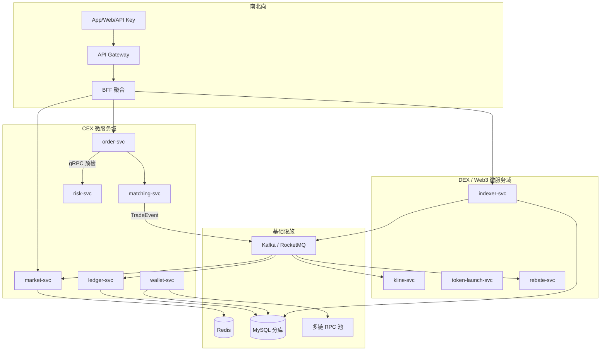

# 交易所微服务全链路架构白板（CEX + DEX）

## 30 秒版（开场）

> 交易所微服务 = **按业务能力拆服务**（订单、撮合、账务、钱包、行情、索引），**同步 gRPC 走资金关键路径短链**，**异步 MQ 走成交/链上事件扇出**。CEX 与 DEX **分域部署、可共用用户与网关**；忌「一个 order-service 包打天下」。关键词：**限界上下文、事件驱动账务、BFF 聚合查询**。

## 3 分钟版（一面深度）

1. **是什么**：面向 CEX（链下撮合+账务）与 DEX（链上合约+链下索引）的完整微服务拓扑与数据流。
2. **为什么**：交易所面试常要求「画一张架构图」；需证明拆分合理、一致性与故障域清晰。
3. **怎么做**：南北向 API Gateway → 渠道 BFF → 领域服务；东西向 gRPC + Kafka；账务/钱包 **独立库**。

## 10 分钟版（45min 白板）

### 总览图

### 45 分钟时间盒

| 阶段 | 时间 | 交付 |
|------|------|------|
| 澄清 | 0～5 min | CEX only / DEX only / 混合；峰值 QPS；是否多链 |
| 域划分 | 5～15 min | 画 CEX + DEX 两域，标同步/异步边界 |
| 关键链路 | 15～28 min | 下单、成交入账、充提、链上 Swap→K 线 |
| 非功能 | 28～38 min | 幂等、限流、可观测、多活 |
| 演进 | 38～45 min | MVP 单体 → 拆撮合 → 拆账务 → 加 DEX 索引 |

### CEX 同步 vs 异步边界

| 路径 | 模式 | 原因 |
|------|------|------|
| 下单 → 风控预检 | **同步 gRPC** | 需立即拒单 |
| 下单 → 撮合 | **内存队列 / 同进程** 或 gRPC 流 | 低延迟；可撮合独立进程 |
| 撮合 → 账务 | **异步 MQ** | 解耦峰值；多订阅者 |
| 撮合 → 行情 | **异步 MQ** | fan-out WebSocket |
| 提现申请 → 钱包 | **同步** 扣减冻结 + **异步** 链上广播 | Saga |

### DEX 同步 vs 异步边界

| 路径 | 模式 | 原因 |
|------|------|------|
| 用户查 K 线/盘口 | **同步** 读 Redis/MySQL | 读模型 |
| Indexer 扫块 | **异步** 内部流水线 | 与 API 解耦 |
| Swap 事件 → K 线 | **MQ** | 削峰、可重放 |
| 合约调用 | **链上**；Go 仅 RPC | 非微服务 RPC |

### 与单体对比（面试话术）

- **MVP**：模块化单体（Go monorepo + 清晰 package 边界）
- **第一次拆**：matching-svc 独立（CPU/延迟隔离）
- **第二次拆**：ledger-svc + wallet-svc（资金合规审计）
- **DEX 上线**：indexer-svc 独立（RPC 依赖与 reorg 复杂度）

## 生产场景

- **CEX 开盘**：仅扩 matching + market；ledger consumer 水平扩
- **链上拥堵**：indexer-svc 降级确认数；API 读缓存
- **混合所**：BFF 聚合 CEX 余额 + 链上余额，**禁止** wallet 直接调 ledger 内部表

## 追问链

1. **撮合要不要微服务？** → 可先进程隔离再服务化；关键是 **单 symbol 单写者**（[S-EXCH-16](../14-dex-cex-engineering/S-EXCH-16-perpetual-matching-position.md)）。
2. **DEX 索引能否与 K 线合并？** → 可同团队维护，但 **建议分服务**：索引写链、K 线读聚合，故障域不同。
3. **共用用户服务？** → 可以 `user-svc`；交易域只持 `userId`。
4. **和 EXCH-13 区别？** → 13 讲 CEX 业务链路；本题讲 **服务切分与通信模式**。

## 反模式

- 所有交易能力塞进 `trade-svc`
- 账务通过 REST 轮询撮合成交
- DEX Indexer 与 API 共库且无幂等键
- 网关里写业务 SQL

## 延伸阅读

- [S-MSVC-02 域拆分](./S-MSVC-02-domain-decomposition.md)
- [S-EXCH-13 CEX 端到端](../14-dex-cex-engineering/S-EXCH-13-cex-end-to-end-architecture.md)
- [S-EXCH-14 Web3 全栈](../14-dex-cex-engineering/S-EXCH-14-web3-exchange-fullstack-architecture.md)
- [Microservices - Fowler](https://martinfowler.com/articles/microservices.html)
