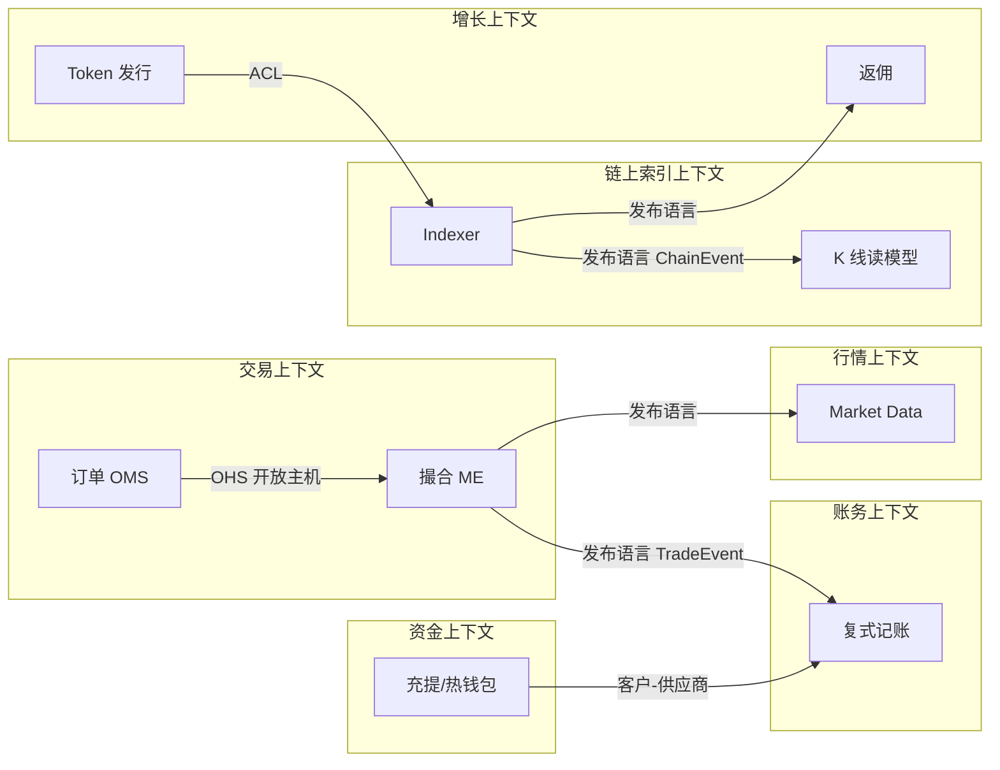

# 交易域服务拆分与限界上下文

## 30 秒版（开场）

> 交易所先按业务语言、规则和一致性边界识别限界上下文，再决定进程和数据库部署。
> bounded context、微服务和数据库不是必然 1:1。聚合通常定义单事务一致性边界；
> 跨聚合/上下文通过 API、事件和对账协作，避免无意的跨库写事务。

## 3 分钟版（一面深度）

1. **是什么**：用 DDD 战略设计划分交易所服务边界与集成模式。
2. **为什么**：拆错边界会导致分布式事务地狱、对账对不上、发布耦合。
3. **怎么做**：每份数据有唯一写入 owner；服务通过 API/事件访问。可共享物理数据库
   或构建只读投影，但禁止绕过 owner 直接跨 schema 修改；分析 JOIN 放到读模型/数仓。

## 10 分钟版

### 限界上下文地图（CEX + DEX）

### 上下文集成模式

| 关系 | 示例 | 集成方式 |
|------|------|----------|
| 发布-订阅 | ME → Ledger | Kafka `trade.matched` |
| 开放主机服务 OHS | OMS → ME | gRPC `SubmitOrder` |
| 防腐层 ACL | Launch → 链上 Factory | abigen + 版本适配 |
| 共享内核 | 谨慎、小而稳定 | 可共享经过治理的 ID/基础类型；共享可写 user 表会模糊 owner |

### 服务清单与职责（面试白板表）

| 服务 | 所属上下文 | 核心聚合 | 禁止做的事 |
|------|------------|----------|------------|
| order-svc | 交易 | Order | 直接改余额 |
| matching-svc | 交易 | OrderBook, Trade | 写账务流水 |
| ledger-svc | 账务 | JournalEntry | 发起链上转账 |
| wallet-svc | 资金 | Deposit, Withdraw | 撮合订单 |
| market-svc | 行情 | Ticker, Depth | 资金结算 |
| indexer-svc | 链上 | ChainCursor, RawLog | 算 K 线 OHLC |
| kline-svc | 行情读模型 | KlineBar | 扫链 |
| risk-svc | 风控 | Rule, Blacklist | 持久化成交 |

### 何时不该再拆

| 信号 | 建议 |
|------|------|
| 团队较小、领域和扩展边界尚未稳定 | 模块化单体 + 少量需要隔离的服务；不要用固定人数作为硬阈值 |
| 强一致 reservation 是一个自然事务边界 | 优先共置账户聚合或调用权威 reserve 接口；是否使用分布式事务需按参与者和延迟评估，不能先按服务数量机械拆分 |
| 链上索引 < 3 人维护 | indexer + kline 可同部署，逻辑分包 |

参见 [S-ARCH-14](../03-system-design/S-ARCH-14-microservice-boundary.md)

### CEX vs DEX 拆分差异

| 维度 | CEX | DEX |
|------|-----|-----|
| 真相源 | 撮合日志权威记录订单执行；账务流水权威记录资产余额 | canonical 区块/receipt/state；Indexer 游标只是消费进度，不是真相源 |
| 主要时延约束 | matching/order acceptance 的尾延迟 | 链最终性、RPC 新鲜度、索引 lag 与查询 SLO |
| 扩展维度 | per symbol | per chain_id |

## 生产场景

- **返佣要读成交**：根据规则消费 `TradeEvent`、`SwapEvent` 或更合适的
  `TradeSettled`；若返佣要求账务已结算，就不能只看原始撮合事件。服务不应读取
  ledger 私有表，可通过公开事件/API 获得结算状态
- **钱包入账**：wallet-svc 发 `DepositConfirmed` → ledger-svc 消费入账
- **合约升级**：Launch 上下文通过 ACL 适配新旧 ABI

## 追问链

1. **订单和撮合能否合并？** → 小所可以；量大后撮合独立扩缩。
2. **行情能否合并进撮合？** → 读多写少，合并增加耦合；建议 MQ 解耦。
3. **与 S-SOL-01 关系？** → SOL-01 讲 DDD 通用；本题 **交易所域实例化**。

## 反模式

- 按 `users` / `orders` 表拆服务
- ledger 暴露 `UPDATE balance` 给所有服务
- indexer 直接写返佣结算表（跨上下文事务）

## 延伸阅读

- [S-SOL-01 限界上下文](../11-solution-architecture/S-SOL-01-bounded-context-ddd.md)
- [S-ARCH-14 微服务边界](../03-system-design/S-ARCH-14-microservice-boundary.md)
- [S-EXCH-03 账务](../14-dex-cex-engineering/S-EXCH-03-account-ledger.md)
