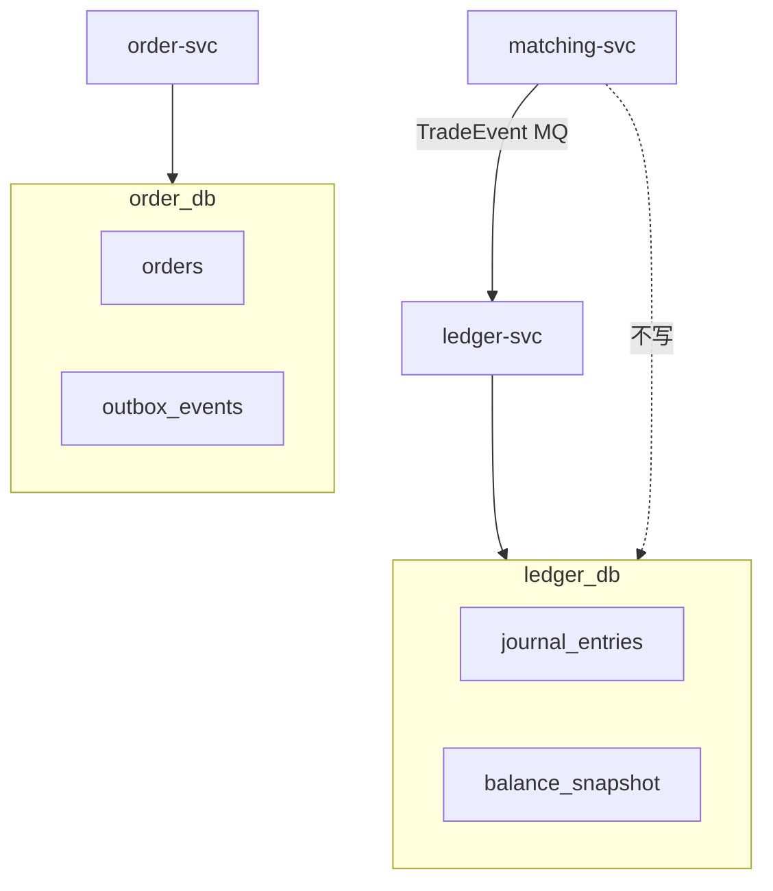
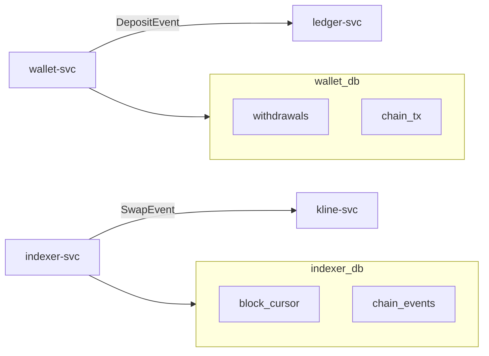
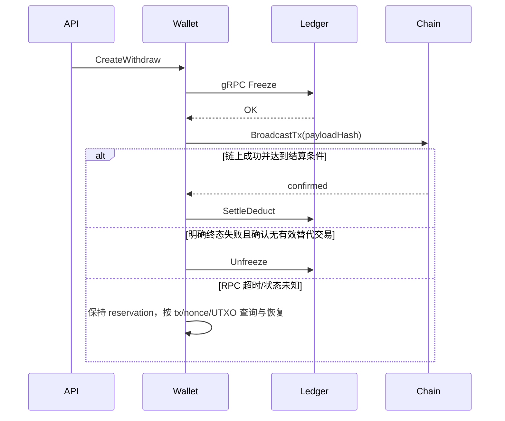

# Database per Service 与跨服务数据一致性

## 30 秒版（开场）

> Database per Service 的核心是 **数据写入所有权**，不要求每个服务必须独占一台
>数据库。跨 owner 的流程用本地事务、Outbox/日志发布、幂等、Saga 和持续对账；
> 资金 reservation 的强一致边界必须先定义，不能把所有问题都笼统归为“最终一致”。

## 3 分钟版（一面深度）

1. **是什么**：每个微服务独占数据库 schema/实例，数据通过 API 或事件协作。
2. **为什么**：独立演进与故障隔离，并防止其他服务绕过账务规则写表。模块化单体
   或共享物理数据库也可以正确实现资金系统，关键是 owner、事务边界和容量证据，
   不是“单体库必然锁竞争”。
3. **怎么做**：本地事务写业务表 + Outbox；MQ 投递；下游幂等消费；定时对账修差异。

## 10 分钟版

### 库归属（交易所）

#### 订单与账务：各自持有权威库

#### 钱包与索引：事件连接上下文

### 典型跨服务流程

#### CEX：成交 → 账务

1. matching-svc 将已排序命令/结果持久化到可恢复日志，由 publisher 从该日志续传
   `trade.matched`；避免把“写 WAL + 直接发 MQ”做成无恢复点的双写
2. ledger-svc 消费，**幂等** `trade_id` 写 journal
3. 失败时重试并隔离 poison event/相关分区，告警后从原事件重放；不能丢进 DLQ
   后继续处理依赖其顺序的同账户事件

#### CEX：提现 Saga

#### DEX：Indexer → K 线 → 返佣

- `indexer_db` 幂等 `(chain_id, tx_hash, log_index)`
- kline-svc **只读** Swap 事件，写 `kline_db`
- rebate-svc 消费同一事件或独立 `rebate_db`

### 一致性模式选型

| 场景 | 模式 | 说明 |
|------|------|------|
| 成交入账 | 事件 + 幂等 | 至少一次消费 |
| 提现 | **Saga** | 补偿解冻 |
| 充提+账务 | Saga + 各服务本地 Outbox | Outbox 只原子覆盖本服务数据库，不能让两个服务共享一个“分布式 Outbox” |
| 资产/负债对账 | 实时增量 + 周期全量 | 检测和隔离差异；对账不是用来掩盖缺失的一致性设计 |

参见 [S-DIST-05](../middleware/distributed/S-DIST-05-distributed-transaction.md)

### 查询怎么办（无 JOIN）

| 需求 | 方案 |
|------|------|
| 用户资产总览 | BFF 聚合权威余额与链上读模型，并返回 `asOf`/数据新鲜度；多个独立响应不天然是同一时点快照 |
| 订单+成交 | order-svc 存快照；或 CQRS 读库 |
| 管理后台报表 | ES / 数仓同步事件 |

## 生产场景

- **MQ 重复消费**：ledger 侧 `uk(trade_id, entry_type)`
- **Indexer reorg**：发布带原 event id、orphaned block hash 和新 canonical version 的
  reversal/recompute 指令；不是所有 RPC/历史回补都会直接给出 `removed=true`
- **对账不平**：暂停提现（[S-EXCH-15](../14-dex-cex-engineering/S-EXCH-15-settlement-ha-disaster-recovery.md)）

## 深挖问答

1. **能否共享一个 MySQL 实例多 schema？** → 可以，但 **逻辑上** 仍 per-service；避免跨 schema 事务。
2. **强一致下单扣款？** → 若 ledger 是余额权威源，就在接受订单前幂等 reserve；
   也可把“可交易余额 + reservation”放进同一交易账户聚合并由账务消费其确定性
   资金事件。不能在 order_db 自说“已冻结”，再异步通知 ledger，却仍宣称强一致。
3. **与 2PC/XA？** → 是否采用取决于参与数据库、延迟预算、故障恢复与团队能力；
   常见交易热路径更偏好本地事务 + durable event，但不应把 XA 说成行业绝对禁用。

## 反模式

- ledger 开放 SQL 给 order-svc
- 无 Outbox 直接「写库后发 MQ」
- DEX 索引与返佣同一事务跨聚合

## 延伸阅读

- [S-EXCH-03 账务](../14-dex-cex-engineering/S-EXCH-03-account-ledger.md)
- [S-BC-05 Indexer](../12-blockchain-web3/S-BC-05-indexer-reorg.md)
- [Database per service](https://microservices.io/patterns/data/database-per-service.html)
