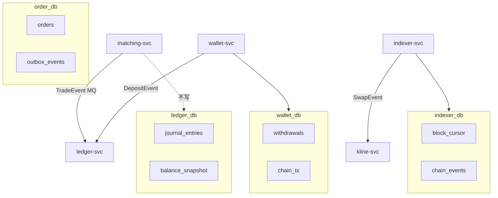
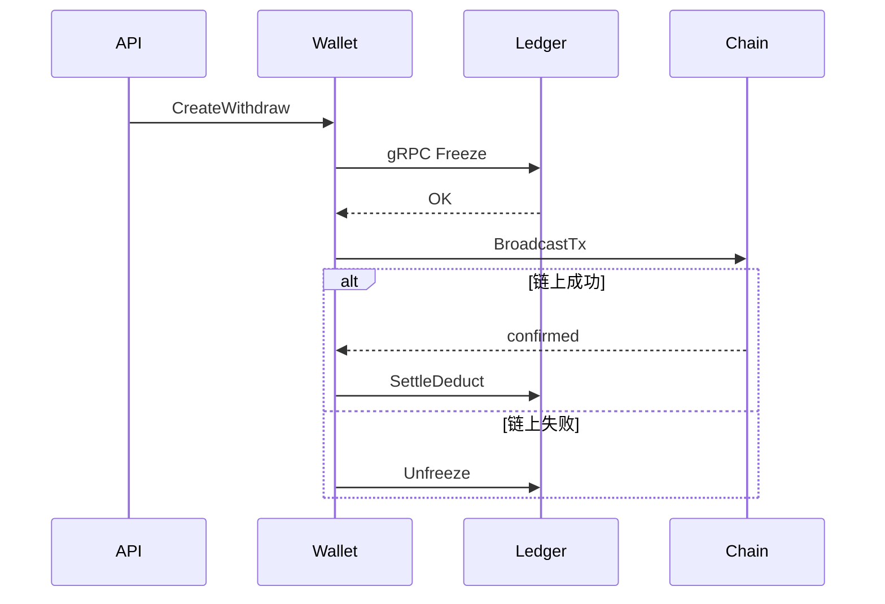

# Database per Service 与跨服务数据一致性

## 30 秒版（开场）

> 交易所微服务 **一服务一库**：`order_db`、`ledger_db`、`wallet_db`、`indexer_db`。**禁止跨库 JOIN**；一致性靠 **事件（MQ）+ Saga + 幂等 + 对账**。CEX 成交入账、DEX 充提入账、返佣结算都是 **最终一致** 典型场景。关键词：**Outbox、幂等键、日终对账兜底**。

## 3 分钟版（一面深度）

1. **是什么**：每个微服务独占数据库 schema/实例，数据通过 API 或事件协作。
2. **为什么**：独立扩缩、合规审计、故障隔离；交易所资金域 **不能接受** 大单体库锁竞争。
3. **怎么做**：本地事务写业务表 + Outbox；MQ 投递；下游幂等消费；定时对账修差异。

## 10 分钟版

### 库归属（交易所）

### 典型跨服务流程

#### CEX：成交 → 账务

1. matching-svc 写 WAL + 发 `trade.matched`
2. ledger-svc 消费，**幂等** `trade_id` 写 journal
3. 失败进 DLQ，人工/脚本补账

#### CEX：提现 Saga

#### DEX：Indexer → K 线 → 返佣

- `indexer_db` 幂等 `(chain_id, tx_hash, log_index)`
- kline-svc **只读** Swap 事件，写 `kline_db`
- rebate-svc 消费同一事件或独立 `rebate_db`

### 一致性模式选型

| 场景 | 模式 | 说明 |
|------|------|------|
| 成交入账 | 事件 + 幂等 | 至少一次消费 |
| 提现 | **Saga** | 补偿解冻 |
| 充提+账务 | Outbox | 避免双写不一致 |
| 跨所对账 | 日终批 | 修最终一致 |

参见 [S-DIST-05](../middleware/distributed/S-DIST-05-distributed-transaction.md)

### 查询怎么办（无 JOIN）

| 需求 | 方案 |
|------|------|
| 用户资产总览 | BFF **并行** gRPC 聚合 ledger + wallet + 链上 |
| 订单+成交 | order-svc 存快照；或 CQRS 读库 |
| 管理后台报表 | ES / 数仓同步事件 |

## 生产场景

- **MQ 重复消费**：ledger 侧 `uk(trade_id, entry_type)`
- **Indexer reorg**：`removed=true` 发冲正事件，kline/rebate 回滚
- **对账不平**：暂停提现（[S-EXCH-15](../14-dex-cex-engineering/S-EXCH-15-settlement-ha-disaster-recovery.md)）

## 追问链

1. **能否共享一个 MySQL 实例多 schema？** → 可以，但 **逻辑上** 仍 per-service；避免跨 schema 事务。
2. **强一致下单扣款？** → 下单冻结可走 order_db 本地表 + 异步同步 ledger；或同步 gRPC freeze（短链路）。
3. **与 2PC/XA？** → 交易所极少用；延迟与运维成本高。

## 反模式

- ledger 开放 SQL 给 order-svc
- 无 Outbox 直接「写库后发 MQ」
- DEX 索引与返佣同一事务跨聚合

## 延伸阅读

- [S-EXCH-03 账务](../14-dex-cex-engineering/S-EXCH-03-account-ledger.md)
- [S-BC-05 Indexer](../12-blockchain-web3/S-BC-05-indexer-reorg.md)
- [Database per service](https://microservices.io/patterns/data/database-per-service.html)
