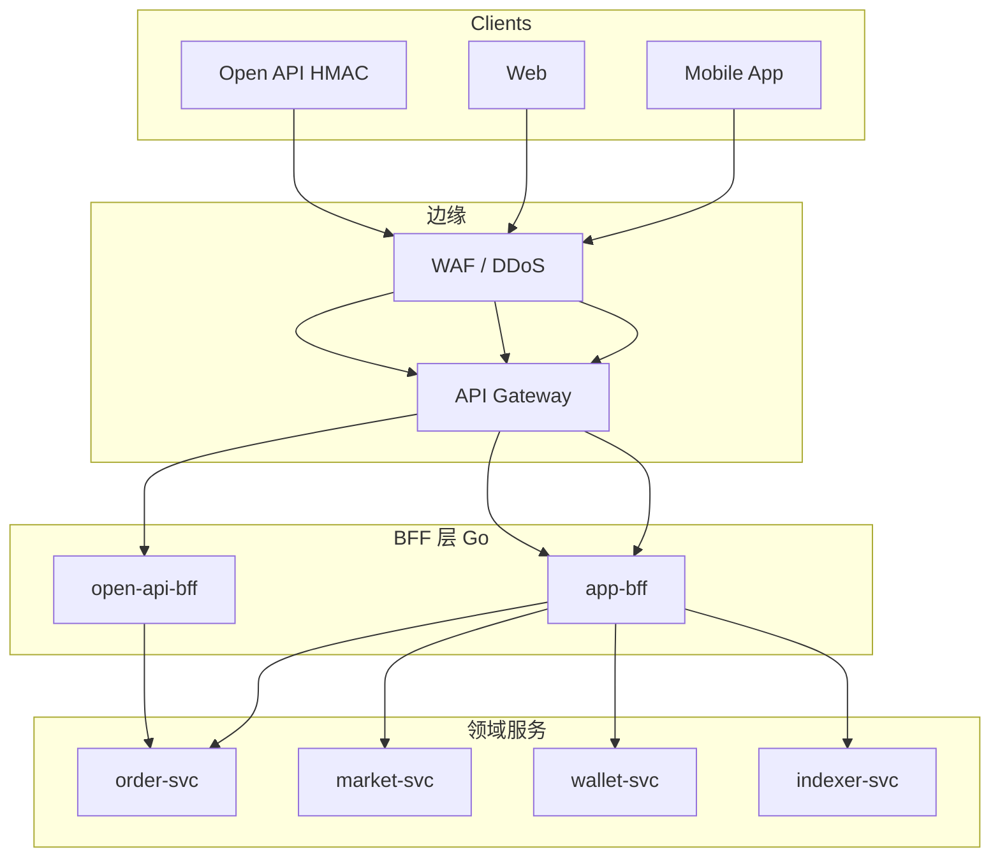

# API 网关、BFF 与交易流量治理

## 30 秒版（开场）

> **API 网关** 挡南北向（鉴权、WAF、全局限流）；**BFF** 按 App/Web/OpenAPI 渠道 **聚合** order+market+wallet 接口；**交易流量治理** 在网关+BFF+服务三层：**按用户/IP/symbol 限流、熔断、灰度、超时**。忌网关里跑账务逻辑。关键词：**渠道隔离、无状态网关、敏感接口单独桶**。

## 3 分钟版（一面深度）

1. **是什么**：外部流量进入微服务集群的层次化治理架构。
2. **为什么**：交易所公网攻击面大；移动端与 OpenAPI 字段差异大；下单接口需 **极严限流**。
3. **怎么做**：APISIX/Kong/自研 Go Gateway → 渠道 BFF → 领域 gRPC；WebSocket 行情 **独立网关**（[S-EXCH-11](../14-dex-cex-engineering/S-EXCH-11-websocket-market-hub.md)）。

## 10 分钟版

### 分层架构

### 职责矩阵（交易所定制）

| 能力 | API Gateway | BFF | 领域服务 |
|------|-------------|-----|----------|
| TLS 终止 | 通常在边缘 LB/Gateway；内网是否再加 mTLS 取决于威胁模型 | — | 可通过 Mesh/服务端 mTLS |
| JWT / HMAC 验签 | 外部凭证校验、时钟/nonce/replay 控制 | 传递受签名的身份上下文 | 领域服务仍校验授权与资源归属，不能盲信可伪造 header |
| 全局限流 | ✅ IP/全局 QPS | 用户级 | 接口内部 sentinel |
| 下单限流 | 粗粒度桶 | **细粒度** user+symbol | 撮合层队列 |
| 字段裁剪 | — | ✅ 移动端瘦身 | — |
| 聚合查询 | — | ✅ 资产总览 | — |
| 业务规则 | ❌ | 轻量编排 | ✅ 核心 |

### 限流维度（必背）

| 接口类型 | 限流键 | 仅用于讲维度的示例；生产阈值由容量、风险等级和套餐压测确定 |
|----------|--------|------------------|
| 公开市场数据 | IP | 100 req/s |
| 下单 | userId + symbol | 10 req/s |
| 提现 | userId | 1 req/min |
| Open API | apiKey + endpoint | 按套餐 |
| WS 订阅 | connId + symbol 数 | 50 symbols |

实现可用边缘本地桶 + 分布式配额服务/Redis + 服务内并发/队列上限。必须设计
Redis/配额服务故障时的策略：提现/下单等敏感写通常保守限制，公开读可以使用
last-known/local fallback；不能让限流依赖本身成为全站单点。

### 熔断与降级

| 依赖 | 策略 |
|------|------|
| market-svc 超时 | BFF 返回缓存 ticker |
| ledger 不可用 | 禁止提现；查询余额降级只读副本 |
| indexer 延迟 | K 线标注 `delayed` |

### 灰度与路由

- 新 BFF 版本：网关 weight 5% → 20% → 100%（[S-ARCH-15](../03-system-design/S-ARCH-15-release-strategy.md)）
- 新交易对：路由到独立 matching 集群

### CEX vs DEX API 差异

| 渠道 | BFF 特点 |
|------|----------|
| CEX 现货/合约 | 订单、仓位、余额 |
| DEX | 池子列表、K 线、链上地址绑定 |
| 混合 | 资产总览聚合 CEX+链上；**两套后端** |

## 生产场景

- **Open API 被刷**：apiKey 限流 + 签名时钟偏移校验
- **行情 WS 与 REST 分流**：不同 Ingress host
- **大促**：网关提前扩容；BFF 无状态 HPA

## 追问链

1. **BFF 能否省掉？** → 可以。只有当多个渠道的聚合、发布节奏和数据形状确实
   不同时才值得独立 BFF；多渠道不自动意味着每个渠道都要一个服务。
2. **与 S-SOL-04 区别？** → SOL-04 通用；本题 **交易限流维度与渠道**。
3. **gRPC 能否直接对公网？** → 可以，前提是客户端生态、HTTP/2/代理兼容、
   TLS、认证、配额和可观测性满足要求；REST/HMAC 只是常见产品选择，不是安全定律。

## 反模式

- 网关查 ledger 数据库做余额
- BFF 里分布式事务跨 order+wallet
- 下单接口无限流

## 延伸阅读

- [S-SOL-04 BFF/网关/Mesh](../11-solution-architecture/S-SOL-04-bff-gateway-mesh.md)
- [S-NET-05 WebSocket 网关](../06-network-governance/S-NET-05-websocket-gateway.md)
- [API Gateway pattern](https://microservices.io/patterns/apigateway.html)
