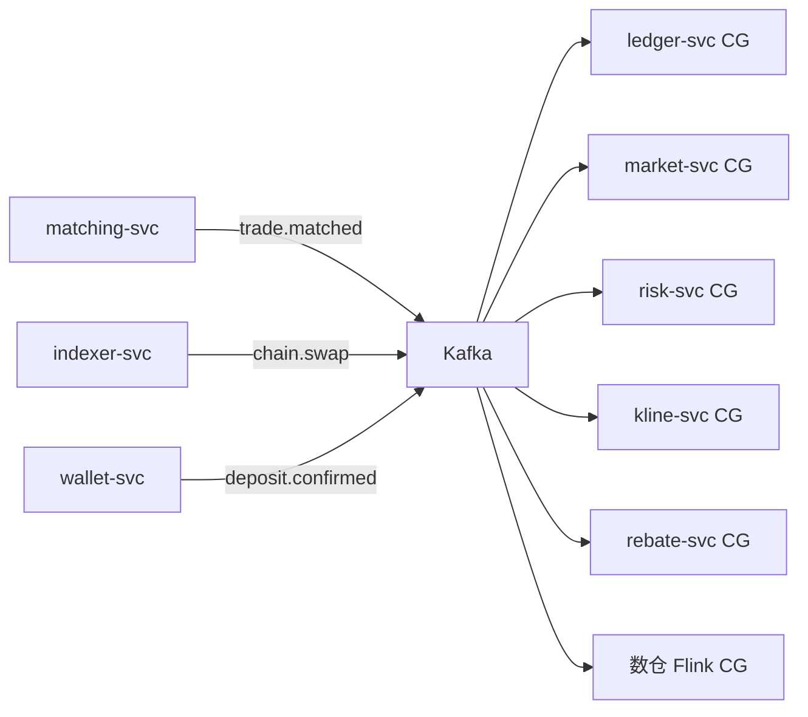

# 事件总线与异步服务边界（交易所）

## 30 秒版（开场）

> 交易所 **成交、链上日志、充提状态** 适合走 **Kafka/RocketMQ** 扇出；**下单风控、余额冻结** 走同步 gRPC。Topic 按 **领域事件** 划分：`trade.matched`、`deposit.confirmed`、`chain.swap`、`withdraw.status`。关键词：**分区键保序、消费幂等、Outbox、DLQ 补账**。

## 3 分钟版（一面深度）

1. **是什么**：微服务间通过消息中间件传递领域事件，实现解耦与削峰。
2. **为什么**：成交后要同时驱动账务、行情、风控、大数据；DEX Indexer 吞吐波动大。
3. **怎么做**：本地事务 + Outbox 发消息；消费者幂等；关键资金消费者 **独立消费组**。

## 10 分钟版

### 事件流全景



### Topic 设计（交易所）

| Topic | 生产者 | 消费者 | 分区键 |
|-------|--------|--------|--------|
| `trade.matched` | matching | ledger, market, risk | `symbol` 或 `trade_id` |
| `order.lifecycle` | order-svc | 审计、推送 | `user_id` |
| `chain.swap` | indexer | kline, rebate | `pool_address` |
| `chain.deposit` | indexer/wallet | ledger | `user_id` |
| `withdraw.status` | wallet | ledger, notify | `withdraw_id` |

**分区键原则**：需 **单用户/单 symbol 有序** 的用对应 key；全局有序则单分区（慎用）。

### 同步 vs 异步决策表

| 操作 | 通道 | 原因 |
|------|------|------|
| 下单风控 | gRPC | 立即反馈 |
| 成交后入账 | MQ | 削峰、可重放 |
| 链上 Swap 入库 | MQ | Indexer 与 API 解耦 |
| 推送 WS 行情 | MQ → market → WS | fan-out |
| 资金费率结算 | 定时任务 + MQ | 批量 |

### 可靠性

| 机制 | 说明 |
|------|------|
| Outbox | order/ledger 同库写 outbox，relay 发 Kafka |
| 幂等 | `uk(event_id)` 或业务键 `trade_id` |
| DLQ | ledger 消费失败进死信，告警 + 人工补账 |
| 重放 | 新 consumer group 从 offset 重建读模型 |

参见 [S-KAFKA-02](../middleware/kafka/S-KAFKA-02-producer-reliability.md)、[S-RAB-01](../middleware/rabbitmq/S-RAB-01-exchange-async-pipeline.md)

### CEX vs DEX 事件差异

| 类型 | CEX 事件 payload | DEX 事件 payload |
|------|------------------|------------------|
| 成交 | price, qty, maker/taker | — |
| Swap | — | pool, amountIn/Out, sender, tx_hash |
| Reorg | — | `removed=true` 冲正 |

### Kafka vs RocketMQ（交易所口述）

| 维度 | Kafka | RocketMQ |
|------|-------|----------|
| 吞吐 | 成交广播、日志 | 高 |
| 顺序 | 分区内有序 | 单 Queue 有序 |
| 延迟消息 | 外部调度 | 原生 delay level |
| 典型用途 | trade 总线 | 充提通知、关单 |

## 生产场景

- **lag 堆积**：ledger consumer 扩容；临时降级非关键消费者（数仓）
- **重复消息**：账务仍幂等；行情可多写无害
- **消息过大**：深度快照走对象存储，MQ 只传引用

## 追问链

1. **为何不用 RPC 广播成交？** → N 个订阅者耦合；MQ 可重放审计。
2. **Exactly-once？** → 端到端难；交易所 **至少一次 + 幂等** 务实。
3. **与 S-ARCH-10 关系？** → ARCH-10 讲语义；本题 **交易所 Topic 划分**。

## 反模式

- 下单成功靠 MQ 回调用户（应用 WebSocket/轮询订单状态）
- 一个 `exchange-events` 大 Topic 无 schema
- 消费者里跨库写 ledger+wallet

## 代码示例

```go
// Outbox relay（简化）
type OutboxEvent struct {
    ID        int64
    Topic     string
    Key       string
    Payload   []byte
    Published bool
}
// 定时或 CDC 扫描 unpublished → Kafka Publish → 标记 published
```

## 延伸阅读

- [S-KAFKA-03 交易事件总线](../middleware/kafka/S-KAFKA-03-trade-event-bus.md)
- [S-MSVC-04 数据一致性](./S-MSVC-04-database-per-service.md)
- [Transactional Outbox](https://microservices.io/patterns/data/transactional-outbox.html)
