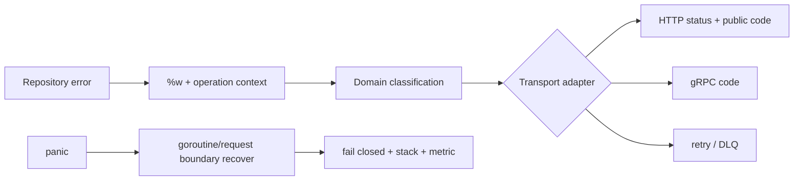

# 错误契约、Wrapping 与 Panic 边界

## 30 秒版（开场）

> Go 的 error 是 API 契约，不只是日志字符串。调用方需要分支处理的错误，应通过 sentinel、类型或稳定的分类码暴露，并用 `errors.Is/As` 判断；`fmt.Errorf("...: %w", err)` 保留 cause。`panic` 只用于无法继续的程序不变量或程序员错误，`recover` 只能放在 goroutine/request 等隔离边界，把故障转成失败响应并记录栈，不能把未知状态继续当成功执行。

## 3 分钟版（一面深度）

1. **分类**：可重试、业务拒绝、调用方错误、依赖故障、内部 bug 的处理策略不同。
2. **传播**：在边界增加有用上下文，但保留原始 cause；不要靠字符串匹配。
3. **映射**：domain/service 层返回稳定错误语义，HTTP/gRPC/MQ adapter 再映射状态码、重试与 DLQ。
4. **Panic 边界**：`recover` 只有在**同一 goroutine 的 deferred function 中直接调用**
   才能截获正在展开的 panic；一个 goroutine 不能捕获另一个 goroutine 的 panic。每个独立
   goroutine/request 边界都要自行决定 fail-fast 还是 recover 后结束当前工作单元。

## 10 分钟版（原理 + 图示）



**稳定契约的三种方式**

| 方式 | 适合 | 注意 |
|------|------|------|
| sentinel `var ErrNotFound` | 少量、稳定、无额外字段 | 暴露后会成为兼容性承诺 |
| 自定义错误类型 | 需要字段，如 retry-after、资源 ID | 调用方用 `errors.As` |
| 领域分类码 | 跨进程协议、公开 API | 错误码与内部 cause 分离 |

```go
var ErrInsufficientBalance = errors.New("insufficient balance")

type RetryableError struct {
    After time.Duration
    Err   error
}

func (e *RetryableError) Error() string { return e.Err.Error() }
func (e *RetryableError) Unwrap() error { return e.Err }

func debit(ctx context.Context, repo Repository, id string) error {
    if err := repo.Debit(ctx, id); err != nil {
        return fmt.Errorf("debit account %s: %w", id, err)
    }
    return nil
}
```

`errors.Join` 表达“多个错误都发生了”，`errors.Is/As` 会遍历错误树；它不适合替代业务批处理结果，因为调用方通常还需要知道每个 item 的成功/失败。

**Typed nil 陷阱**

```go
func bad() error {
    var e *MyError
    return e // interface 的动态类型非 nil，因此 error != nil
}
```

应该直接 `return nil`，不要把 nil 指针装入 error interface。

## 生产场景

- DB 超时：保留 `context.DeadlineExceeded`，adapter 决定返回超时并统计依赖错误。
- 重复请求：返回稳定的幂等结果或 `ErrConflict`，不能只写 `"duplicate"`。
- Web3 签名服务：HSM 暂时不可用可重试；策略拒签是业务拒绝；签名不一致属于高危内部错误，应 fail closed。

## 排查与工具

- 日志记录 operation、request/trace ID、错误链；敏感参数和私钥材料绝不进入 error。
- 指标按低基数分类码聚合，错误原文只进日志。
- panic 记录栈、构建版本与请求 ID，并触发错误率告警；不要对所有 panic 自动重试。

## 架构取舍

公开库若 wrap 了某个底层 sentinel，调用方可能依赖它，之后更换底层实现就受兼容性约束。只有希望把底层错误纳入 API 契约时才 `%w`；否则可保留内部日志并返回自己的领域错误。

## 追问链

1. **什么时候不用 `%w`？** → 不希望暴露底层实现为公共契约时。
2. **`errors.Is` 和 `==`？** → `Is` 可沿 unwrap/join 树判断；`==` 只比较当前值。
3. **recover 后能继续吗？** → 被 recover 后，发生 panic 的函数不会从 panic 点继续；
   控制流按 defer/recover 规则返回到边界。边界应结束当前工作单元，未知不变量被破坏时
   不能继续提交副作用。
4. **context 错误要包装吗？** → 可以包装上下文，但必须让 `errors.Is(err, context.Canceled/DeadlineExceeded)` 仍成立。
5. **错误是否都应打印？** → 在“负责处理或丢弃”的边界打印一次，逐层重复打印会制造噪音。

## 反模式与事故

- `if strings.Contains(err.Error(), "duplicate")`：文本变化就破坏逻辑。
- 每层都 log + return：一条故障生成多份重复日志。
- `recover()` 后返回 nil：调用方误以为成功，可能造成资金状态错乱。
- 用 panic 处理用户输入或普通依赖超时。

## 延伸阅读

- [Working with Errors in Go 1.13](https://go.dev/blog/go1.13-errors)
- [Errors are values](https://go.dev/blog/errors-are-values)
- [`errors` package](https://pkg.go.dev/errors)
