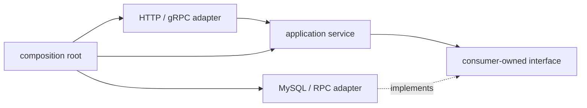

# 包边界、接口设计与依赖注入

## 30 秒版（开场）

> Go 包应该围绕高内聚能力而不是 MVC 层名拆分；依赖方向保持单向，循环依赖通常意味着边界错了。接口优先由使用方定义，并保持最小；实现方通常返回具体类型。依赖注入用显式构造函数完成，同时把配置校验、启动、关闭和健康检查纳入生命周期，而不是用全局变量或 service locator 隐藏依赖。

## 3 分钟版（一面深度）

1. **包边界**：按业务能力或稳定抽象分包，包名短、具体，不建 `util/common/base` 垃圾桶。
2. **接口位置**：消费者只声明自己需要的方法，降低 mock 面积和实现耦合。
3. **构造注入**：`NewService(repo, clock, logger)` 让依赖显式且可测试。
4. **生命周期**：构造只完成校验与组装；`Run(ctx)`/`Close()` 管理 goroutine、连接和退出顺序。

## 10 分钟版（原理 + 图示）



```go
// package transfer：接口由消费者定义。
type Ledger interface {
    Post(ctx context.Context, entries []Entry) error
}

type Service struct {
    ledger Ledger
    clock  Clock
}

func NewService(ledger Ledger, clock Clock) (*Service, error) {
    if ledger == nil || clock == nil {
        return nil, errors.New("transfer: missing dependency")
    }
    return &Service{ledger: ledger, clock: clock}, nil
}
```

**为什么常返回具体类型**

- 调用方仍可把 `*Service` 赋给自己的小接口。
- 实现方不用提前预测所有消费者需要的抽象。
- 新增方法不会扩大一个公开接口并迫使所有 mock 修改。

**什么时候由实现方提供接口**

当接口本身就是稳定协议或有多个实现要被统一发现，例如 `database/sql/driver.Driver`。这不是“接口永远放消费者”规则的例外，而是此时实现包本身在定义协议。

**目录边界**

- `cmd/<app>`：composition root，只做配置、组装、信号与生命周期。
- `internal/`：限制仓库外部导入，不等于自动获得好架构。
- `pkg/`：不是 Go 工具链特殊目录；只在确有外部复用 API 时使用。
- 避免每层都复制同名 DTO；只在边界语义确实变化时转换。

## 生产场景

- 多链钱包：application 层依赖 `ChainReader`/`Broadcaster` 小接口，各链 adapter 分别实现。
- 支付服务：ledger、risk、compliance 都是显式依赖；单测用 fake，集成测用真实容器。
- 后台 worker：`Run(ctx)` 返回错误，进程级 supervisor 决定退出或重启。

## 排查与工具

- `go list -deps ./...` 检查依赖图。
- 构造函数过多参数通常提示 service 职责过宽，可先按 use case 拆分，而不是立即引入 DI 容器。
- goroutine 泄漏排查时，先确认谁拥有启动权、谁负责取消与 `Wait`。

## 架构取舍

| 方案 | 优点 | 风险 |
|------|------|------|
| 手写构造注入 | 可读、编译期检查、易调试 | 大项目 wiring 较多 |
| 代码生成 DI | 保留静态依赖图 | 增加生成步骤 |
| 运行时容器 | 动态组装 | 错误延迟到运行时、依赖隐藏 |

资深面试中应先给出简单显式方案，再说明规模达到什么程度才引入生成工具。

## 追问链

1. **接口越多越好吗？** → 否；只有存在替换点或消费者需要隔离时才抽象。
2. **为什么不把 repository interface 放 repository 包？** → 容易变成实现方的大接口，消费者被迫依赖无关方法。
3. **配置放全局单例？** → 隐藏依赖、并发测试困难；应解析后作为不可变值注入。
4. **如何避免循环依赖？** → 提取真正的下层协议或重新划分能力边界，不建 `common` 中转包。
5. **构造函数能启动 goroutine 吗？** → 通常不做；否则错误处理和关闭所有权不清晰。

## 反模式与事故

- `init()` 中连接 DB、注册全局客户端，测试导入包就产生副作用。
- 一个 `Repository` 有几十个方法，所有 fake 都必须实现。
- service locator 的 `Get("redis")` 让依赖只能运行时发现。
- `Close` 不幂等或关闭顺序反了，先关 DB 后 worker 仍在写。

## 延伸阅读

- [Effective Go: Interfaces](https://go.dev/doc/effective_go#interfaces)
- [Package names](https://go.dev/blog/package-names)
- [Organizing a Go module](https://go.dev/doc/modules/layout)

