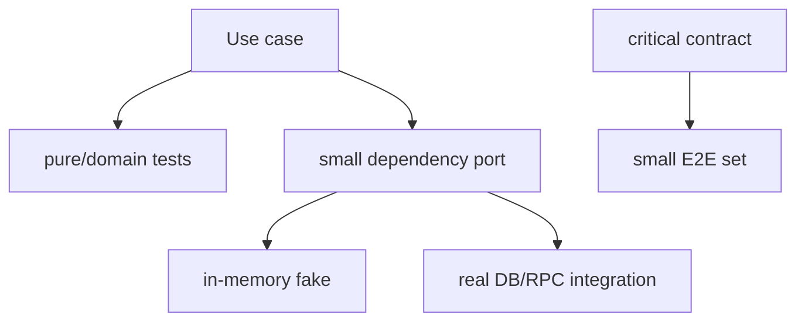

# Go 单元测试：表驱动、子测试与 Test Double

## 30 秒版（开场）

> Go 单测的核心不是表驱动语法，而是把输入、依赖和可观察结果做成确定性契约。表驱动 + `t.Run` 适合覆盖同一行为的多组边界；fake 适合有状态协议，stub 返回固定值，mock 只在“交互本身就是契约”时使用。时间、随机数、ID 和外部 I/O 应通过小接口或函数注入，测试不能靠 sleep 和真实公网稳定性。

## 3 分钟版（一面深度）

1. **测试层次**：纯函数单测最多；边界 adapter 做集成测；关键用户路径做少量端到端。
2. **表驱动**：案例有清晰名称，断言业务结果和错误类别，不只比字符串。
3. **并行测试**：共享 fixture 必须隔离；`t.Parallel` 不是加速按钮。
4. **Test Double**：优先手写小 fake；mock 框架用于验证顺序、次数等交互契约。

## 10 分钟版（原理 + 图示）



```go
func TestService_Debit(t *testing.T) {
    tests := []struct {
        name    string
        balance int64
        amount  int64
        want    int64
        wantErr error
    }{
        {"success", 100, 40, 60, nil},
        {"insufficient", 30, 40, 30, ErrInsufficientBalance},
        {"zero rejected", 100, 0, 100, ErrInvalidAmount},
    }

    for _, tt := range tests {
        // 此处没有 t.Parallel，t.Run 会等子测试返回，因此也没有跨迭代异步捕获。
        t.Run(tt.name, func(t *testing.T) {
            repo := &fakeRepo{balance: tt.balance}
            err := NewService(repo).Debit(context.Background(), tt.amount)
            if !errors.Is(err, tt.wantErr) {
                t.Fatalf("error = %v, want %v", err, tt.wantErr)
            }
            if repo.balance != tt.want {
                t.Fatalf("balance = %d, want %d", repo.balance, tt.want)
            }
        })
    }
}
```

若子测试调用 `t.Parallel()`，闭包会在外层循环继续后运行：package language version 为
Go 1.22+ 时 range 每轮变量独立；仍按旧语言语义编译的 package 才需要 `tt := tt` 或把
`tt` 显式作为参数。不能只根据本机安装的 Go toolchain 版本判断。

**四类 double**

| 类型 | 用途 | 风险 |
|------|------|------|
| dummy | 只满足参数，不被使用 | 被意外调用时要立即失败 |
| stub | 返回预设值 | 容易只测 happy path |
| fake | 可工作的内存实现 | 语义可能与真实 DB 偏离 |
| mock/spy | 验证调用次数、参数、顺序 | 与实现细节过度耦合 |

Fake repository 不能假装具备真实数据库的隔离级别、唯一约束和锁语义；这些必须由集成测试验证。

**确定性设计**

- 注入 `Clock.Now()`，不要在测试里等待真实分钟跳变。
- 注入 ID generator / RNG，并固定 seed。
- 并发逻辑用 channel/barrier 协调，不用 `time.Sleep` 猜调度。
- `t.TempDir`、`t.Setenv`、`t.Cleanup` 管理资源；`testing` 明确禁止在 parallel test 或具有 parallel ancestor 的测试中调用 `t.Setenv`，因为环境变量是进程级状态。

## 生产场景

- 资金扣减：单测验证领域不变量；MySQL 集成测验证唯一键、事务和死锁重试。
- RPC adapter：录制固定响应只能测解析；超时、限流和 provider 差异需契约测试。
- Webhook：表驱动覆盖乱序、重复、缺签名、旧时间戳和冲正。

## 排查与工具

```bash
go test ./...
go test -shuffle=on -count=20 ./...
go test -run 'TestService_Debit/insufficient' ./...
```

Flaky test 先找共享状态、时间依赖、goroutine 未退出和端口冲突，不要直接增加 retry 掩盖。

## 架构取舍

如果一个 use case 需要 mock 十几个对象，优先检查职责是否过宽。测试友好通常来自清晰边界，不来自给每个具体类型套一层接口。

## 追问链

1. **覆盖率多少合格？** → 没有通用数字；门禁关注关键包、变化覆盖和风险分支，覆盖率不代表断言质量。
2. **何时用 golden file？** → 大型稳定输出；更新必须人工 review，不能失败后自动接受。
3. **测试私有函数吗？** → 优先通过公开行为；复杂纯算法可提取为独立包或函数。
4. **mock DB 能替代集成测吗？** → 不能验证 SQL、锁、隔离和 driver 行为。
5. **如何测取消？** → 用可控 fake 阻塞，在收到 `ctx.Done()` 后返回并断言 goroutine 退出。

## 反模式与事故

- 单测调用真实第三方 API，网络波动导致 CI 随机失败。
- `time.Sleep(100 * time.Millisecond)` 等待 goroutine。
- 只断言 `err != nil`，没有验证错误类别与状态未被部分写入。
- 为实现细节写大量 mock expectation，重构不改行为却全线失败。

## 延伸阅读

- [Add a test](https://go.dev/doc/tutorial/add-a-test)
- [Using Subtests and Sub-benchmarks](https://go.dev/blog/subtests)
- [`testing` package](https://pkg.go.dev/testing)
