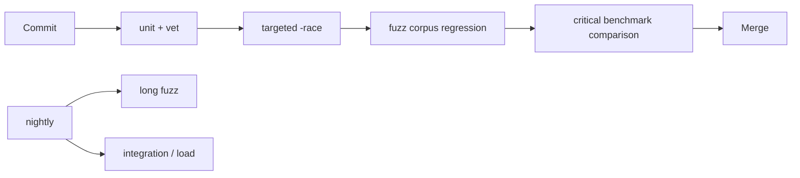

# Fuzz、Benchmark、Race 与回归门禁

## 30 秒版（开场）

> 单测验证已知案例，fuzz 用覆盖引导探索未知输入，race detector 只能发现实际执行路径上的数据竞态，benchmark 则必须在稳定环境下比较分布与 alloc，而不是迷信一次 ns/op。CI 应分层：快速单测每次提交，`-race`/fuzz seed/关键 benchmark 做门禁，长时间 fuzz 和全量压测进入 nightly；覆盖率只是发现未测试区域的信号。

## 3 分钟版（一面深度）

1. **Fuzz**：先放合法/非法 seed corpus，再写永远应成立的 invariant；发现的崩溃输入进入回归 corpus。
2. **Race**：编译插桩 + happens-before 运行时分析；没报不等于无竞态。
3. **Benchmark**：隔离初始化、报告分配、控制并发和数据规模；比较前后版本而非背绝对数。
4. **门禁**：按风险和耗时分层，避免把 flaky benchmark 当硬阈值。

## 10 分钟版（原理 + 图示）



```go
func FuzzDecodeAmount(f *testing.F) {
    f.Add("0")
    f.Add("1.23")
    f.Add("-1")
    f.Fuzz(func(t *testing.T, s string) {
        amount, err := ParseAmount(s)
        if err != nil {
            return
        }
        if amount.Sign() < 0 {
            t.Fatalf("accepted negative amount %q", s)
        }
        roundTrip, err := ParseAmount(amount.String())
        if err != nil || roundTrip.Cmp(amount) != 0 {
            t.Fatalf("round trip failed: %q", s)
        }
    })
}
```

Fuzz target 应快、确定、无外部网络；不要把“任何输入都不 panic”当唯一断言，还要验证业务不变量。

```go
func BenchmarkEncode(b *testing.B) {
    value := fixture()
    b.ReportAllocs()
    b.ResetTimer()
    for i := 0; i < b.N; i++ {
        Sink = Encode(value)
    }
}
```

基准结果受 CPU 频率、热状态、后台任务、GC、编译器和数据分布影响。用多次样本和统计比较工具观察变化，阈值应给噪声留余量。

## 生产场景

- 钱包地址/交易解析器：fuzz 长度、编码、未知字段和恶意输入。
- 并发缓存：单测 + `-race` + 高冲突 benchmark。
- RPC JSON 解码：保存触发 panic 或极端分配的 corpus，防止回归。
- 核心撮合/账本：benchmark 同时看 `ns/op`、`B/op`、`allocs/op` 和尾延迟压测。

## 排查与工具

```bash
go test ./...
go test -race ./...
go test -fuzz=FuzzDecodeAmount -fuzztime=30s ./path/to/pkg
go test -run='^$' -bench=. -benchmem -count=10 ./path/to/pkg
```

Fuzz 发现失败后先固定 corpus，再最小化并修复；不要只删掉失败文件。Race 报告要看双方访问栈和 goroutine 创建栈。

## 架构取舍

| 工具 | 找什么 | 找不到什么 |
|------|--------|------------|
| unit test | 已知行为回归 | 未想到的输入 |
| fuzz | 输入空间中的崩溃/不变量违反 | 未执行到的协议状态组合 |
| race | 被执行路径的数据竞态 | 业务竞态、死锁、泄漏 |
| benchmark | 微观性能变化 | 完整系统 P99 与容量 |

## 追问链

1. **Fuzz 是否替代单测？** → 否；seed 和明确案例仍用于可读的行为契约。
2. **Race 为什么不全生产开启？** → CPU/内存开销显著且依工作负载变化，通常放 CI/预发或少量 canary。
3. **Benchmark 变快 3% 能合并吗？** → 先判断是否超出噪声，并确认没有正确性/内存/尾延迟回退。
4. **覆盖率 100% 就够吗？** → 可能没有有效断言，也可能没覆盖并发时序和真实依赖语义。
5. **如何测并发 benchmark？** → 根据目标使用 `RunParallel` 或显式 goroutine，并报告 contention 与工作负载。

## 反模式与事故

- Fuzz target 访问公网或共享 DB，结果不可复现。
- benchmark 把 fixture 创建和日志输出计入热路径。
- race 只跑几秒、路径覆盖很低，却宣称“没有竞态”。
- CI 对微小 benchmark 抖动硬失败，团队最后关闭门禁。

## 延伸阅读

- [Go Fuzzing](https://go.dev/doc/security/fuzz/)
- [Data Race Detector](https://go.dev/doc/articles/race_detector)
- [`testing` package](https://pkg.go.dev/testing)

