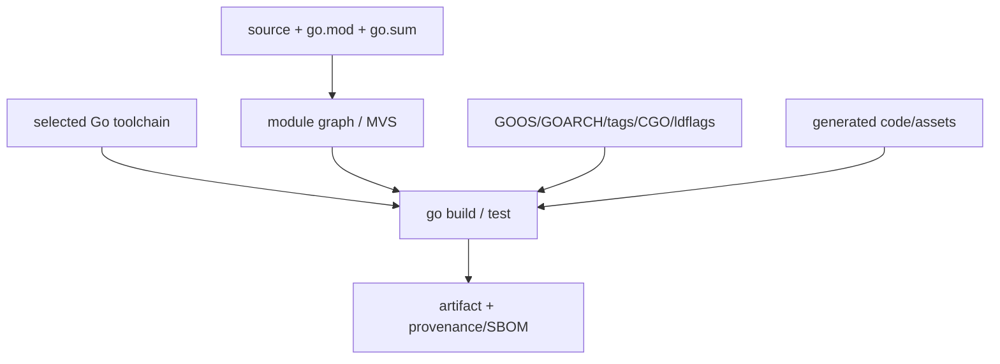

# Go Modules、Workspace、Toolchain 与可复现构建

## 30 秒版（开场）

> Go Modules 用 MVS 从依赖图中选择每个 module path 的版本；它不是传统 SAT 求“最新兼容版本”。`go` 行声明最低 Go 版本要求，`toolchain` 行可声明主模块开发时建议工具链；`go.work` 适合本地多模块联调，但 CI/发布必须明确是否启用。可复现构建依赖固定源码、模块图、工具链、构建参数和外部生成物，`go.sum` 负责校验下载内容，不是依赖锁文件的完整替代。

## 3 分钟版（一面深度）

1. **MVS**：每条 `require` 声明的是最低要求；对同一 module path，MVS 选择当前模块图中
   出现的最高版本。它不会为了寻找“最新兼容版本”而枚举仓库中的更新版本。
2. **`go mod tidy`**：补齐构建/测试所需依赖并删除不再需要的条目，不等于“升级所有依赖”。
3. **Workspace**：`go.work` 的 `use`/`replace` 可让多个本地 module 联调；发布前要防止只在 workspace 下成功。
4. **Toolchain**：Go 1.21+ 会根据 `go`/`toolchain` 与 `GOTOOLCHAIN` 选择或下载合适工具链。

## 10 分钟版（原理 + 图示）



**文件职责**

| 文件/机制 | 作用 | 常见误解 |
|-----------|------|----------|
| `go.mod` | module path、Go 版本、require/replace 等 | 不是只给 IDE 看 |
| `go.sum` | 模块内容与 `go.mod` 内容校验 | 不保证依赖无漏洞 |
| `go.work` | 本地/工作区组合多个主模块 | 不应无意改变发布依赖 |
| `vendor/` | 把选定依赖复制到仓库 | 仍需与 `go.mod` 一致 |
| `GOPROXY`/`GOSUMDB` | 获取与公开模块校验策略 | 私有模块需配置 `GOPRIVATE` |

**MVS 面试例子**

若主模块要求 `A v1.2`，另一个依赖要求 `A v1.4`，构建列表选择 `A v1.4`。它不会自动跳到
`v1.9`；升级需要显式命令或依赖图变化。依赖模块自己 `go.mod` 中的 `replace` 会被忽略；
实际构建只采用主模块的 `replace`，启用 workspace 时还会采用 `go.work` 的 `replace`。
发布库时不能假设消费者继承你的替换规则。

**可复现构建清单**

- 固定 toolchain patch 版本与基础镜像 digest。
- 在干净环境中执行生成步骤，并验证生成文件无 diff。
- 固定 build tags、CGO、目标平台和链接参数；不要嵌入随机时间戳后又宣称 bit-for-bit reproducible。
- 明确是否启用默认 VCS stamping（`-buildvcs`）并记录源码状态；只固定依赖而忽略脏工作树、
  C toolchain 或系统库，仍不能宣称 bit-for-bit 可复现。
- 保存源码 commit、模块图、工具链版本、构建参数、artifact digest 与 SBOM。
- CI 至少有一次 `GOWORK=off` 构建，防止本地 workspace 掩盖缺失依赖。

## 生产场景

- 安全补丁：显式 `go get module@patched`，跑测试和 `govulncheck`，review 间接依赖变化。
- 多服务 monorepo：workspace 提升本地联调体验，各 module 仍独立发布。
- 离线/受控环境：内部 proxy + checksum 策略 + vendor；不要直接复制某开发者的 module cache。

## 排查与工具

```bash
go version
go env GOTOOLCHAIN GOWORK GOPROXY GOSUMDB GOPRIVATE
go list -m all
go mod graph
go mod why -m example.com/dependency
GOWORK=off go test ./...
go mod verify
```

遇到“本机能编、CI 不能”时，先比较实际 toolchain、`GOWORK`、环境变量、CGO、build tags 和是否存在未提交生成物。

## 架构取舍

库通常应谨慎提高 `go` 最低版本，因为消费者工具链必须满足；内部服务可更积极跟进受支持版本，但要统一 builder、开发环境与回滚策略。

## 追问链

1. **`go.sum` 是 lock file 吗？** → 它记录校验和，选定版本主要由 `go.mod` 和模块图决定；其中也可能保留历史校验项。
2. **`go mod tidy` 会升级吗？** → 不以升级为目标；它可能因模块图/Go 版本变化调整条目，但不会简单追最新。
3. **`go.work` 要不要提交？** → 取决于仓库工作流；关键是 CI 明确使用还是禁用，避免隐式行为。
4. **`replace ../foo` 能发布吗？** → 本地开发可用，消费者拿不到该路径；发布前必须去除或换成可获取版本。
5. **如何复现一年前二进制？** → 需要源码、模块、toolchain、构建环境/参数和生成物，不只是一份 `go.sum`。

## 反模式与事故

- CI 使用 `GOTOOLCHAIN=auto` 却不记录最终下载的版本。
- 本地 `go.work` 替换了依赖，提交后 CI 在干净环境失败。
- 私有 module 未配置 `GOPRIVATE`，路径被发送到公共 proxy/checksum 服务。
- `-ldflags "-X ...=$(date)"` 导致每次产物 hash 不同，却没有记录 provenance。

## 延伸阅读

- [Go Modules Reference](https://go.dev/ref/mod)
- [Go Toolchains](https://go.dev/doc/toolchain)
- [`go.mod` file reference](https://go.dev/doc/modules/gomod-ref)
