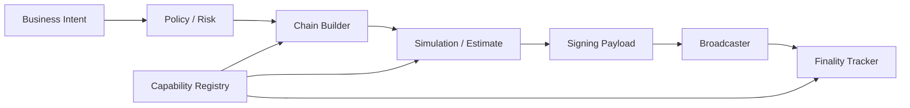

# 多链钱包 Chain Adapter 与能力矩阵

## 30 秒版（开场）

> 多链钱包不能抽象成一个“address + nonce + gas”的万能接口。正确做法是先建立能力矩阵：状态模型、签名方案、交易 freshness/replay、手续费、token 表示、finality、replacement、memo/tag、模拟与索引能力；再用小能力接口组合 adapter。公共领域模型只保留真正共性，链特有字段必须可扩展且可审计，不能为追求统一而丢失 UTXO、blockhash、object reference 等语义。

## 3 分钟版（一面深度）

1. **能力发现**：每个 chain/network/版本声明 capability，不让业务用链名 `switch` 到处散落。
2. **职责拆分**：Reader、Builder、Simulator、Signer codec、Broadcaster、Finality tracker 分开。
3. **原始数据保真**：保存 canonical raw transaction、signing payload、链原始 amount 和 RPC response digest。
4. **版本化**：链升级、RPC 迁移、token extension 和 fee market 变化都可能改变能力。

## 10 分钟版（原理 + 图示）



**能力矩阵示例**

| 维度 | EVM | Bitcoin | Solana | Cosmos SDK | Sui |
|------|-----|---------|--------|------------|-----|
| 状态 | account | UTXO | account data | account/module store | versioned objects + 支持资产的 address balances |
| 防重放/freshness | chain ID + nonce | 消费 outpoint | recent blockhash / nonce | chain-id + sequence | tx data；object 路径还绑定 refs |
| fee | gas limit × fee market | feerate × vbytes | fee/compute budget | gas × gas price/fee | coin object / address balance / 特定 gasless 能力 |
| 并发冲突域 | sender nonce | selected outpoints | writable accounts/blockhash | signer sequence | input objects；或 sender + asset balance domain |
| 替换 | same nonce policy | RBF/CPFP policy | 通常重建并重签 | chain/mempool specific | 重新构建；object 路径需新 refs，余额路径需重查 effects/余额 |

这只是设计入口，具体规则必须由 adapter 文档和链版本配置给出，不能把表格当协议规范。
Sui 在 2026 年引入 Address Balances 后，资金与 gas 路径可按协议能力呈现为 object、
address balance 或 hybrid；`input objects` 仍是 object 路径的冲突域，而余额路径还需
sender/asset 级 reservation。详见
[S-WALLET-11](./S-WALLET-11-sui-go-capability-adapter.md)。

```go
type Builder interface {
    Build(ctx context.Context, intent Intent) (UnsignedEnvelope, error)
}

type Simulator interface {
    Simulate(ctx context.Context, tx UnsignedEnvelope) (Simulation, error)
}

type FinalityTracker interface {
    Observe(ctx context.Context, ref TxRef) (Observation, error)
}
```

不要定义一个几十个方法的 `BlockchainClient`，否则所有链都被迫实现无意义方法或返回 `not supported`。可选能力应通过接口/feature flag 明确发现。

**规范化边界**

- 地址：checksum、大小写、前缀、network 与 memo/tag 规则按链验证；绝不能统一 `strings.ToLower`。
- 金额：内部使用 raw integer + asset decimals/metadata；展示格式不是签名输入。
- 交易 ID：有的链存在 txid/wtxid 或签名前后 ID 差异，领域模型应允许多标识。
- finality：输出 observed/confirmed/finalized 等领域水位，并保存链原始证据。

## 生产场景

- 新增一条链：先补 capability contract 和 conformance tests，再接业务状态机。
- RPC 升级：adapter 双栈，shadow read 对比结果后切流。
- 多供应商：同一 adapter 对 provider 差异归一，但不能掩盖方法缺失和数据一致性差异。

## 排查与工具

为每个 adapter 建 golden transaction vectors：地址、序列化、signing hash、签名、tx ID、fee、错误映射。主网升级前在 testnet/devnet 回放，并对关键 RPC 做 provider 差异测试。

## 架构取舍

统一层越厚，业务越简单，但越容易丢链语义。建议“薄公共内核 + 明确 capability + 链特有 extension”，而不是把所有链伪装成 EVM。

## 深挖问答

1. **为什么不用统一 `SendTransaction(to, amount)`？** → 无法表达 UTXO 选择、token account、memo、object input、合约 calldata 和 fee policy。
2. **链特有字段会污染领域层吗？** → 业务 intent 保持稳定；unsigned envelope 和审计证据允许版本化 extension。
3. **如何测试 adapter？** → 官方向量、双实现交叉验证、testnet 集成和主网只读回放。
4. **如何处理 unsupported？** → 在 capability discovery 阶段拒绝，不等到签名后才失败。
5. **如何灰度新链版本？** → versioned adapter、shadow build/read、按资产/租户切流和可回退。

## 反模式与事故

- 所有地址小写，破坏区分大小写或 checksum 语义。
- 金额先转浮点再构造链上 raw amount。
- 为统一接口丢弃 Bitcoin outpoint、Sui object version 或 Address Balance funding mode，恢复时无法判断冲突。
- adapter 内直接执行风控和账务，链升级迫使核心业务一起改。

## 延伸阅读

- [Ethereum accounts](https://ethereum.org/developers/docs/accounts/)
- [Bitcoin transactions](https://developer.bitcoin.org/devguide/transactions.html)
- [Solana accounts](https://solana.com/docs/core/accounts)
- [Sui object model](https://docs.sui.io/develop/sui-architecture/object-model)
