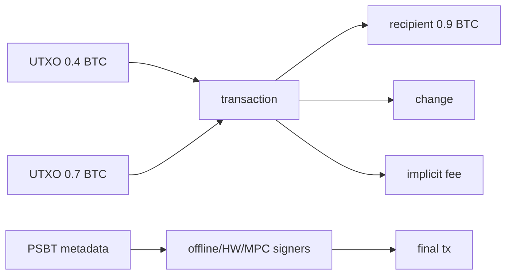

# Bitcoin UTXO、Coin Selection、PSBT 与手续费替换

## 30 秒版（开场）

> Bitcoin 交易消费一个或多个完整 UTXO，并创建新的 outputs；多余价值通常进入 change，手续费等于 inputs 总额减 outputs 总额，工程上按交易 vbytes × feerate 估算。Coin selection 同时权衡手续费、找零、dust、隐私和 UTXO 碎片。PSBT 是多参与方交换未完成交易及签名元数据的容器，不是链上交易格式。未确认交易加速要区分 replacement relay policy（RBF）和后代付费（CPFP），规则受节点版本与策略影响。

## 3 分钟版（一面深度）

1. **UTXO identity**：`txid + vout`；同一 outpoint 只能被 canonical 链中的一笔交易消费。
2. **Coin selection**：先 reserve，再构造/签名；并发 worker 不能选择同一 UTXO。
3. **PSBT**：creator/updater/signer/finalizer/extractor 可分角色，便于硬件钱包、离线签名和多方协作；不同 PSBT version 的全局字段结构不同。
4. **Fee bump**：RBF 替换原交易；CPFP 用高费率 child 提升 package 激励。二者都不能保证一定被矿工选择。

## 10 分钟版（原理 + 图示）



**Coin selection 目标冲突**

- 少 inputs 通常更省手续费，但持续选大币可能暴露资金关联。
- exact match 可省 change output，但搜索成本和隐私策略更复杂。
- consolidate 小 UTXO 可减少未来碎片，却可能在高费率时很贵。
- 不要把 **dust relay threshold** 与钱包的 **economic spend threshold** 混成一个数：前者是节点是否转发某类低价值 output 的 policy，受 script 类型和 dust relay fee 等影响；后者是钱包按未来 input 成本/费率判断 UTXO 是否值得创建或消费的本地策略。低于任一策略边界时可能不创建 change 而并入 fee，但理由不同。

示例代码用“largest-first + vbytes”演示边界，不是生产钱包算法。生产还要考虑 script 类型、input weight、ancestor/descendant policy、冻结/标签、隐私和锁定状态。

**PSBT 边界**

PSBT 可携带每个 input 所需的 UTXO、脚本、派生路径、部分签名等信息。BIP 174 定义的 PSBTv0 与 BIP 370 的 PSBTv2 字段组织和可修改能力不同，参与方必须先协商并校验支持的 version，不能把 v0/v2 当成可无条件互换。签名前必须重新验证 outputs、fee、network、sighash 和策略；“PSBT 来自内部系统”不代表可信。最终广播的是 extracted raw transaction。

**RBF 与 CPFP**

- RBF：构造一笔冲突交易，通常消费相同 input 并支付更高费用。是否接受/转发由节点 mempool policy 决定，不能把历史 BIP125 opt-in 规则当作所有节点永恒共识规则。
- CPFP：花费原交易的未确认 output，以较高 child fee 提高 parent+child package 的整体费率。
- 已确认后不能靠 RBF/CPFP“取消”；链重组是另一类风险。

## 生产场景

- 提现批处理：按隐私、费率、最大 weight 和业务 SLA 选择 UTXO。
- 归集：低费率窗口 consolidate，避免未来高费时无法经济消费。
- 离线冷签：在线构造 PSBT，隔离域验证并签名，在线 final/extract/broadcast。

## 排查与工具

- 保存 UTXO reservation、PSBT hash、final raw tx、txid/wtxid、fee/vbytes 与广播响应。
- 对“广播超时”先按 raw tx/inputs 查询，不要立即释放 UTXO 再签第二笔。
- 监控 UTXO 数量与分布、effective value、unconfirmed chain、mempool rejection reason。

## 架构取舍

| 策略 | 优点 | 代价 |
|------|------|------|
| largest-first | 简单、input 少 | 隐私与 change 可能较差 |
| smallest-first | 可整理碎片 | fee 高、input 多 |
| exact/branch search | 可能无 change | 计算与 fallback 复杂 |
| batch payment | 摊薄固定开销 | 延迟和隐私关联 |

## 深挖问答

1. **手续费字段在哪？** → 没有单独 fee output；inputs 总额减 outputs 总额。
2. **UTXO 锁住多久？** → reservation 有 lease/fencing，但签名或广播不确定后不能仅凭超时释放，要查链/mempool。
3. **PSBT 是未签名交易吗？** → 它是表达待完成交易并携带元数据/部分签名的容器；具体字段取决于 PSBT version，最终需 finalize/extract。
4. **RBF 一定可用吗？** → 否；看原交易、替换交易和节点/矿工 policy。
5. **CPFP 谁能做？** → 能花费原交易某个未确认 output 的主体。

## 反模式与事故

- 按“转账金额百分比”估手续费，忽略 input/output 大小。
- 多实例不做 outpoint reservation，构造双花交易。
- 签名器不验证 PSBT outputs，被替换收款地址。
- 广播超时就释放 UTXO并另签，造成冲突与状态混乱。

## 代码示例

见 [coinselect.go](https://github.com/twodog-tt/Golang-development-manual/blob/master/examples/senior/coinselect/coinselect.go)：

```bash
go test ./examples/senior/coinselect/...
```

## 延伸阅读

- [Bitcoin transactions](https://developer.bitcoin.org/devguide/transactions.html)
- [Wallets](https://developer.bitcoin.org/devguide/wallets.html)
- [BIP 174: PSBT](https://github.com/bitcoin/bips/blob/master/bip-0174.mediawiki)
- [BIP 370: PSBT Version 2](https://github.com/bitcoin/bips/blob/master/bip-0370.mediawiki)
- [BIP 125](https://github.com/bitcoin/bips/blob/master/bip-0125.mediawiki)
