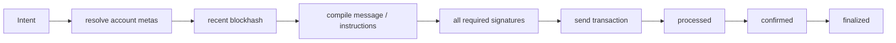

# Solana 账户模型、PDA 与交易生命周期

## 30 秒版（开场）

> Solana 的 account 是程序读写状态的容器，包含 lamports、data、owner 等；owner 是可修改该 data、扣减 lamports 的 program，不等于业务资产所有者，其他 program 仍可向 writable account 增加 lamports。交易 message 显式列出账户与读写权限，并带 recent blockhash 作为 freshness；若业务要在它过期后继续，须先核对旧交易历史和业务状态，再用新 blockhash 重建、重签。PDA 是 program + seeds 推导出的无私钥地址，程序通过 runtime 授权“签名”。确认必须区分 processed、confirmed、finalized，不能把 RPC 返回 signature 当作支付完成。

## 3 分钟版（一面深度）

1. **账户/程序**：程序本身可执行，状态放在独立 accounts；并行执行依赖账户读写集合是否冲突。
2. **PDA**：off-curve、无私钥；seed 是协议的一部分，要做 domain separation 和版本设计。
3. **交易**：signatures + message；recent blockhash 有有效窗口，versioned transaction 可引用 Address Lookup Table。
4. **Token**：mint、token account、authority 分离；ATA 是特定 owner+mint+token program 的确定性默认账户。

## 10 分钟版（原理 + 图示）

**owner 容易说错**

- System Program 拥有普通系统账户的数据语义。
- Token Program/Token Extension Program 拥有 token account 的 data。
- token account 内部的 authority/owner 字段才表示谁能转移 token；不能仅看顶层 account owner。

**PDA**

PDA 由 program ID、seeds 和 bump 推导，落在 Ed25519 曲线之外，因此不存在对应私钥。程序在 CPI 中提供同样 seeds，由 runtime 验证后赋予签名权限。不要把用户可控字符串不加域分隔地拼成 seeds；还要处理 seed 长度、规范化和升级兼容。

**重试语义**

- 同一已签交易重复发送通常保持同一 signature，可用于幂等重播。
- blockhash 过期后必须获取新 blockhash、重建并重签，signature 会变化。
- 在重签前要查询旧 signature 和业务链上状态；若 instruction 本身无幂等保护，旧交易延迟成功与新交易都执行会造成重复业务效果。
- `getSignatureStatuses` 默认只查 recent status cache；没有设置 `searchTransactionHistory=true` 时返回 `null`，只表示当前缓存未命中，不证明交易从未执行。即使请求历史，也要考虑 provider 的归档/保留能力，并结合 `lastValidBlockHeight`、`getTransaction`、多 provider 与业务账户状态判断。
- durable nonce 是另一种 freshness 机制，使用和并发规则不同。

**Commitment**

`processed` 延迟低但回滚风险最高；`confirmed` 获得集群投票确认；`finalized` 达到更强的最终性水位。钱包可先展示低水位，但高价值入账应按风险使用更强 commitment，并保存 slot/block evidence。

## 生产场景

- SPL/Token-2022 充值：解析时按 program ID 和 extensions 处理，不能假设所有 token account 固定布局完全相同。
- 平台代付：fee payer 与业务 authority 可不同，策略需验证所有 signer 和 writable account。
- 高频发送：blockhash service、simulation、compute budget、priority fee 和签名队列协同。

## 排查与工具

关注 `BlockhashNotFound`、signature verification、account in use、compute budget、simulation logs、slot lag 与 commitment。保存 message bytes、首个 signature（即交易 txid）、`lastValidBlockHeight` 和 account metas，不能只存人类可读 instruction，也不能把单个 RPC 的 status cache miss 当作不存在证明。

## 架构取舍

Versioned transaction + ALT 可压缩账户地址、支持更复杂交易，但增加 lookup table 生命周期和解析复杂度。简单交易不必强行使用；adapter 必须能解析 legacy 与支持的版本。

## 追问链

1. **PDA 有私钥吗？** → 没有；runtime 根据 program+seeds 授权程序签名。
2. **recent blockhash 是 nonce 吗？** → 都参与 freshness，但不是 EVM 账户递增 nonce；并发与过期语义不同。
3. **confirmed 等于最终吗？** → 不等于 finalized。
4. **ATA 一定存在吗？** → 地址可预先推导，但账户可能尚未创建；可用幂等创建指令。
5. **交易失败会扣费吗？** → 已被处理的失败交易仍可能消耗费用；要区分未落地和执行失败。
6. **`getSignatureStatuses` 返回 null 能否重签？** → 不能据此单独判断；默认查询窗口有限，要先补历史查询、有效高度与业务状态证据。

## 反模式与事故

- 把顶层 account owner 当 token 持有人。
- blockhash 过期后盲目重签，不查旧交易是否成功。
- 所有 token 按旧固定布局解码，忽略 Token-2022 extensions。
- 用 processed 事件直接给高价值充值不可逆入账。

## 延伸阅读

- [Accounts](https://solana.com/docs/core/accounts)
- [Program Derived Address](https://solana.com/docs/core/pda)
- [Transactions](https://solana.com/docs/core/transactions)
- [getLatestBlockhash](https://solana.com/docs/rpc/http/getlatestblockhash)
- [getSignatureStatuses](https://solana.com/docs/rpc/http/getsignaturestatuses)
