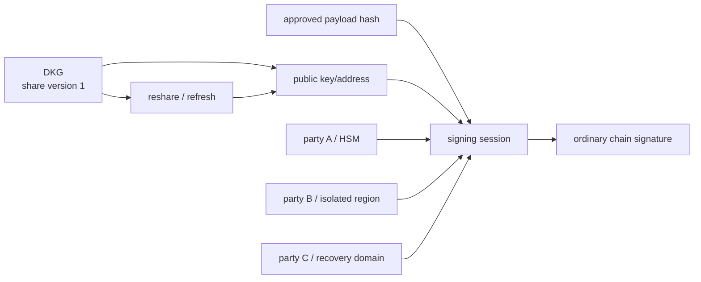

# MPC/TSS 的 DKG、Reshare 与故障恢复

## 30 秒版（开场）

> MPC/TSS 的价值是多个参与方用 key shares 协作产生链可验证签名，正常协议不需要把完整私钥集中到一处；但它不自动解决授权、恶意内部人、备份和可用性。生产要讲清 DKG、share version、threshold/quorum、签名 round、session binding、nonce/preprocessing 安全、reshare 与 key rotation 的区别，以及参与方丢失、网络分区、协议中断后的恢复。任何降级到单私钥都是架构失败。

## 3 分钟版（一面深度）

1. **DKG**：参与方共同产生 shares 和 public key；具体安全性质取决于协议和威胁模型。
2. **签名会话**：绑定 algorithm/domain、public key、chain、payload hash、policy version、session ID 和参与方集合。
3. **Reshare**：可在保持同一 public key 的前提下刷新 shares/改变参与方；key rotation 则生成新 public key，通常需要链上迁移资产。
4. **恢复**：share 备份、恢复 quorum、旧 share 销毁证明、审计和演练必须成体系。

## 10 分钟版（原理 + 图示）

**协议不能混讲**

ECDSA、Schnorr/EdDSA 的 threshold 协议轮次、预处理和证明不同。FROST 是 threshold Schnorr 的标准化方案示例，不能拿它直接解释所有 EVM secp256k1 ECDSA 实现。面试中应说“按链签名算法选择经过审计的协议/实现”，而不是自己拼密码学。

**签名会话不变量**

- 同一业务 intent 只能对应经过审批的 payload hash。
- session ID 全局唯一，并绑定 share version 与 participant set。
- 某些协议中的 nonce/preprocessing material 绝不能复用；崩溃恢复必须按协议规定丢弃或恢复。
- 超时后先查询 session 状态；不能盲目启动另一个不同 payload 会话。
- 审计日志记录 metadata，不记录 shares、可复用秘密或敏感 transcript。

**Reshare 与轮换**

| 操作 | 公钥/地址 | 用途 |
|------|-----------|------|
| share refresh | 通常不变 | 在协议支持、旧 share 安全销毁且威胁模型允许时，降低移动攻击者长期积累风险 |
| participant resharing | 可保持不变 | 换机器/地域/机构、调整门限 |
| key rotation | 改变 | 怀疑 key compromise、算法迁移 |

是否能保持公钥、支持何种参与方变化取决于具体协议。完成后必须原子切换 share version，旧版本达到销毁/禁用条件；混用版本会造成不可用或安全问题。

## 生产场景

- 2-of-3 热签：三方跨故障域，但两方同时在线才能签；区域级故障与维护窗口要演练。
- 大额交易：提高审批门槛不一定要改变密码学 threshold，可由 policy engine 决定参与方/人工批准。
- 灾备恢复：在隔离环境恢复足够 shares，验证公钥一致，执行测试签名，再按审批上线。

## 可运行的跨进程边界

`examples/signer-project/backend/frostcluster/` 将 3 个 Taurus FROST Taproot participant
拆成独立进程并执行真实 DKG 与 2-of-3 BIP-340 signing：

- participant 只创建/加载自己的 `TaprootConfig`，coordinator 不接收 share；
- `protocol.Message.MarshalBinary` 跨 HTTP 传输，接收方重新校验 session、protocol、
  sender/recipient、round 与 canonical encoding；由于固定 Taurus 版本的
  `Message.UnmarshalBinary` 会吞掉 CBOR 解码错误，入口另用严格 CBOR decoder 拒绝畸形、
  重复 map key、未知字段和非 canonical 消息，不能把“上游返回 nil”当成解码成功；
- 生产配置要求 TLS 1.3 mutual TLS；loopback token 仅用于本机 subprocess test；
- share file 原子写入且 mode `0600`，但 plaintext 或同进程 static AES-GCM 都不是
  HSM/KMS-backed share isolation；
- participant 在构造协议 handler 前同步提交 bbolt session ledger；DKG/signing session ID
  一经尝试即永久烧毁，失败、中断或进程重启都不能恢复旧 round。已有 share 时再次 DKG
  在启动协议前 fail closed；
- coordinator queue 在内存中，重启会中止活跃 ceremony。新 session 必须使用新 ID，
  不恢复或复用可能含 nonce 的旧 signing round。

灾备时 share file 与 session ledger 必须作为同一版本、同一防回滚恢复单元。只恢复旧
ledger、复制 share 却漏掉 ledger，或回滚虚机快照，都可能重新开放已经使用过的 session ID；
生产应以 HSM/KMS sealing、单调外部版本/不可回滚日志和恢复演练补上这一边界。

这个项目证明“份额没有集中到 coordinator，进程与认证边界可执行”，不证明协议库已经
完成生产审计，也未实现 reshare、跨地域可靠广播、恶意 coordinator 容错、share
HSM-sealing 或业务 intent/policy 验证。面试中不能把“进程拆开”直接说成“生产 MPC”。

## 排查与工具

指标：session latency/round、participant availability、abort reason、share version mismatch、policy rejection、queue age。故障要区分网络超时、参与方拒绝、协议验证失败、HSM/KMS 不可用和 payload 不一致。

## 架构取舍

门限越高通常意味着攻击者需要控制更多 share，代价是可用性下降；它并不自动代表业务授权
更强。参与方全在同一云账号/同一管理员控制域，即使机器分开也不是真正隔离。安全模型要覆盖
身份、网络、运维、供应商、备份和 policy engine，而不只写 `2-of-3`。

## 追问链

1. **MPC 是否永远不出现完整私钥？** → DKG 正常协议可避免集中重构；既有 key 导入、备份/恢复方案必须单独审计，不能绝对化。
2. **MPC 和链上 multisig？** → MPC 通常产出普通签名；链上 multisig 的策略由合约/协议公开执行。
3. **一方掉线怎么办？** → threshold 仍满足可继续；不满足则暂停，不能降级到明文私钥。
4. **Reshare 后地址变吗？** → 取决于操作；保持同公钥的 resharing 不变，key rotation 会变。
5. **如何防重复签名？** → intent/payload/session 幂等、策略状态机和协议 nonce 安全共同保证。

## 反模式与事故

- shares、备份和业务 DB 在同一账号/同一备份系统。
- 协议超时后复用一次性 nonce/preprocessing material。
- 只完成 share refresh，却没有证明旧 share 已禁用/销毁，就宣称历史泄露风险已经清零。
- 新旧 share version 混用，签名长期失败。
- MPC API 接受任意 digest，未验证链、收款方、金额和 calldata。

## 延伸阅读

- [NIST Threshold Cryptography](https://csrc.nist.gov/projects/threshold-cryptography)
- [RFC 9591: FROST](https://www.rfc-editor.org/rfc/rfc9591)
- 关联：[S-BC-10 MPC/TSS 托管架构](../12-blockchain-web3/S-BC-10-mpc-tss-custody.md)
