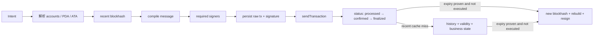

# Solana Go SDK 实战：离线构建、签名与确认状态

## 30 秒版（开场）

> Solana 交易签名的是由 account keys、recent blockhash 和 instructions 编译出的 message。
> Go 生态常用 `gagliardetto/solana-go`，但官方文档把它列为社区 SDK，不能说成官方维护。
> `sendTransaction` 成功只代表 RPC 接受提交，不保证被确认或执行成功；后端要按 signature
> 查询 processed/confirmed/finalized 与执行错误。recent blockhash 过期后必须用新 blockhash
> **重建并重签**，不能修改已签名 bytes；但创建新 attempt 前还要排除旧交易已执行，不能把
> 单次 status cache miss 当作失败证明。

## 3 分钟版（一面深度）

1. 获取符合策略的 recent blockhash，并保存 `lastValidBlockHeight` 等 freshness 证据。
2. 构造 instruction，明确 program ID、writable/signer accounts、PDA/ATA 与 payer。
3. 编译 message 后让所有 required signers 对同一 bytes 签名；任何字段变化都使签名失效。
4. 保存 raw/base64 transaction 与首个 signature，再向一个或多个 RPC 广播同一 bytes。
5. 用 `getSignatureStatuses`/交易查询判断执行错误与 commitment；首个 signature 是交易 txid。默认 status 查询只覆盖 recent cache，历史追踪要显式请求并确认 provider 能力。

可运行离线示例：

```bash
cd examples/non-evm-sdk/solana
go test ./...
```

## 10 分钟版（原理 + 图示）



### SDK 身份与版本治理

示例固定 `github.com/gagliardetto/solana-go` 版本。它是成熟的社区实现，不是 Solana
官方 Go SDK。生产应固定版本、保留 golden transaction vectors，并在协议/RPC 升级时与
官方 CLI、Rust/TypeScript 实现或链上模拟交叉验证。

### `sendTransaction` 的真实语义

官方 RPC 文档明确说明：成功响应不保证交易被集群确认。它可能随后：

- 因账户余额、程序错误或 compute budget 失败；
- 只达到 processed，尚未达到业务要求的 confirmed/finalized；
- 在 blockhash 过期前从未落块；
- 已成功但当前 provider 暂时查询不到。

因此状态应至少区分 `SUBMITTED`、`PENDING`、`EXECUTED_FAILED`、`CONFIRMED`、
`FINALIZED` 和 `EXPIRED_UNKNOWN`。

`getSignatureStatuses` 在未设置 `searchTransactionHistory=true` 时只搜索 recent status
cache；`value: null` 不能证明从未执行。历史查询仍受 provider 保留/归档能力影响，因此恢复
流程还要保存 `lastValidBlockHeight`，并结合当前 block height、`getTransaction`、多 provider
和业务账户状态。

### Blockhash 过期与重试

同一已签名 raw tx 在有效窗口内可以向多个 provider 重播；blockhash 已过期后，重播相同
bytes 不会刷新其有效期。只有在有效高度与足够的历史/业务证据表明旧交易未执行后，若要继续
业务，才创建有 lineage 的新 attempt：获取新 blockhash、重新编译 message、重新审批/签名
并记录新 signature。不能“替换 blockhash 但复用旧签名”。

### Commitment policy

| 水位 | 用途示例 | 风险 |
|------|----------|------|
| processed | 快速 UI 反馈 | 可能落在被抛弃 fork |
| confirmed | 常规业务等待 | 仍不是最高最终性 |
| finalized | 大额结算/不可逆动作 | 延迟更高 |

最终策略应按业务金额、网络健康和链官方定义配置，而不是把标签翻译成固定区块数。

## 生产场景

- SPL Token 转账先校验 mint、decimals、ATA owner 和 token program 版本。
- 大交易考虑 versioned transaction 与 Address Lookup Table；不能把 legacy message 假设写死。
- 用 simulation/compute units 辅助预算，但模拟成功不保证最终执行成功。
- 批量签名前冻结完整 message hash，签名器只接受 allowlisted program 与账户策略。

## 排查与工具

保存 message bytes、raw tx、signature、recent blockhash、last valid height、RPC endpoint、
preflight 配置和 status history。错误排查优先看链返回的 `err`/log messages，不要只看
HTTP 200。

## 架构取舍

跳过 preflight 可降低提交延迟，却减少早期错误反馈；多 RPC 广播提升可用性，但会增加
状态不一致噪声。无论选择哪种，业务真相都应由 signature 的链上执行状态、commitment 与
相关账户/程序状态变化决定；`effects` 是 Sui 常用术语，不应机械套到 Solana 表达中。

## 深挖问答

1. **signature 是业务幂等键吗？** → 它标识一份已签 message；业务还需要 intent/attempt lineage。
2. **RPC 返回 signature 是否成功？** → 只表示接收提交，必须继续查 execution 与 commitment。
3. **blockhash 过期可直接重发吗？** → 重播相同 bytes 不会恢复有效性；先确认旧交易未执行，再用新 blockhash 重建、重签。
4. **多个 signer 怎么保证一致？** → 所有人必须签完全相同的 compiled message bytes。
5. **Go SDK 不官方能否使用？** → 可以，但要固定版本、向量测试、交叉验证并隔离 adapter。

## 反模式与事故

- 把社区 Go SDK 说成 Solana 官方 SDK。
- `sendTransaction` 返回 signature 就给用户最终入账。
- 修改已签交易的 blockhash、账户或 instruction 后继续使用原签名。
- `getSignatureStatuses` 返回 null 就立即认定失败并创建第二笔交易。
- 只保存 JSON intent，不保存实际 message/raw bytes。
- 把 processed/confirmed/finalized 当成所有业务都相同的一个 success。

## 代码示例

```go
signed, err := solanatx.BuildSignedTransfer(seed, recipient, 1_000, recentBlockhash)
if err != nil {
    return err
}
// signed.Base64 与 signed.Signature 先持久化，再广播并跟踪状态。
```

示例的离线路径验证 system transfer 的确定性构建、Ed25519 签名和 base64 编码，并用
`EvaluateStatus` 演示 commitment/执行错误判定；endpoint adapter 另实现 genesis identity、
latest blockhash、`sendTransaction` 与 `getSignatureStatuses` 的真实 JSON-RPC wire contract。
本地 fake server 测试不访问外网，外网 smoke 为 opt-in；ALT、SPL Token、生产签名器与
provider quorum 仍不在这个最小项目的完成声明内。

## 延伸阅读

- [Solana Transactions](https://solana.com/docs/core/transactions)
- [sendTransaction](https://solana.com/docs/rpc/http/sendtransaction)
- [getSignatureStatuses](https://solana.com/docs/rpc/http/getsignaturestatuses)
- [S-WALLET-03 Solana 账户模型与交易生命周期](./S-WALLET-03-solana-account-pda-transaction.md)
