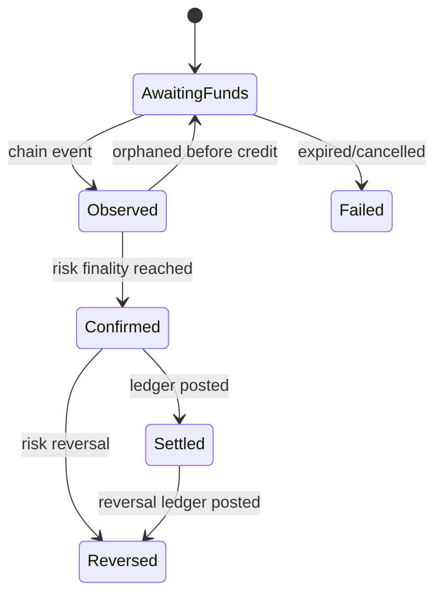

# Web3 支付状态机、幂等、Webhook 与冲正

## 30 秒版（开场）

> 支付 intent、链上 transaction 和账本 settlement 是三个不同对象。状态至少区分 awaiting、observed、confirmed/finalized、settled、failed/reversed；链上看到 tx hash 不等于支付完成。创建 API 用商户作用域幂等键，链事件用 chain+tx/log 等唯一键，Webhook 按 event ID 至少一次投递并允许乱序。区块重组或业务退款不能删除原记录，要用状态转换和不可变冲正流水表达。

## 3 分钟版（一面深度）

1. **Payment intent**：冻结商户、金额、资产、链、收款路由、报价/过期时间和业务幂等键。
2. **Payment attempt**：记录地址/二维码、链上 observation、tx lineage、少付/多付/错币。
3. **Settlement**：只有达到风险水位并写账本后才是商户可结算资金。
4. **Webhook**：签名 + timestamp/replay window，持久化后快速 2xx，消费者按 event ID 幂等。

## 10 分钟版（原理 + 图示）



**三个幂等域**

| 边界 | 幂等键 | 说明 |
|------|--------|------|
| 商户创建支付 | merchant_id + idempotency_key | 同 key 但请求参数不同必须冲突 |
| 链上 observation | chain + block/tx/event identity | 还要保留 reorg lineage |
| Webhook delivery | endpoint + event_id + attempt | event 不变，delivery attempt 可多次 |

状态更新用数据库事务 + version/CAS 或行锁；发 MQ/Webhook 用 outbox。不能先发“支付成功”再提交账本。

**乱序与重复**

Webhook 消费方不应假设 `observed` 一定早于 `settled` 到达。payload 带资源当前状态和事件发生时间/sequence，消费者可按 event ID 去重，必要时回查 payment API 获取权威快照。

**Refund、reversal 与链不可逆**

- refund：新的资金流，可能产生新的链上 tx。
- reversal：账本上抵消原分录，用于 reorg、错误入账或风险处置。
- chargeback：传统支付网络概念，原生链转账通常没有同样机制；稳定币发行人/托管方控制另当别论。

## 生产场景

- 少付/多付：进入 exception 状态，不把任意金额自动视为完成。
- 错链/错 token：资产 identity 不匹配，人工或预定义退款流程。
- 链 reorg：未 settled 回退 observation；已 settled 触发风险冻结和冲正，而不是删交易。
- Webhook endpoint 超时：指数退避、最大重试、DLQ/人工重放，事件 ID 保持不变。

## 排查与工具

保存状态事件流、version、幂等请求摘要、链证据、ledger transaction ID、webhook delivery 日志。指标关注各状态年龄、transition conflict、重复 observation、orphan/reversal 和 webhook 成功率。

## 架构取舍

状态机可以放代码或 workflow engine；无论哪种，转换表、幂等、timeout、补偿和审计都必须显式。workflow engine 不会自动解决资金语义。

## 深挖问答

1. **tx confirmed 就能通知成功吗？** → 要看链 finality、金额风险和账本是否已 posted。
2. **同 idempotency key 参数变了？** → 返回冲突，不能复用旧结果掩盖调用错误。
3. **Webhook 如何防伪造？** → TLS 之外还要签名、timestamp、secret rotation、raw body 验证和 replay 防护。
4. **Webhook 是否 exactly once？** → 网络上通常做 at-least-once + 消费方幂等。
5. **重组后删掉充值记录？** → 不删；标记 orphaned 并用冲正保持审计。

## 反模式与事故

- 一个 `status=success` 混合链确认、内部入账和商户结算。
- 幂等键不校验请求摘要，错误请求得到旧结果。
- Webhook 处理完成前才落 delivery，进程崩溃后丢事件。
- 重试时生成新 event ID，消费方无法去重。

## 代码示例

见 [payment.go](https://github.com/twodog-tt/Golang-development-manual/blob/master/examples/senior/paymentstate/payment.go)：

```bash
go test ./examples/senior/paymentstate/...
```

## 延伸阅读

- [HTTP Semantics](https://www.rfc-editor.org/rfc/rfc9110)
- [Ethereum transactions](https://ethereum.org/developers/docs/transactions/)
- 关联：[S-BC-05 链上索引器](../12-blockchain-web3/S-BC-05-indexer-reorg.md)

