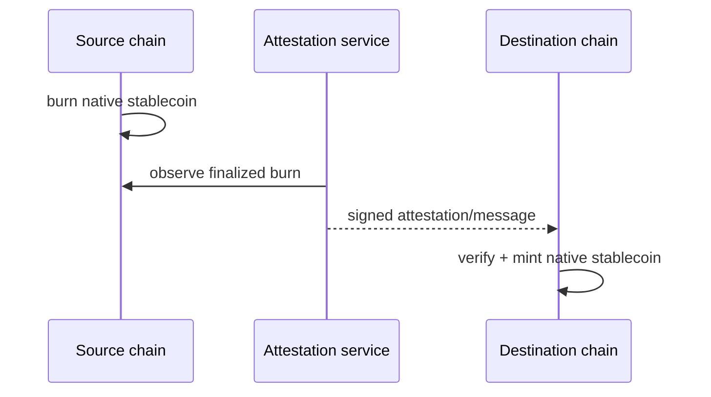

# 稳定币发行人控制、跨链转移与结算风险

## 30 秒版（开场）

> “稳定币”不是一种统一技术资产。要区分发行人原生 token、bridge wrapped token、合约版本和 chain；同 symbol 不代表同一赎回权或风险。中心化发行稳定币的合约可能具有 mint/burn、pause、denylist/freeze、upgrade 等控制，具体以官方合约和条款为准。跨链也要区分锁定铸造桥与 burn-and-mint 协议；例如 CCTP 通过源链 burn、attestation、目标链 mint 转移原生 USDC，但仍有 finality、attestation、合约、运营和目的链风险。

## 3 分钟版（一面深度）

1. **资产身份**：issuer + chain + contract/mint/type + version；展示 symbol 只是 UI。
2. **发行人风险**：储备/赎回、银行与法律实体、合约管理员、冻结、升级、depeg。
3. **跨链风险**：bridge validator/light client/attester、finality、消息重放、流动性、wrapped asset。
4. **支付策略**：allowlist 精确资产，分链限额和 finality，不接受“任何叫 USDC 的 token”。

## 10 分钟版（原理 + 图示）

上图是 burn-and-mint 类型，不代表所有桥。传统 lock-and-mint 可能在源链锁资产、目标链铸 wrapped representation，风险集中在锁仓与桥验证集。

**风险清单**

| 层 | 问题 |
|----|------|
| 发行/储备 | 是否可按面值赎回、储备和银行/司法风险 |
| 合约 | admin key、pause/freeze、upgrade、漏洞 |
| 链 | finality、停机、拥塞、reorg |
| 跨链 | attestation/proof、replay、domain mapping、限额 |
| 市场 | depeg、深度、滑点、做市对手方 |
| 运营 | 错 contract、错误 decimals、地址名单更新滞后 |

**CCTP 边界**

Circle 文档描述 CCTP 为源链 burn、目标链 mint 的 native USDC 跨链机制，不依赖传统 bridge liquidity pool/wrapped token。工程上仍应保存 source message、nonce/domain、attestation、destination mint tx 和版本；fast/standard 模式、费用与支持链会变化，应从官方 capability 获取而非写死。

## 生产场景

- 支付收款：只展示官方 allowlisted contract，后台再次校验 chain ID、token program/contract 和 decimals。
- Treasury 再平衡：比较 CCTP、交易所、其他桥的时间、费率、限额和故障域。
- Depeg：动态降限额、提高折价/确认、暂停自动结算，不能等价格归零才响应。

## 排查与工具

维护资产 registry 的来源、审核人、生效版本和官方链接。监控 mint/burn/pause/admin 事件、价格偏离、流动性、跨链 pending age、attestation failure 与目的链 mint 失败。

## 架构取舍

原生 issuer-supported token 通常减少 wrapped bridge 风险，但增加发行人控制与赎回依赖；去中心化/超额抵押稳定币又有抵押、预言机和清算风险。没有“绝对安全稳定币”，只能明确风险预算。

## 追问链

1. **USDC 都一样吗？** → 不；必须核对 chain 和官方 contract/mint，bridged 表示可能不同。
2. **burn 后目标链 mint 失败怎么办？** → 状态机持续追踪 message/attestation，可重试 destination receive；不能在内部凭空记成已完成。
3. **冻结能力是否一定存在？** → 取决于具体 token 合约/发行安排，需查官方实现和当前版本。
4. **CCTP 是否零信任？** → 不应这样绝对表述；安全仍依赖协议合约、attestation/运营与两条链。
5. **depeg 如何入账？** → 账本按资产单位保持数量，估值/风险敞口另记录市场价格与 haircut。

## 反模式与事故

- 仅按 symbol/decimals 识别资产，收到假 token。
- 把 bridged token 当成可直接向发行人赎回的原生 token。
- 跨链源 tx 成功就把目标链余额记为可用。
- 资产 registry 靠代码常量，合约迁移后长期未更新。

## 延伸阅读

- [USDC Contract Addresses](https://developers.circle.com/stablecoins/usdc-contract-addresses)
- [Cross-Chain Transfer Protocol](https://developers.circle.com/cctp)
- [Circle Stablecoin Docs](https://developers.circle.com/stablecoins)

