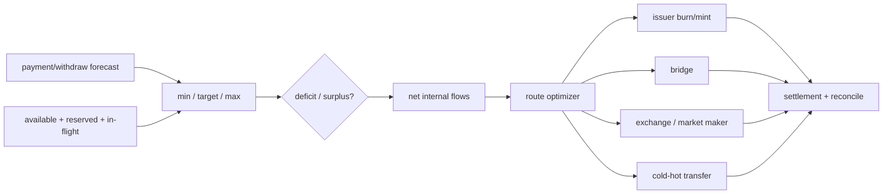

# Treasury、流动性与多链资金再平衡

## 30 秒版（开场）

> Treasury 的目标不是让每条链余额最多，而是在安全敞口、提现/支付 SLA、手续费和资本占用之间维持目标库存。每个 chain+asset+custody domain 都是独立 liquidity bucket，available、reserved、pending inbound/outbound 和用户负债必须分开。再平衡是带时间、费用、限额和风险的路径规划：优先净额化与批处理，再选择链上转移、issuer burn/mint、交易所或做市渠道，并全程走审批、状态机和对账。

## 3 分钟版（一面深度）

1. **库存视图**：链上余额不是可花余额；扣除 pending 提现、gas、冻结和风险 buffer。
2. **目标区间**：每 bucket 设 min/target/max，基于流量预测、补充 lead time 和压力情景。
3. **再平衡路径**：成本 = fee + spread + slippage + capital time + counterparty/bridge risk。
4. **冷热分层**：热钱包只保运营所需，超额自动上收；冷到热需要更强审批和提前量。

## 10 分钟版（原理 + 图示）



**可用流动性示意**

```text
spendable =
  confirmed_onchain
  - reserved_withdrawals
  - pending_signed_not_final
  - minimum_gas_buffer
  - compliance_holds
  - operational_safety_buffer
```

不能把用户负债当公司资产净值，也不能把同 symbol 的跨链余额无条件相加。

**再平衡决策**

- 先对冲同链入/出流和商户结算，减少外部移动。
- 高频小额需求批处理，低频大额走审批。
- 路径必须考虑 source finality、destination 可用时间和失败恢复。
- 对 bridge/provider/counterparty 设单点和累计 exposure limit。

## 生产场景

- 某链支付增长：目标库存提前提高，而不是等提现失败再补。
- 链拥塞/gas 激增：临时扩大 buffer、提高最小批量或引导其他链。
- 稳定币 depeg：按资产隔离风险，不用另一条链同 symbol 自动抵消。
- 冷钱包补热：分 tranche，防一次操作暴露过多资金。

## 排查与工具

Dashboard 至少展示 physical balance、ledger liability、available/reserved、in-flight、目标区间、预测耗尽时间、route pending age 和对账差异。每次再平衡保存决策输入、报价、审批、payload 和最终成本。

## 架构取舍

库存越分散，局部 SLA 越好但资本和攻击面越大；越集中越安全/高效，但跨链补充慢。架构师应给出按流量与风险分层的动态区间，而不是固定“热钱包留 10%”。

## 追问链

1. **链上余额为什么不等于可用？** → 有预占、未决交易、gas、冻结和安全 buffer。
2. **如何设 min？** → 峰值流量 × 补充 lead time + 风险余量，并做压力测试。
3. **桥最便宜就选桥吗？** → 还要算安全、finality、限额、流动性和失败恢复。
4. **如何避免频繁来回搬？** → hysteresis、最小批量、净额化和预测。
5. **再平衡如何幂等？** → intent/payload 唯一、状态机、同 raw tx 重播和 ledger/outbox 对账。

## 反模式与事故

- 只看 hot wallet balance，不看已签未确认提现。
- 每分钟越界就自动反向调仓，形成振荡和手续费损耗。
- 所有链/资产共用同一阈值。
- bridge 卡住后人工在另一渠道再发，却未把两条路径建立 replacement/compensation lineage。

## 延伸阅读

- [CCTP and crosschain liquidity management](https://developers.circle.com/cctp)
- [Bitcoin Payment Processing](https://developer.bitcoin.org/devguide/payment_processing.html)
- 关联：[S-WALLET-06 归集与恢复](../17-multichain-wallet/S-WALLET-06-deposit-sweep-reservation-recovery.md)

