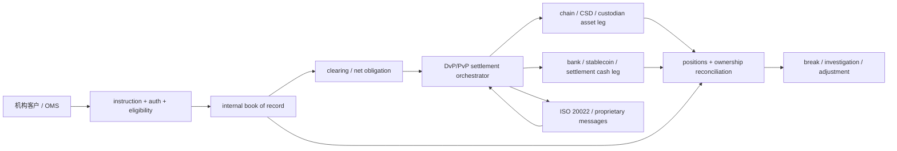
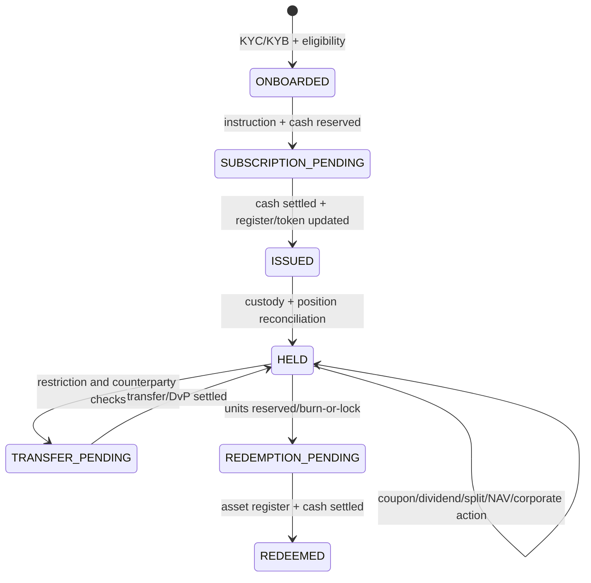

# 机构托管、DvP 清算、RWA 生命周期与 ISO 20022

## 30 秒版（开场）

> 机构金融系统要分开 instruction/message、内部 book of record、custodian/chain movement、clearing obligation、settlement asset 和 legal finality。ISO 20022 是金融业务模型与消息标准，不是资金网络；XML 校验、网络 ACK 或状态消息都不能单独证明钱已最终结算。RWA token 也不天然等于法律所有权，要把发行实体/登记簿、投资者资格、托管、申赎、公司行动、现金腿、链上转移限制和持续对账组成完整生命周期。设计时用不可变 instruction、双分录、DvP/PvP、状态证据和 exception case 管理，不能用一个 `SUCCESS` 覆盖全部阶段。

## 3 分钟版（一面深度）

### 必须区分的事实

| 层 | 事实与 owner |
|----|-------------|
| Client instruction | 谁要求买卖/申购/赎回/付款，授权、适当性和幂等 |
| Internal book of record | 客户权益、现金/资产 pending/available/reserved、费用和分录 |
| Custodian/sub-custodian | omnibus/segregated account 中实际持仓与控制权 |
| Chain/register/issuer | token、法定登记簿、transfer agent 或发行人记录的状态 |
| Clearing | 各方应收应付、netting、margin/collateral 与待结算义务 |
| Settlement | 证券/资产腿和资金腿实际转移，以及适用规则下的 finality |
| Messaging | pain/pacs/camt 等业务消息及 network/scheme 状态，不等于以上所有层已完成 |

链上 token、托管 statement 和内部账本分别是不同域的证据；系统要持续证明三者关系，而不是选一个宣称“唯一真相”。

## 10 分钟版（端到端架构）



### Custody 模型

- **Omnibus**：外部以机构总账户持有，内部 subledger 记录 beneficial entitlement；效率高，但内部账本、客户资产隔离和 reconciliation 要求更高。
- **Segregated**：外部按客户/组合分户，隔离和可解释性更直观，但开户、费用、流动性和操作复杂度更高。
- **On-chain segregated address** 不自动等于法律隔离；仍取决于实体结构、合同、破产隔离、控制权和司法辖区。
- **Proof of key control** 只证明能操作某地址，不证明负债完整、资产无质押或客户享有何种法律权利。

内部权益变更应走双分录与状态科目；外部 omnibus 持仓通过 position proof 与客户 subledger 总和对账。

### Clearing、Settlement 与 DvP/PvP

Clearing 计算并确认义务，可能包含 gross/netting、fee、margin、collateral 和 fail management。Settlement 使用某种 settlement asset 完成价值转移。BIS/CPMI 将 DvP 描述为把证券转移和资金转移连接起来，使交付仅在对应资金转移发生时发生；PvP 对应两种货币支付腿，目标是降低 principal risk。

“同一智能合约原子交换”可以降低操作窗口，但仍要问：

- 两条腿是否真在同一 finality domain；跨链/链下腿是否只是锁定或承诺；
- cash token 是央行货币、商业银行负债、稳定币还是其他 credit exposure；
- token transfer 是否同时改变法定登记/beneficial ownership；
- 协议 finality 与法律 finality、撤销/冻结/法院命令如何衔接；
- 失败、partial settlement、日终 cutoff、流动性不足和 corporate action 怎么处理。

技术原子性不能替代 settlement asset 与法律权利分析。

### ISO 20022 的正确边界

ISO 20022 定义业务建模方法、数据字典和消息。常见支付消息族包括：

- `pain`：客户侧 payment initiation/status 等；
- `pacs`：FI-to-FI payment clearing/settlement 指令、状态、return 等；
- `camt`：cash management、statement、notification、investigation/cancellation 等。

具体 message version、必填字段、状态码和流程由 CBPR+、HVPS+、本地 RTGS/ACH 或银行 implementation guideline 决定。不能只看 namespace 就推断业务语义，也不能把一套 schema 直接通用于所有 rail。

典型状态要分层：

```text
CREATED -> VALIDATED -> TRANSPORT_ACCEPTED -> SCHEME_ACCEPTED
        -> SETTLEMENT_PENDING -> SETTLED
        -> REJECTED / RETURN_PENDING / RETURNED / INVESTIGATION
```

- HTTP 200、MQ ACK、network ACK：只证明传输/接收层。
- payment status report：证明对方在某 usage guideline 下声明的业务状态。
- statement/debit-credit notification、settlement account movement 与内部对账：才构成更强结算证据。
- cancellation request 只是请求；原付款若已不可撤销，可能需要 return，而不是把原流水改成 cancelled。

`MsgId/InstrId/EndToEndId` 等标识的唯一范围依 scheme 而异；UETR 是 Swift 跨境跟踪语境的重要标识，不是所有 ISO 20022 rail 的通用幂等键。内部仍应有稳定 `instruction_id/attempt_id` 和映射表。

### RWA 生命周期



需要建模：发行/增发、投资者资格与 transfer restriction、NAV/price 来源、申赎 cutoff、token mint/burn、法定 register/transfer agent、托管、收益分配、税务/公司行动、冻结/法院命令、链升级与跨链表示。任何一步失败都要能 reconciliation 和 case management。

token burn 不等于赎回资金已到账；subscription cash 到账也不等于 token/法定份额已发行。

## 生产场景

- **银行返回状态但 statement 未见入账**：保持 settlement pending/investigation，不提前释放客户资产。
- **链上 token 已转、法定 register 更新失败**：冻结后续转移，进入 ownership break；不能只重试数据库 UPDATE。
- **Omnibus custodian 少仓**：按客户 subledger、pending settlement、fee/corporate action 分解 break，禁止用新客户资产填平。
- **RWA dividend**：按 record date、eligible position、withholding policy 生成可审计 entitlement，再跟踪现金/稳定币 distribution。

## 排查与工具

每笔交易建立 evidence timeline：client instruction、auth/approval、ledger entries、outbound message digest/version、network/scheme IDs、custodian/chain transaction、settlement account statement、register position、reconciliation case。敏感 PII 与支付数据要做字段级访问和保留控制。

## 架构取舍

同步 DvP 可降低 principal risk，却可能增加流动性需求和跨系统耦合；净额结算提高资金效率，却积累结算敞口。选择取决于产品、rail、资产、交易对手和法规，系统必须显式度量 unsettled exposure、cutoff 和 fail aging。

## 深挖问答

1. **ISO 20022 是支付网络吗？** → 不是，是业务建模与消息标准；消息可运行在不同网络/市场基础设施上。
2. **收到 pacs 状态就算结算吗？** → 看 usage guideline 与状态语义，并结合 settlement account/statement、rail finality 和对账证据。
3. **链上原子交换就是 DvP 完成吗？** → 还要确认两条腿、settlement asset、法律所有权和 finality 是否真正联动。
4. **RWA token holder 一定是法律所有人吗？** → 不能泛化；取决于发行结构、登记簿、合同和司法辖区。
5. **Omnibus 如何证明客户资产？** → 外部持仓/控制证据 + 内部逐客户 subledger + pending/encumbrance + 持续 reconciliation。

## 反模式与事故

- 把 ISO 20022 当成“接入后资金自动全球实时结算”的协议。
- 用一个 `SUCCESS` 同时代表消息送达、清算接受、链执行、现金结算和客户可用。
- RWA mint 后不对法定 register、custodian 和 token supply，导致三套所有权分叉。
- 以链上地址独立推断客户资产已法律隔离。
- cancellation API 返回成功后直接冲销原付款，未等待 cancellation/return 最终结果。

## 合规边界

RWA、托管、证券和支付规则高度依司法辖区、实体、客户类型与产品结构变化。本题只讨论系统架构与控制点，不构成法律或监管意见；落地必须由当地法律、合规、财务和市场基础设施规则共同确认。

## 延伸阅读

- [ISO 20022 Message Definitions](https://www.iso20022.org/iso-20022-message-definitions)
- [Swift ISO 20022 Standards](https://www.swift.com/standards/iso-20022/iso-20022-standards)
- [CPMI-IOSCO PFMI](https://www.bis.org/cpmi/publ/d101.htm)
- [BIS Tokenisation in the context of money](https://www.bis.org/cpmi/publ/d225.pdf)
- [S-PAY-04 支付账本、清结算与三方对账](./S-PAY-04-ledger-clearing-settlement-reconciliation.md)
