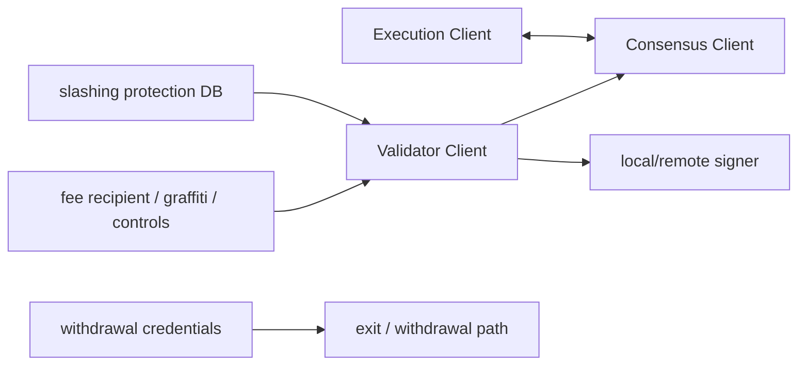

# Validator、Staking、Slashing 与密钥生命周期

## 30 秒版（开场）

> Ethereum validator 通过 validator signing key 执行 attest、proposal 等职责，withdrawal credentials 控制提款路径，两者不是同一密钥。普通离线会损失奖励/产生 penalty，但 slashing 针对可证明的冲突行为，如双 proposal、双投票或 surround vote。最大工程风险是同一 validator key 在两套活跃实例同时签名；HA 不能做普通 active-active，迁移前必须安全停旧实例并导入 slashing protection history。

## 3 分钟版（一面深度）

1. **组件**：EL + CL + validator client/remote signer；validator 可与 beacon node 分离。
2. **职责**：attestation、block proposal、sync committee 等，错过职责与冲突签名后果不同。
3. **密钥**：signing key、withdrawal credentials、fee recipient/operator 凭据分层。
4. **生命周期**：生成/存储 → deposit/activation → duties → migration → exit/withdrawal → archive/audit。

## 10 分钟版（原理 + 图示）

**Penalty 与 slashing**

| 事件 | 典型后果 |
|------|----------|
| 短时离线/漏签 | 少奖励或 inactivity penalty |
| 同 slot 双 proposal | slashable |
| 同 target 双 attestation | slashable |
| surround/surrounded vote | slashable |

具体惩罚数值、退出周期和协议规则会升级，不能背成永久常量；应引用当前协议/客户端。

**安全迁移**

1. 停止旧 validator 并确认不会自动恢复。
2. 导出 EIP-3076 slashing protection interchange 数据。
3. 在新环境导入并校验。
4. 迁移 signing key/配置，保持严格单活。
5. 小批次观察 duties 后再扩大。

仅复制 keystore 不复制 slashing history 是危险操作。Remote signer/HSM 也不能让两套 validator client 无协调地并发请求冲突签名。

**Exit**

传统 voluntary exit 由 validator signing key 发起；协议升级后还存在 execution-layer triggerable withdrawal/exit 机制（EIP-7002）。实际操作必须按目标网络已激活规则和客户端支持执行，不能把 EIP 草案/已激活状态混淆。

## 生产场景

- 多区域 HA：beacon nodes 可多活，validator key/signing duty 采用单活 owner + fencing，而不是双活。
- Remote signer：mTLS、请求域验证、速率限制、anti-slashing 和审计。
- Client diversity：降低相关 client bug，但同一 validator key 的切换仍需安全编排。

## 排查与工具

指标：head/finalized lag、attestation effectiveness、missed duties、proposal status、signer latency/error、slashing DB health、time sync。所有签名请求记录 duty domain/slot/epoch/root，不记录私钥。

## 架构取舍

本地 key 简单低延迟但主机风险集中；remote signer/HSM 隔离更强，却增加网络和可用性依赖。无论哪种，anti-slashing 状态不能成为无备份单点，也不能在分区时双主。

## 深挖问答

1. **离线会被 slash 吗？** → 一般是 penalty/漏奖励；slashing 是特定可证明冲突行为。
2. **为什么 validator 不能 active-active？** → 两实例可能对不同 fork/区块签冲突消息。
3. **只迁移 keystore 行吗？** → 不行，还要 slashing history、配置和严格停旧。
4. **withdrawal key 能签 attestation 吗？** → 不是同一职责；signing key 执行 validator duties。
5. **如何做灾备？** → 预置环境、加密备份、fenced ownership、导入保护数据和定期演练，切换宁可短时离线。

## 反模式与事故

- Kubernetes Deployment 两副本挂同一 validator key。
- 自动故障转移未 fencing，网络分区后双主。
- slashing DB 损坏后直接用空库启动。
- 为降低漏签率放宽 signer policy，反而增加冲突签名风险。

## 延伸阅读

- [Ethereum Proof of Stake](https://ethereum.org/developers/docs/consensus-mechanisms/pos/)
- [Rewards and penalties](https://ethereum.org/developers/docs/consensus-mechanisms/pos/rewards-and-penalties/)
- [EIP-3076 Slashing Protection Interchange](https://eips.ethereum.org/EIPS/eip-3076)
- [EIP-7002 Execution-layer triggerable withdrawals](https://eips.ethereum.org/EIPS/eip-7002)

