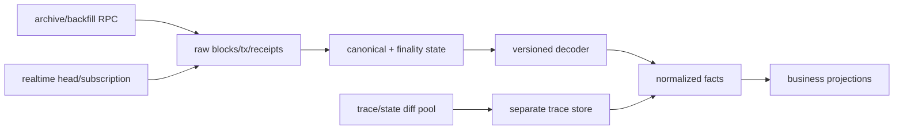

# 链上数据平台：Backfill、实时流、Trace 与 Schema

## 30 秒版（开场）

> 链上数据平台应把 raw canonical evidence、decoded facts 和业务 projections 分层。Backfill 与 realtime 必须重叠一段并用 block hash/tx/log identity 去重，cursor 不能只存高度；reorg 时标记 orphan、回退 projection 并重放。Receipt/log 是协议化数据，trace/state diff 往往是 client-specific 调试输出，需要独立重资源管线和 schema version。ABI/合约升级后要可重解码，不能只保留扁平业务表。

## 3 分钟版（一面深度）

1. **Raw layer**：block/header、tx、receipt/log、source/provider、ingest version，不可变保留。
2. **Decode layer**：ABI/type registry 版本化；未知事件先落 raw，后续可 backfill decode。
3. **Projection layer**：余额、交易、NFT、支付等查询模型，可从事实重建。
4. **双通道**：realtime 降延迟，backfill 保完整；在 watermark 交汇后校验再切换。

## 10 分钟版（原理 + 图示）

**Identity 与 lineage**

- block：`chain_id + hash`，number 是可变化位置。
- log observation：`chain_id + block_hash + tx_hash + log_index`。
- canonical event：业务键另设，但必须指回 observation。
- decoder：记录 ABI/type schema version、code hash/implementation 和 decode status。

**Backfill/realtime 交接**

1. Realtime 从当前 head 开始写 raw。
2. Backfill 从历史向前推进。
3. 在重叠区按 block hash、tx/receipt 数和抽样结果核对。
4. gap=0 且 finality watermark 一致后，完成 ownership 切换。

不能先停 backfill 再启动实时，否则窗口内事件易丢；也不能两个 writer 无唯一键地重复投影。

**Trace 边界**

Ethereum JSON-RPC 标准方法与 `debug_trace*`/其他 trace API 的可用性、格式、性能按 client/provider 不同。Trace 可能需要重放 EVM 和历史 state，必须限并发、超时、隔离节点，并保存 tracer/client/version。

## 生产场景

- Proxy 合约升级：按 implementation/code hash 选择 ABI，历史记录保留当时 decoder。
- 新字段需求：从 raw/facts 回放，不重新依赖可能已不提供的第三方历史 API。
- 多链：共享 ingestion contract，但 finality、identity、trace 和 schema adapter 分链。

## 排查与工具

指标：head/backfill lag、missing block/receipt、decode failure、reorg depth、projection checksum、trace queue/timeout、provider disagreement。定期从链上随机抽样与数据库反查，并做从 raw 重建演练。

## 架构取舍

OLTP 数据库适合状态与低延迟查询，列式/对象存储适合大规模历史分析，搜索引擎适合检索；不要让一个存储同时承担 raw archive、账本事实和全文查询。

## 追问链

1. **为什么 raw 数据不能删？** → decoder/schema 会升级，业务 projection 需要可重建和审计。
2. **cursor 只存 block number 行吗？** → 不行，reorg 无法识别 canonical lineage。
3. **trace 是共识数据吗？** → 执行结果应一致，但 trace API/格式/细节常是 client-specific，需验证。
4. **如何补漏块？** → range gap scanner + hash continuity + receipt/count/checksum 对账。
5. **ABI 不知道怎么办？** → raw 落库、标记 unknown，registry 更新后重解码。

## 反模式与事故

- 只存解析后的 event 字段，ABI bug 后无法修复历史。
- backfill 与 realtime 无重叠校验，切换点丢块。
- trace 和普通 RPC 共用节点，分析任务拖垮支付。
- 以 block number 做唯一键，reorg 新块覆盖旧证据。

## 延伸阅读

- [Ethereum JSON-RPC](https://ethereum.org/developers/docs/apis/json-rpc/)
- [Geth EVM tracing](https://geth.ethereum.org/docs/developers/evm-tracing/)
- [Ethereum Archive Nodes](https://ethereum.org/developers/docs/nodes-and-clients/archive-nodes/)
- 关联：[S-BC-05 Indexer Reorg](../12-blockchain-web3/S-BC-05-indexer-reorg.md)

