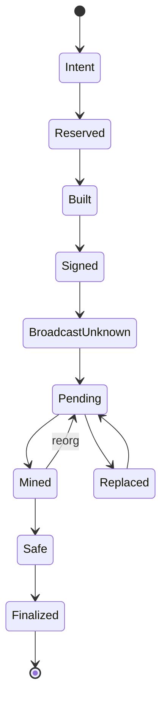

# Relayer 与交易管理器：Nonce、Fee、Replacement、Finality

## 30 秒版（开场）

> Transaction manager 把业务 intent 转成可恢复的链上状态机：持久化 intent → 预占 nonce/资源 → build/simulate → 策略签名 → 保存 raw tx → 广播 → receipt → safe/finalized。Nonce 是同一 sender 的冲突域，分配不能只靠每次读 RPC；fee bump 必须建立同 nonce replacement lineage。RPC timeout、mempool missing 和 dropped 都不是最终失败，只有结合旧 raw tx、链上 nonce、receipt 和 replacement 状态才能决定下一步。

## 3 分钟版（一面深度）

1. **Intent 幂等**：业务 ID + operation 唯一，冻结 to/value/data/chain/policy。
2. **Nonce manager**：单 writer 或 durable reservation/lease；支持 gap、replacement 和重启恢复。
3. **Fee policy**：EIP-1559 fee cap/tip cap、预算、deadline、provider mempool policy。
4. **Finality**：mined 不等于 finalized；reorg 后 receipt 可能消失或换 block。

## 10 分钟版（原理 + 图示）

**Nonce 恢复**

- `latest` nonce 反映已确认状态，`pending` 还受单节点 mempool 影响。
- 本地 reservation ledger 是并发分配依据，RPC 用于校准和恢复。
- nonce gap 会让后续交易等待；manager 应识别缺口并重播/替换，而不是继续无限分配。
- 同 nonce 的多个 signed tx 都要保存，最终只有 canonical 成功者决定业务结果。

**Fee replacement**

Replacement acceptance 是节点 mempool policy，不是 EIP-1559 本身保证。提高 fee cap/tip 时同时检查业务预算、base fee 演进和 provider 规则。取消通常是同 nonce 发向自身的替代交易，并不是协议级撤销；原交易可能先被打包。

**Relayer 额外语义**

跨链 relayer 还要绑定 source message/event identity、source finality、proof/attestation、destination nonce 和 receive tx。重复 relay 应由目标协议 message ID 防重放，内部也要幂等；不能把“源链交易成功”直接视为目的链执行成功。

## 生产场景

- Gas spike：按 SLA 分档 bump，达到预算上限后告警/暂停，不无限竞价。
- Provider timeout：同 raw tx 多播/查询，不重新 build。
- Reorg：receipt orphaned 后回到 pending，账本/业务状态按 finality 水位处理。
- Private transaction route：仍需 public fallback、expiry 和泄漏风险策略。

## 排查与工具

保存 sender、nonce、intent hash、unsigned/signed payload hash、raw bytes、all tx hashes、fee lineage、provider responses、receipt block hash 和 finality。指标：nonce gap age、pending age、replacement count、simulation failure、reorg 和 gas spend。

## 架构取舍

每账户单 worker 最容易保证 nonce；高吞吐可多账户分片或 durable allocator，但一个 sender 的状态仍需一致控制。不要让每个业务微服务直接持 key 并自行发交易。

## 深挖问答

1. **pending tx 查不到就是 dropped？** → 不一定；provider mempool 局部、节点重启或传播差异都可能导致查不到。
2. **广播超时怎么办？** → 查询 tx hash/nonce，并可重播同 raw tx。
3. **同 nonce replacement 会双执行吗？** → canonical 链上只能有一个消费该 nonce；内部状态仍要正确关联 winner/loser。
4. **mined 能给用户最终成功吗？** → 按业务风险等 safe/finalized 或链特定水位。
5. **simulation 成功保证上链成功吗？** → 不保证，状态、base fee、nonce 和合约条件会变化。

## 反模式与事故

- 多 pod 都调用 `pending nonce` 后各自加一。
- 只保存最新 replacement tx hash，历史 raw tx 丢失。
- 交易长时间 pending 就标记失败并退回余额，之后旧交易成功。
- Relayer 未验证 source finality 就执行高价值目的链操作。

## 延伸阅读

- [Ethereum Transactions](https://ethereum.org/developers/docs/transactions/)
- [EIP-1559](https://eips.ethereum.org/EIPS/eip-1559)
- [Ethereum Proof of Stake](https://ethereum.org/developers/docs/consensus-mechanisms/pos/)

