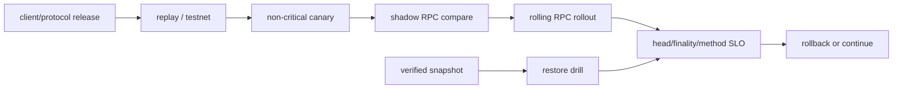

# 节点运维：升级、快照、Pruning、监控与 Runbook

## 30 秒版（开场）

> 节点 SRE 的目标是“跟随正确 canonical/finalized chain 并按方法 SLO 提供数据”，不是进程存活。升级要跟踪协议 fork、EL/CL/client 兼容和数据库迁移，先在非关键/影子节点 canary；快照只缩短恢复时间，必须验证来源、network/genesis、head/finality 和数据库一致性。Pruning、archive/history 是 client-specific 容量策略。Validator key 不能普通 active-active，RPC 节点则应多实例、多 client、独立数据目录。

## 3 分钟版（一面深度）

1. **发布**：版本矩阵、release notes、fork deadline、canary、回滚与 DB format 兼容。
2. **恢复**：从 genesis/sync、可信 checkpoint、snapshot/backup 的 RTO/RPO 和验证路径。
3. **容量**：disk growth、IOPS、compaction、pruning window、trace/archive workload 隔离。
4. **监控**：EL/CL head/finalized lag、peer、RPC 方法 SLO、disk、reorg、validator duties。

## 10 分钟版（原理 + 图示）

**节点分层**

- broadcast nodes：保护写路径，限制 debug/trace。
- read nodes：普通查询与缓存。
- archive/trace nodes：重查询独立限流。
- validator stack：与公共 RPC 隔离，key/anti-slashing 更严格。

**升级清单**

1. 确认 network fork 与最低 client 版本。
2. 验证 EL/CL 组合、Engine API/JWT、flags 和废弃配置。
3. 备份配置、密钥引用、slashing protection；数据库备份按 client 官方流程。
4. Canary 对比 head/finalized hash、RPC golden calls、资源与错误。
5. 分批 rollout；DB migration 后的回滚可能不是简单换回旧 binary。

**Snapshot 信任边界**

快照可能损坏、过旧或来自错误网络。恢复后校验 genesis/network、数据库检查、canonical head/finalized、随机 block/state 与多可信源；Validator 在完全同步和 anti-slashing 就绪前不得启用 duties。

## 生产场景

- Disk 逼近阈值：先保护写入和快照空间，按 client 文档 pruning/扩容，不能在线随意删除 DB 文件。
- Fork 前：提前完成版本覆盖，未升级节点隔离流量。
- 节点分叉/落后：从 LB 摘除，保留证据，比较 peers/client bug，再 resync/restore。
- Provider/API 迁移：shadow traffic 对比语义，不只比 HTTP 200。

## 排查与工具

**核心告警**

- `head_lag`、`safe/finalized_lag` 或对应链 finality lag。
- EL↔CL disconnected、peer 过低、reorg 异常。
- disk free/IO latency、DB compaction、memory/FD。
- method-level RPC P50/P99/error/429、archive/trace queue。
- validator missed duties、signer error、time drift。

Runbook 要有 owner、影响判断、立即止损、证据命令、恢复步骤、验证和升级路径；每季度至少演练 snapshot restore、provider failover 和 validator safe failover。

## 架构取舍

Client diversity 降低单实现相关风险，但增加配置、监控和行为差异成本。关键基础设施值得承担；低风险内部开发环境可简化。多副本必须独立数据目录，不能共享一个可写数据库卷。

## 追问链

1. **节点进程活着为何还不健康？** → 可能落后、分叉、CL/EL 断连或关键方法失败。
2. **快照能否直接信任？** → 不能；要验证来源、网络、状态和同步结果。
3. **升级能否随时回滚 binary？** → DB schema/format 与 fork 兼容可能阻止直接回滚。
4. **RPC 节点如何多活？** → 独立实例/数据目录，多 client/provider，按 head/finality 健康路由。
5. **Validator 如何 HA？** → key duty 单活 + fencing/slashing protection；宁可短时离线，不双签。

## 反模式与事故

- 所有节点同一 client/version/region，同一 bug 全挂。
- 公共 debug RPC 未鉴权限流，攻击者拖垮 archive。
- 磁盘满后手工删 chain DB 子目录。
- Fork 当天才升级，未验证 EL/CL 兼容。

## 延伸阅读

- [Run an Ethereum node](https://ethereum.org/developers/docs/nodes-and-clients/run-a-node/)
- [Geth backup and restore](https://geth.ethereum.org/docs/fundamentals/backup-restore)
- [Geth database pruning](https://geth.ethereum.org/docs/fundamentals/database-pruning)
- [Client diversity](https://ethereum.org/developers/docs/nodes-and-clients/client-diversity/)

