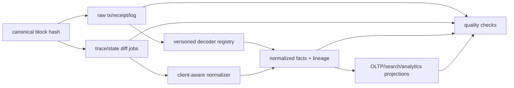

# Trace、State Diff、版本化 Decoder 与链数据质量

## 30 秒版（开场）

> Receipt/log 是协议化执行结果的一部分，但 `debug_trace*`、call trace 和 state diff 的 API、字段及性能通常是 client/tracer/provider-specific。Geth tracing 通过重执行交易收集信息，因此依赖相应历史状态并可能很重；不能把某 provider 的 trace JSON 当成跨客户端共识数据。数据平台应保存 raw response、chain/block/tx identity、client/tracer/config/version 和 decode version，再归一化为可重建 facts；质量门禁同时做 hash lineage、数量/root、跨源抽样、decoder shadow 和 projection balance proof。

## 3 分钟版（一面深度）

推荐分层：

1. **Canonical raw**：header、transaction、receipt/log 和原始 provider response，绑定 block hash。
2. **Execution evidence**：trace/state diff，单独资源池与 schema，标注 client、version、tracer/config、reexec 条件。
3. **Normalized facts**：call、asset transfer、storage change 等稳定内部模型，保留 source pointers。
4. **Business projections**：余额、支付、风控、搜索和报表，可从 facts 重建。
5. **Quality ledger**：每批输入范围、hash/checksum、decoder version、行数、失败/未知和 reconciliation result。

未知 ABI/type 或不支持 trace 时应落 raw + `decode_status`，而不是丢弃或伪造空结果。

## 10 分钟版（数据血缘与版本）



### Trace 与 state diff 的边界

- Geth trace 会本地重执行交易；需要交易访问的历史 state、块上下文和同块前序交易生成的中间状态。
- pruning/sync 模式、节点历史可用性和 reexec 距离会影响能否追踪与延迟，超时不代表交易没有 internal call。
- tracer 配置会改变输出；例如 prestate tracer 的 diff mode 与完整 prestate 语义不同。
- 其他 execution client 或 provider 可能使用不同命名、错误、缺省值和限制。内部 schema 应有 adapter conformance test。
- trace 展示执行路径，不应被描述成“额外的链上共识事件”；最终判定仍绑定 canonical block 与执行结果。

普通支付/RPC 与大规模 trace 应隔离节点、连接池、限流、队列和 SLO，避免分析任务拖垮交易路径。

### 版本化 decoder

Decoder key 不能只有 event signature：

```text
(chain_id, protocol/fork range, contract address or package,
 code_hash / implementation, type-or-ABI version, decoder version)
```

Proxy upgrade、Move package upgrade、Solana program schema、Cosmos protobuf/interface registry 和链级 fork 都可能改变解释。每条 fact 记录：

- raw observation identity；
- decoder name/version 与 schema version；
- code/package/protocol version；
- decode status、warning 和字段 provenance；
- produced_at 与 supersedes/redecode batch。

重解码生成新版本 facts；不要 UPDATE 原记录后让审计无法解释历史报表为何变化。

### 数据质量不是 `count(*)`

| 层 | 质量检查 |
|----|----------|
| 链 lineage | parent continuity、canonical/finality、gap、reorg depth |
| Block/receipt | tx 数、receipt 存在性、status/gas/root 或协议可验证字段 |
| Trace | tx coverage、timeout/unsupported 分类、client/version 差异、重执行预算 |
| Decode | unknown type、ABI mismatch、字段范围、旧新 decoder shadow diff |
| Projection | opening + movements = closing、事件到分录完整性、随机反查 |
| 多源 | 独立 provider 抽样、block-hash 绑定、原始响应留存 |

“两个来源相同”只是证据之一；两者可能同源、同版本或共享错误。

### OLTP、列存与 lakehouse

- OLTP 保存 canonical ownership、任务状态、幂等和低延迟查询。
- 列式系统适合大规模 facts 聚合；排序/分区通常围绕 chain、date/height、address/topic，但要避免高基数分区爆炸。
- 对象存储/lakehouse 适合不可变 raw、批量重算和长期成本控制；manifest/partition commit 要防止读到半批数据。
- 搜索索引是 projection，不是 raw truth；可删除重建。

具体选 ClickHouse、Iceberg/Delta 等要按查询、更新/reorg、成本和团队运维能力，不应把引擎名当成数据正确性方案。

### Block-hash coherent reads

做多个 `eth_call/getStorageAt` 推导一个事实时，使用支持 EIP-1898 的 block hash 参数；必要时 `requireCanonical=true`。只传同一 number 仍可能在调用间跨 reorg，得到无法同时成立的状态组合。

## 生产场景

- Decoder v3 修复 decimal/type bug：从 raw 生成 v3 facts，shadow 比较 v2，审批后按 batch/version 重建 projection。
- Trace provider 限流：普通 receipt pipeline 继续，trace job 标 `retryable/unsupported/pruned`，不能写“无 internal transfer”。
- Proxy implementation 切换：按 block hash 对应 code/implementation 选择 ABI，不用当前 implementation 解码全部历史。
- 分析仓库迟到分区：通过 manifest 和 quality ledger 原子发布，而不是读目录中“已有几个文件”。

## 排查与工具

每个事实都应能一键追到 raw block/tx/receipt/trace、provider、request parameters、client/tracer、decoder commit 和 canonical assignment version。若无法回答“这列数从哪来”，就不能用于资金或监管报表。

## 架构取舍

全量 trace 成本高且 client 耦合强，可按高价值地址、风险规则、失败交易或异步分析分层；但一旦产品承诺“完整 internal transfer”，就要量化 coverage，不能把缺失静默解释为空集合。

## 追问链

1. **Trace 是链上共识数据吗？** → 执行结果受协议约束，但 trace API/表示常是 client-specific 的重执行观测。
2. **Trace 超时是否表示没有 internal call？** → 不是；必须记录失败类型并重试/换具备历史状态的节点。
3. **ABI signature 相同就能共用 decoder 吗？** → 不一定，还要看 address/code/package/protocol 与 decoder version。
4. **为什么 facts 不原地覆盖？** → 保留历史解释、审计和可重复报表，允许比较 decoder 版本。
5. **数据质量最终怎么证明？** → lineage + coverage + 多源抽样 + domain reconciliation + 可从 raw 重建。

## 反模式与事故

- 把 trace 缺失写成空数组，漏记内部资产移动。
- 使用“当前 ABI”批量解码代理合约全部历史。
- 同一报表的多次 RPC 只固定 height，不固定 block hash。
- 在搜索引擎直接修数据，raw/facts 与报表永久分叉。
- 宣称上了 ClickHouse/lakehouse 就解决了 reorg、schema 和质量问题。

## 延伸阅读

- [Geth EVM Tracing](https://geth.ethereum.org/docs/developers/evm-tracing/)
- [Geth custom state-diff tracer](https://geth.ethereum.org/docs/developers/evm-tracing/custom-tracer)
- [EIP-1898](https://eips.ethereum.org/EIPS/eip-1898)
- [S-NODE-07 Canonical Merge](./S-NODE-07-canonical-backfill-realtime-merge.md)
