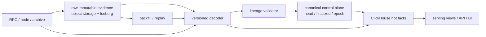

# 链数据列存：ClickHouse 建模、Reorg 与 Lakehouse 分层

## 30 秒版（开场）

> 链数据平台不能按 `block_number` 覆盖，因为 reorg 后同一高度可出现不同 hash。我的分层是：对象存储/lakehouse 保留可重放 raw evidence，canonical control plane 按 parent lineage 提交主链映射，ClickHouse 承担高吞吐分析和热查询。MergeTree 的 `ORDER BY` 决定数据排序与稀疏主索引，主键不保证唯一；`ReplacingMergeTree` 只在后台 merge 时做最终去重，查询正确性不能赌 merge 已发生。容量要用真实压缩率、parts/merge headroom、复制倍数、扫描字节和回填峰值测量，不能只报“每天多少行”。

## 3 分钟版（一面深度）

1. **事实分层**：raw observation、canonical assignment、finalized watermark、derived serving
   是不同事实，不能揉成一张“最新状态表”。
2. **身份键**：日志至少保留 `(chain_id, block_hash, tx_hash, log_index)`；block
   以 `(chain_id, block_hash)` 标识，高度只是排序/定位维度。
3. **ClickHouse 物理设计**：`PARTITION BY` 主要用于生命周期和 part 管理，`ORDER BY`
   才决定 part 内排序和稀疏索引；过细 partition 会制造大量 parts。
4. **去重边界**：ClickHouse primary key 不唯一；ReplacingMergeTree 是 eventual cleanup。
   关键查询用显式版本聚合、经过验证的 `FINAL` 或独立 compacted serving table。
5. **冷/热分层**：lakehouse 保存长期 raw、schema/snapshot 与可重放文件；ClickHouse 保存热点
   规范化列和聚合；PostgreSQL/共识 KV 可保存小而关键的 cursor、lease 和 canonical commit。

## 10 分钟版（端到端数据模型）



核心不变量：

- raw 证据不因 reorg 删除，任何派生结果都能追溯到 decoder version 和 source provenance。
- canonical head 只能沿已验证 parent lineage 原子推进；finalized 以下冲突 fail closed。
- backfill 与 realtime 在重叠 hash 区间交接，不用 `MAX(block_number)` 猜已经接上。
- 聚合结果要能按 canonical version 撤销/重算；finalized 只减少重算频率，不替代 raw。

### 一张 raw event 表的起点

```sql
CREATE TABLE chain_event_raw
(
    chain_id       LowCardinality(String),
    block_number   UInt64,
    block_hash     String,
    parent_hash    String,
    tx_hash        String,
    event_index    UInt32,
    block_time     DateTime64(3, 'UTC'),
    observed_at    DateTime64(3, 'UTC'),
    decoder_id     LowCardinality(String),
    payload        String
)
ENGINE = MergeTree
PARTITION BY toYYYYMM(block_time)
ORDER BY
(
    chain_id,
    block_number,
    block_hash,
    tx_hash,
    event_index
);
```

这只是候选起点，不是通用最优答案：

- 高频查询若以 address/contract 为第一过滤维度，可能需要独立投影或 serving table；不要把
  `address` 无脑塞到最前面，否则按高度扫描会变差。
- `block_time` 是链数据，不等于 ingest time。若存在异常时间戳、超长 backfill 或按到达时间
  管理生命周期，要另外保留并评估 `observed_at` 分区策略。
- 多链吞吐、查询和保留策略差异很大时，可以按链族拆表；统一 schema 不应抹平 UTXO、
  account/object、trace 与 event 的不同基数。
- String 便于示意；生产可在链内固定长度明确时选固定二进制表示，并统一编码，避免 hex 大小写
  或前缀造成身份不一致。

### Partition 不是二级索引

ClickHouse 官方把 partition 首先定位为数据管理能力：TTL、整分区移动/删除和独立维护。
查询真正高频的前缀应反映在 `ORDER BY`。过细 partition 会产生更多独立 parts，而 parts 只在
同一 partition 内 merge。

面试中应先问：

1. 主要查询是按链+高度、地址+时间、交易 hash，还是全链聚合？
2. 数据保留和回填以月、天还是高度区间管理？
3. 单批写入多少行，峰值每秒产生多少 parts？
4. reorg 更正是否落在相同 partition？
5. 哪些查询必须精确，哪些允许近实时 eventual view？

### ReplacingMergeTree 不能当唯一约束

可用版本行表达 canonical assignment：

```sql
-- 示意：同一个 chain_id + block_number 的 assignment 不断追加版本
ENGINE = ReplacingMergeTree(version)
ORDER BY (chain_id, block_number)
```

但必须知道：

- 去重发生在后台 merge，时间未知；未 merge 的重复行仍会被普通查询读到。
- `ORDER BY` 值决定“同一逻辑键”，不是单独声明的 `PRIMARY KEY`。
- `OPTIMIZE ... FINAL` 读写量很大，不能当每次写后的同步提交协议。
- 查询时 `FINAL` 可求正确版本，但要对数据量、分区裁剪和并发做真实 benchmark。
- 更常见的精确查询是 `argMax(value, version)`、维护 compacted table，或由 canonical
  control plane 生成稳定批次。`version` 必须单调且同键不歧义；若可能并列，应把
  source sequence 等确定性 tie-breaker 纳入版本元组。选型必须用查询计划和 SLI 证明。

如果同一逻辑键可能被写进不同 partition，后台 merge 永远不会跨 partition 帮你去重。因此
partition 表达式也属于正确性审查的一部分。

### Reorg 提交方式

```text
observe candidate block/hash
  -> persist raw block/tx/event
  -> validate parent and decoder coverage
  -> find common ancestor on divergence
  -> append canonical=false for removed lineage
  -> append canonical=true for adopted lineage
  -> atomically publish new canonical version/head
  -> recompute affected aggregates
  -> advance finalized watermark only from chain-specific evidence
```

链上原始事实与业务事实分开：同一链上 observation 在 reorg 后可以失去 canonical 身份，但
业务充值 intent 不应因此被复制成一笔新订单。账本侧用冲正/待确认状态机，不直接依赖
ClickHouse 后台 merge 的时机。

### Materialized View 与回填

ClickHouse materialized view 通常在新 block 插入时处理该批数据；对历史 source part 的 mutation、
删除或已有数据，并不会神奇地重放全部派生逻辑。大规模 decoder 升级应：

1. 固定 raw snapshot 与 decoder version；
2. 写新目标表或新版本列；
3. 分区/高度 checkpoint 回填；
4. 做 count、hash、金额守恒、抽样和 canonical 差异校验；
5. shadow query 后原子切换 serving alias/view；
6. 保留旧版本到回滚窗口结束。

## Lakehouse 为什么不是“更便宜的 ClickHouse”

Iceberg 以 metadata、manifest 和 snapshot 管理对象存储中的数据文件，支持 schema/partition
evolution 和 time travel。它适合长期 raw、跨引擎回放和批量重算，但：

- table snapshot 是数据文件集合的一致视图，不是区块链 finality；
- 每次写会形成新 snapshot/metadata，必须 expire snapshot、compact 小文件、清理 orphan file；
- schema field ID 和 partition evolution 降低演进风险，仍要给 decoder 语义单独版本化；
- 不同计算引擎对格式版本和特性的支持可能不同，升级前要做兼容矩阵。

一种常见分层：

| 层 | 适合保存 | 主要 SLO |
|----|----------|----------|
| Object storage + Iceberg | raw block/trace/event、decoder 输出快照 | 可重放、长期保留、成本 |
| ClickHouse | 热明细、地址/协议查询、聚合 | ingest lag、查询 P95/P99、扫描字节 |
| OLTP/control plane | cursor、lease、canonical head、job 状态 | 事务正确性、低延迟写入 |

## 容量与成本验证

不要用固定“ClickHouse 能压缩十倍”作答案。先测：

```text
daily_raw_bytes       = daily_rows × sampled_raw_bytes_per_row
daily_compressed      = daily_rows × measured_compressed_bytes_per_row
steady_storage        = daily_compressed × retention_days × replica_factor
required_headroom     = merges + mutations/backfill + replica repair + temporary parts
query_cost            = read_rows + read_bytes + CPU + peak_memory + concurrency
recovery_time         = bytes_to_restore / measured_effective_throughput + replay/validation
```

至少用代表性的链、trace 深度、payload 分布、排序键和 codec 做样本。分别压测 realtime 稳态、
历史 backfill、深 reorg 重算、节点补副本和大查询并发；任何 QPS/压缩率都必须附工作负载和版本。

## 生产指标

| 域 | 指标 |
|----|------|
| ingest | source/canonical height lag、rows/s、batch size、reject/retry、decoder coverage |
| parts/merge | active parts、small parts、merge queue、merge bytes/s、mutation backlog |
| correctness | duplicate logical keys、canonical diff、parent gap、finalized conflict、replay checksum |
| query | `read_rows`、`read_bytes`、latency、peak memory、spill、failed query |
| replication | replica queue、absolute/relative delay、lost part、read-only replica |
| lakehouse | snapshot/manifest 数、小文件、orphan、compaction lag、restore rehearsal |
| cost | hot/cold bytes、replica factor、扫描 TB、egress、backfill compute |

## 追问链

1. **ClickHouse primary key 会拒绝重复吗？**  
   不会。它是稀疏索引/排序语义，不是 OLTP unique constraint。
2. **ReplacingMergeTree 是否保证读到唯一最新行？**  
   后台 merge 只有 eventual cleanup；精确读需 `FINAL`、版本聚合或 compacted serving 方案。
3. **为什么不能按高度 UPSERT？**  
   reorg 后同高度可有多个 block hash；覆盖会丢失证据，也无法安全找共同祖先。
4. **Partition 越细查询越快吗？**  
   不一定。Partition 主要服务数据管理，过细会制造 parts 和 merge 开销；查询前缀主要看排序键。
5. **Iceberg snapshot 是否等于 finalized snapshot？**  
   不等于。前者是表文件元数据视图，后者是链共识/业务风险状态。
6. **如何证明列存方案比 PostgreSQL 好？**  
   用同一工作负载比较 ingest、扫描字节、P95/P99、回填时间、恢复时间和总成本；不凭产品标签。

## 反模式与错误表达

- “ClickHouse 主键天然唯一。”
- “ReplacingMergeTree 写入后立刻只剩一行。”
- “每次查询加 `FINAL` 就没有性能问题。”
- “按 `block_number` 覆盖就能处理 reorg。”
- “Partition 按地址/交易 hash 越细越快。”
- “Materialized View 会自动重算历史 mutation。”
- “Iceberg time travel 就是链上 finality。”
- “列存压缩率固定，所以可以直接估成本。”

## 延伸阅读

- [MergeTree](https://clickhouse.com/docs/engines/table-engines/mergetree-family/mergetree)
- [ReplacingMergeTree](https://clickhouse.com/docs/engines/table-engines/mergetree-family/replacingmergetree)
- [ClickHouse Partitions](https://clickhouse.com/docs/partitions)
- [Apache Iceberg Specification](https://iceberg.apache.org/spec/)
- [S-NODE-07 Canonical Backfill + Realtime Merge](./S-NODE-07-canonical-backfill-realtime-merge.md)
