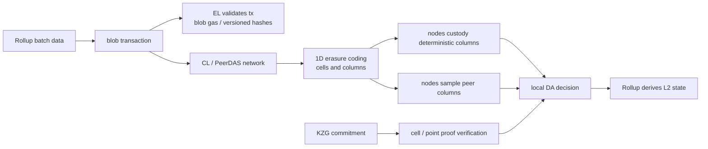

# Blob、DA 与 PeerDAS：从 EIP-4844 到 Fusaka

## 30 秒版（开场）

> EIP-4844 的 blob 是给 Rollup 发布数据的独立数据空间：EVM 不能读取 blob 内容，
> 只能访问 versioned hash，并可通过 KZG point-evaluation 验证承诺开口。Blob 数据由
> 共识层传播且允许在协议保留窗口后被裁剪，不是永久归档。到 2026 年，PeerDAS 已随
> Fusaka 于 2025-12-03 上线：节点托管确定的 data columns，并从 peers 采样，而不再
> 要求每个节点下载所有 blob。KZG 证明内容与承诺一致，采样在网络与纠删码假设下提供
> 概率性可用性判断；二者都不能替 Rollup 自动完成长期归档。

## 3 分钟版（一面深度）

1. **执行与 DA 分离**：blob-carrying transaction 进入 EL 计费和承诺，但 blob 内容
   不可被普通 EVM 合约直接读取。
2. **Sidecar**：共识块引用 commitment，数据通过 sidecar/PeerDAS data column 网络传播。
3. **KZG**：证明某个多项式承诺在指定位置的值正确，解决完整性，不单独证明全网能取到数据。
4. **PeerDAS**：对 blob 做一维纠删码扩展并按 column 切分；节点 custody 固定列并随机采样其他列。
5. **应用责任**：Rollup batcher、derivation node、watcher 和归档服务仍要在可用窗口内获取并保存数据。

## 10 分钟版（原理 + 图示）

### EIP-4844 中三层数据

| 层 | 保存什么 | 常见误解 |
|----|----------|----------|
| EL transaction/header | versioned hashes、blob gas 相关字段 | EL 保存并提供永久 blob 内容 |
| CL block / sidecar | commitment 引用与 blob/sidecar 可用性 | blob 完整嵌入 execution payload |
| Rollup / archive | 可重建 L2 的 batch 数据和长期历史 | Ethereum 会替每个 Rollup 永久归档 |

EIP-4844 原始参数曾对应较低 blob target/max；这些值会随网络升级和
Blob-Parameter-Only fork 改变。面试时不要把 EIP 初始常量当作 2026 主网永久参数。

### PeerDAS 已不是“未来路线图”

Fusaka 由执行层 Osaka 与共识层 Fulu 组成，已于 2025-12-03 在主网上线；
EIP-7594 是其核心能力。按 Fusaka 参数：

- 每个节点只需 custody 总数据的一部分，官方说明为约 `1/8`。
- 每个 blob 经过一维纠删码扩展并分成 cells；同一索引的 cells 组成 column。
- 获取至少一半 columns 可以重建完整数据矩阵。
- 节点每个 slot 从多样化 peers 采样，降低 block producer 选择性 withholding 的成功率。

`1/8`、采样数和 blob target 都是当前协议参数，不应抽象成永不变化的常量。

### DA、完整性与有效性

| 问题 | 机制 |
|------|------|
| 下载到的数据是否匹配 commitment | KZG proof / commitment verification |
| 数据是否足够分布、可被网络恢复 | custody + peer sampling + erasure coding |
| Rollup 状态转换是否正确 | fault proof 或 validity proof |
| 几个月后能否查询原 blob | Rollup/archive/portal 等长期保存策略 |

所以“有 KZG 就证明数据可用”和“有 ZK proof 就不需要 DA”都错误。若数据被 withholding，
用户可能无法重建状态或生成退出证明，即使某个 state root 的密码学格式完全有效。

### Sampling 的边界

PeerDAS 的安全性依赖随机/多样化采样、peer 可达性、custody 分布、纠删码阈值、客户端
实现和 KZG 验证正确性。单个节点采样成功是本地概率判断；网络规模与独立采样共同把
大范围欺骗概率压低。Sybil、eclipse、peer 选择偏差和实现 bug 仍需网络层治理。

## 生产场景

- Rollup batcher 在提交后保存 blob versioned hash、commitment、L1 block/slot 和原始数据归档位置。
- Derivation node 监控 data-column availability、采样失败、重建延迟和 L1 finality。
- 交易所/桥不要把“blob tx included”直接映射为“L2 withdrawal ready”。
- 在协议保留窗口内完成 backfill；长期审计数据放入独立、校验过的多副本存储。

## 排查与工具

先区分 blob transaction 是否进入 canonical L1、对应 commitment 是否正确、节点是否拿到
所需 columns、是否能重建数据、Rollup derivation 是否推进。RPC 查不到旧 blob 不等于
当时 DA 一定失败，也可能只是超过保留窗口或当前 provider 不提供历史数据。

## 架构取舍

DA 吞吐提高可降低 L2 成本，但增加 P2P、纠删码和采样实现复杂度。Rollup 自建长期归档
提高可审计性与恢复能力，但不能把归档服务的可用性反向宣称为 Ethereum 共识保证。

## 追问链

1. **EVM 能读 blob 吗？** → 不能读取 blob 内容；能访问 versioned hash，并使用相关预编译验证开口。
2. **KZG proof 是否等于 DA proof？** → 它证明数据片段与 commitment 一致，DA 还需要获取与采样机制。
3. **PeerDAS 是否还没上线？** → 已随 Fusaka 于 2025-12-03 主网上线。
4. **为什么能只下载一部分？** → 纠删码提供冗余，column custody 与随机采样检测 withholding。
5. **blob 是否永久保存？** → 不是；协议只要求一定保留窗口，长期历史由额外归档体系承担。

## 反模式与事故

- 把 calldata、blob data、commitment 当成同一份链上状态。
- 背诵 EIP-4844 初始 `3/6 blobs`，当作当前主网参数。
- 2026 年仍把 PeerDAS 描述为未部署研究方案。
- Rollup 未保存历史 batch，等节点裁剪后才发现无法回补。
- 只监控 L1 inclusion，不监控 data availability 与 derivation lag。

## 延伸阅读

- [EIP-4844](https://eips.ethereum.org/EIPS/eip-4844)
- [EIP-7594 PeerDAS](https://eips.ethereum.org/EIPS/eip-7594)
- [Fusaka upgrade](https://ethereum.org/roadmap/fusaka/)
- [PeerDAS overview](https://ethereum.org/roadmap/fusaka/peerdas/)
- [S-BC-11 Rollup 安全边界](../12-blockchain-web3/S-BC-11-rollup-finality-da-proof-security.md)
