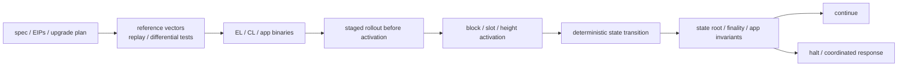

# 协议升级、状态迁移与不可回滚边界

## 30 秒版（开场）

> 链升级要拆成四层：协议规则在指定 block/slot/epoch 激活、节点二进制提前部署、
> 共识状态做确定性迁移、本地数据库 schema 做 client-specific 迁移。所有共识节点
> 必须对同一 pre-state 得到同一 post-state，因此迁移不能依赖 wall clock、网络调用、
> map 非确定顺序或节点本地配置。旧规则产生的新块一旦被新协议接受并最终化，普通
> “回滚旧二进制”通常会停链或分叉；恢复应是激活前中止、修复后二次升级，或经治理
> 协调的新协议事件，而不是随意恢复某台机器快照。

## 3 分钟版（一面深度）

1. **协议激活**：规则以 block number、timestamp、slot、epoch 或治理 plan 为边界。
2. **软件发布**：二进制在激活前分批安装，但激活点前仍执行旧规则，激活点后统一切换。
3. **链上状态迁移**：改变共识可见 key/value、模块版本或状态结构，必须确定、可测试、可重放。
4. **本地 DB 迁移**：索引、缓存、存储格式只影响某个 client；失败可以重建，但不能改变 state root。
5. **恢复策略**：区分未激活、激活但未最终、已经最终三个事故窗口。

## 10 分钟版（原理 + 图示）

### 四层变化

| 层 | 示例 | 失败影响 |
|----|------|----------|
| 协议规则 | Ethereum fork EIP、CometBFT/app consensus rule | 节点对区块有效性产生分歧 |
| 共识状态 | Cosmos module store migration、账户字段变化 | state root 不一致、共识停止 |
| 本地存储 | client freezer/index/schema | 单节点启动失败或需重建 |
| 外围系统 | indexer decoder、RPC schema、风控参数 | 数据错误、漏记、错误入账 |

“数据库迁移成功”不能证明协议升级成功；“链继续出块”也不能证明 indexer、钱包和桥仍按
新事件格式正确工作。

### Ethereum 式 fork activation

执行层和共识层分别维护升级规格，并通过 Engine API 协同。节点运营方需要在激活前更新
兼容版本；到激活点，状态转换和区块验证按新规则执行。不能让少量 validator 在主网上
“先执行新规则试试”，因为这不是普通业务 canary。可做的是：

- devnet/testnet、历史 block replay 和 reference test。
- 多 client differential test。
- 激活前部署已包含旧/新规则的二进制。
- 在外围 RPC/indexer 层做 shadow decode 和只读 canary。

### Cosmos SDK 式状态迁移

`x/upgrade` 在计划高度协调停旧二进制与启新二进制；upgrade handler 调用已注册的
module migrations，并维护 module consensus version。关键要求：

- 每个版本迁移链完整，例如 `1 -> 2 -> 3`，不可跳过未注册步骤。
- 新 store 的 add/delete/rename 在正确高度只执行一次。
- migration 顺序显式处理跨模块依赖。
- 大状态迁移评估区块时间、内存和 I/O，必要时选择 export/genesis 路径。

### Determinism 清单

共识迁移中禁止或严格约束：

- 当前时间、随机数、外部 HTTP/RPC、DNS 和本地文件内容。
- 未排序 map 迭代、并发竞态、浮点跨平台差异。
- “失败后继续部分结果”的非原子流程。
- 根据节点私有配置决定链上结果。

输入应只来自共识状态、区块上下文和已固定升级参数；输出由 test vector 和 state root
验证。

### 三个事故窗口

| 窗口 | 典型动作 |
|------|----------|
| 激活前发现问题 | 停止发布/撤销计划/更换兼容版本，不改变 canonical state |
| 激活后尚未形成稳定 canonical/finalized 结果 | 按协议和治理规则协调 halt、修复、重启；不能各自选择历史 |
| 新规则区块已最终化 | 旧二进制普通回滚不再兼容；需要向前修复或明确的新 fork/治理恢复 |

本地节点损坏可从可信 snapshot 或 genesis 重放，但这只是恢复同一 canonical chain；
不能把任意旧 snapshot 恢复成全网事实。

## 生产场景

- 建立升级矩阵：EL、CL、validator、signer、RPC、indexer、relayer、wallet adapter 版本。
- 保存升级前后 state root、module version、二进制 digest、配置 hash 和审批证据。
- 对历史状态做 dry-run migration，统计耗时、峰值内存、DB 增长和 invariant。
- 升级窗口提高充值/提现水位，暂停依赖新 decoder 的高风险自动化。
- 准备 halt criteria、沟通渠道和签名人，但禁止临场共享 validator/key material。

## 排查与工具

先定位是协议验证分歧、共识状态 root 分歧、本地 DB 打不开，还是外围 decoder 错误。
对比相同 pre-state、相同 binary digest 和 upgrade parameters 的 transition 输出。
某个节点能启动不代表它跟随正确 fork；必须比较 canonical hash 和 finalized checkpoint。

## 架构取舍

In-place migration 快、无需导出全状态，但把计算放在升级关键路径；export/genesis 更慢、
协调成本高，却便于离线转换和审计。选择取决于状态规模、停机窗口、链治理和迁移复杂度，
不是固定偏好。

## 深挖问答

1. **协议升级能否 Kubernetes 滚动发布？** → 可提前滚动兼容二进制，但新共识规则必须在同一激活边界生效。
2. **状态迁移失败能否重试？** → 必须设计为确定且只执行一次的升级流程；节点应从相同 pre-state 重放，不能提交部分结果。
3. **为何不能调用外部 API？** → 节点看到的响应可能不同，导致 state root 分叉。
4. **升级后发现 bug 能否换回旧镜像？** → 若旧镜像不理解已激活规则，不能作为普通回滚；应向前修复或协议级协调。
5. **本地 DB schema 与链上 state migration 有何区别？** → 前者可重建且不进入共识，后者决定所有节点的 state root。

## 反模式与事故

- 把链升级当普通无状态 Web 服务滚动发布。
- 迁移依赖外部 RPC 或节点本地配置。
- 只测试“新节点能启动”，不做历史 replay 与多实现 differential test。
- 没有外围 decoder/ABI/schema 兼容矩阵。
- 在 finalized 后把恢复旧快照称为“无损回滚”。

## 延伸阅读

- [Ethereum execution specifications](https://github.com/ethereum/execution-specs)
- [Ethereum consensus specifications](https://github.com/ethereum/consensus-specs)
- [Cosmos SDK upgrades and store migrations](https://docs.cosmos.network/sdk/latest/guides/upgrades/upgrade)
- [Cosmos SDK x/upgrade](https://docs.cosmos.network/sdk/latest/modules/upgrade/README)
- [S-NODE-06 节点运维 Runbook](../19-node-rpc-staking/S-NODE-06-node-operations-runbook.md)
