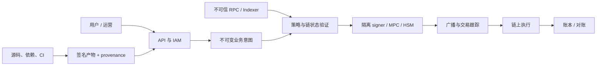

# Web3 威胁建模、IAM 与信任边界

## 要点卡

[返回 P0 知识图谱](../_meta/p0-knowledge-graph.md)

!!! abstract "30 秒回答"

    威胁模型不是列漏洞或画 STRIDE，而是对一个明确版本写清资产、攻击者能力、信任边界、
    滥用路径、安全不变量、控制和剩余风险 owner。Web3 要把观察链数据、批准 intent、构建、
    签名、广播、确认和账本拆开；RPC、队列、VPC、CI 与运营后台都不是天然可信。
    HSM/MPC 能缩小密钥材料暴露面，但恶意 intent 若通过策略，密码设备仍可能忠实签名。

**3 分钟展开**

1. 先写资金/授权/完整性不变量，再画 DFD 和跨边界身份；风险按影响、可利用性与检测/恢复能力排序。
2. IAM 区分 human、workload、signer 与 break-glass；最小权限要细到 tenant/key/chain/action/amount/environment 和有效期。
3. 审批必须绑定 canonical intent digest，包括 recipient、amount、chain、calldata、fee ceiling 和 policy version，防止“批 A 签 B”。
4. 每个控制指定 owner、验证方法和 residual risk；架构、链、权限、依赖或事故变化后更新模型。

| 记忆槽 | 内容 |
|--------|------|
| 三个不变量 | 网络位置不等于信任；HSM/MPC 不替代授权；审批必须绑定完整意图 |
| 手画图 | `identity → intent → policy → signer → broadcast → observation → ledger`，逐箭头标信任边界 |
| 项目落点 | Launchpad 类 DEX/钱包用 signer fence、policy digest、链证据和账本对账举例，只讲真实落地层级 |
| 一个取舍 | 集中 policy 易治理但价值集中；分散执行降低单点，却增加策略漂移与证据一致性成本 |

**错误表达**

- ❌ “服务在 VPC 内且私钥在 HSM，所以请求可信、交易安全。”
- ✅ “网络和 HSM 只是控制层；仍需 workload identity、完整 intent 授权、fencing 与审计对账。”

**自测追问**：攻击者不拿到私钥，仍有哪些路径能让 signer 产生一笔恶意有效签名？

## 10 分钟版（原理 + 图示）

图中每条箭头都要标注身份、协议、认证、数据完整性、重放边界和失败模式。尤其不能因为流量位于 VPC 内就把它当成可信。

### 先写安全不变量

| 域 | 示例不变量 |
|----|------------|
| 托管签名 | 只签署经过当前策略批准的**准确交易意图**；旧 owner/epoch 永远不能继续签 |
| 充值入账 | orphan observation 不得成为最终可用余额；业务幂等与链 observation identity 分层 |
| 跨链 | destination 只能消费被认证的 source domain/emitter/payload/nonce，且一次 |
| 账本 | 每资产分录守恒；历史只能 reversal/adjustment，不能静默改写 |
| 发布 | 只运行来自允许 source/builder、digest 与 provenance 均验证通过的产物 |

控制是否充分，要看它能否维护不变量，而不是看产品清单是否包含 WAF、KMS 和 SIEM。

### IAM 不是一张 RBAC 表

- **Human identity**：SSO、强认证、JIT elevation、审批时限、会话录制；日常管理员和 break-glass 分离。
- **Workload identity**：按服务和环境发短期身份，不把共享 access key 写进镜像、配置中心或 CI 日志。
- **Signer identity**：调用方身份之外还要验证 intent、policy digest、epoch、request ID 和有效期。
- **Machine-to-machine authorization**：认证“是谁”后仍要判断“可对哪把 key、哪条链、哪种方法、多少额度做什么”。
- **Emergency identity**：封存、定期测试、使用即告警；break-glass 不是永久超级账号。

NIST Zero Trust 的重点是对每次资源访问进行显式决策，不是“什么都不信所以系统无法协作”。网络位置只能作为信号之一。

### 典型攻击树：盗签一笔提现

攻击者可能不需要拿到私钥：

- 接管运营账号后修改 allowlist 或审批规则；
- 控制 RPC，让策略引擎基于错误 chain ID、nonce、余额或合约状态构造交易；
- 重放一次合法审批，但替换 recipient/amount/calldata；
- 利用 coordinator 双主，让旧 leader 继续向 HSM/MPC 请求签名；
- 投毒 builder/decoder，使 UI 显示和实际签名 bytes 不一致；
- 窃取足够 MPC 份额，或诱导合法 quorum 对恶意 intent 协作。

因此控制必须覆盖治理、数据、业务语义和密码学四层。

## 生产场景

一次“新增链/新增 token”评审应更新 DFD、资产和 attacker capability，检查 chain ID、合约地址、decimal、finality、reorg、admin/freeze 权限、SDK 版本、RPC trust 和恢复流程。能力变化不是普通配置变更。

## 排查与工具

审计日志至少能从 `business_intent_id` 关联到 caller identity、审批、policy version/digest、构建的 raw bytes/digest、signer key/epoch、广播 attempt、链上 observation 和账本分录。日志应防篡改并限制敏感数据，不应记录私钥、seed、MPC share 或完整认证 token。

## 架构取舍

集中 policy engine 易于治理，却可能成为高价值单点；分散策略降低中心依赖，却容易版本漂移。常见做法是控制面统一发布签名策略版本，数据面 signer 本地 fail closed，并对高风险操作保留独立限额和 fencing。

## 深挖问答

1. **做了 STRIDE 就完成威胁模型吗？** → 没有；还要有范围、攻击者能力、风险优先级、控制 owner 和验证证据。
2. **VPC 内请求可信么？** → 不能据此推断；验证 workload identity、请求完整性、授权语义和重放边界。
3. **HSM 能防运营账号被盗吗？** → 只能保护密钥操作边界；若策略允许恶意 intent，HSM 仍可能忠实签名。
4. **服务账号最小权限是什么？** → 不只是 API action，还包括 key/tenant/chain/environment/resource condition 和时限。
5. **威胁模型多久更新？** → 重大架构、链协议、资产、权限、依赖和事故后更新；同时定期复审假设。

## 反模式与事故

- 把“内部服务”“多签”“链上不可篡改”直接等同于可信。
- 所有 worker 共用一个云凭证和 signer client certificate，无法撤销单个主体。
- 审批只绑定订单号，未绑定 recipient、amount、chain、calldata 和 fee ceiling。
- break-glass 账号长期启用且不演练，真正事故时凭证已失效或权限过大。
- 只列漏洞，不写资金、安全和可用性不变量，也不指定 residual risk owner。

## 延伸阅读

- [OWASP Threat Modeling Cheat Sheet](https://cheatsheetseries.owasp.org/cheatsheets/Threat_Modeling_Cheat_Sheet.html)
- [NIST SP 800-207 Zero Trust Architecture](https://csrc.nist.gov/pubs/sp/800/207/final)
- [S-SOL-07 安全审计架构](../11-solution-architecture/S-SOL-07-security-audit-architecture.md)
- [S-BC-10 MPC/TSS 托管架构](../12-blockchain-web3/S-BC-10-mpc-tss-custody.md)
