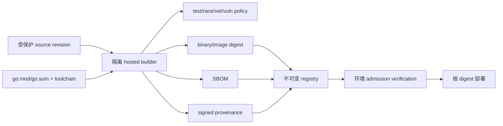

# SBOM、SLSA Provenance 与发布准入

## 30 秒版（开场）

> SBOM 回答“产物里有什么”，provenance 回答“由哪个 builder、哪些输入和步骤构建”，签名证明某身份认可了某 digest；三者都不自动证明软件无漏洞或业务上允许部署。生产发布应以不可变 digest 为主键，把 source revision、依赖锁定、测试、SBOM、构建 provenance、签名和环境准入串成验证链。按 SLSA v1.2 Build Track，L1 是存在 provenance，L2 是托管构建平台生成并签名，L3 还要求 hardened build；不要继续背旧版单一 SLSA 1–4。

## 3 分钟版（一面深度）

| 证据 | 能回答 | 不能单独回答 |
|------|--------|--------------|
| SBOM | 包、版本、关系、license/标识 | 这些组件是否恶意、运行时是否加载、构建过程是否被篡改 |
| Provenance | builder、source、参数、依赖输入、产物 digest | builder 本身是否值得信任、代码是否安全 |
| Artifact signature | 某 key/identity 对 digest 的认证 | 签名者是否有发布权限、签名时是否经过测试 |
| Vulnerability scan | 已知数据库与可达性分析结果 | 未知漏洞、业务逻辑漏洞、恶意但无 CVE 的代码 |
| Admission policy | 当前环境是否允许该证据组合 | 运行后不会被配置、身份或依赖服务攻破 |

所以正确表达是“建立可验证的供应链与风险门禁”，不是“生成 SBOM 后供应链安全了”。

## 10 分钟版（发布链路）

### 当前版本事实

- SLSA v1.2 将 Build 和 Source 分 track；Build L1/L2/L3 的含义如上。
- SPDX 是 ISO/IEC 5962:2021 的开放标准。**截至本次审计基准 2026-07-18，SPDX 官方规格页列出的 current version 是 3.0，仓库发布页的稳定补丁为 3.0.1；3.1-RC1 仍标为 pre-release，不应表述为已最终发布。** 组织应明确自己接受的稳定 schema/version，而不是仅写“3.x”。
- SBOM schema 版本、生成器版本和 artifact digest 都应入证据；“最新格式”不是兼容策略。

### Go 供应链边界

- `go.sum` 校验下载 module 内容与记录一致，不证明上游源码可信或没有恶意逻辑。
- `go mod verify` 验证 module cache 与下载时记录的一致性，不替代 provenance、review 或漏洞分析。
- `replace`、私有 proxy、`GOPRIVATE/GONOSUMDB` 会改变信任链，必须审计；不能为了下载成功全局关闭 checksum。
- 固定 Go toolchain、CGO compiler、OS base、代码生成器和构建 flags；只固定 `go.mod` 还不等于 bit-for-bit reproducible。
- `govulncheck` 结合调用信息减少噪声，但无报告不代表没有未知漏洞或动态加载路径。
- 用 `go version -m`、镜像 digest、SBOM 与 provenance 做运行产物反查，而不是只记录 Git tag。

### Web3 还要追踪什么

合约 ABI、bytecode、compiler/optimizer、link reference、部署参数、proxy implementation、genesis/chain config、数据库 migration 和 decoder schema 都是发布物。后端镜像签名通过，不代表它将调用的链上 implementation 就是审核版本；应在部署和运行时核对 chain ID、address 与 code hash。

### 准入策略示例

生产 admission 可以要求：

1. image 只能按 digest 引用，来自允许 registry；
2. provenance 由允许的 hosted builder 身份签发，subject digest 与 image 一致；
3. source repo、branch/tag policy、review 和 builder workflow 在允许范围；
4. SBOM 存在且 schema 可解析，高危漏洞按 exploitability/exception policy 处理；
5. 环境配置、migration、合约 code hash 和 feature flag 通过独立校验；
6. exception 有 owner、理由、补偿控制和过期时间。

签名 key 的身份认证与“该身份是否被授权发布到 mainnet”是两次判断。

## 生产场景

- 上游 Go module 被接管：快速从 SBOM 找受影响 digest，再结合 provenance 定位 builder/source，阻断新部署并重建。
- CI runner 被污染：普通 artifact signature 可能照常成功；需要隔离 builder、短期签名身份和可信 provenance。
- 合约升级：将 audited source/compiler settings 映射到 bytecode/code hash，并让后端 decoder 和 allowlist 同步版本化。
- 紧急修复：可以缩短常规流程，但不能发布无来源 digest；exception 必须可追溯和自动过期。

## 排查与工具

从线上 pod/process 读取实际 image/binary digest，再反向查询 registry、provenance、SBOM、source revision 和 CI run。不要从 deployment label 的版本字符串推断实际运行内容。

## 架构取舍

完全可复现构建价值很高，但部分 CGO/平台产物实现成本大；至少保证输入可枚举、builder 可认证、产物按 digest 不可变、可独立重建比较。供应链门禁要在风险和恢复速度之间设计分级，而不是所有 CVE 一刀切阻塞。

## 深挖问答

1. **SBOM 和 provenance 区别？** → 前者是组成清单，后者是构建来源与过程证据。
2. **签了镜像是否安全？** → 只证明签名身份认可 digest；还要验证身份授权、builder、source 和策略。
3. **`go.sum` 能防恶意依赖吗？** → 能发现内容与已记录 checksum 不一致，不能判断已记录内容是否恶意。
4. **为什么按 digest 部署？** → tag 可移动，digest 才能把扫描、签名、provenance 与运行对象绑定。
5. **合约也需要 provenance 吗？** → 需要追踪源码、compiler/config、bytecode、部署与链上 code hash。

## 反模式与事故

- 生成 SBOM 后不归档、不绑定 artifact digest，也不用于查询或事件响应。
- CI 用户自定义步骤可读取 provenance signing secret，仍宣称 hardened build。
- admission 只验证“有签名”，不校验 signer identity、source repo 和 workflow。
- 部署使用 `latest`/可移动 tag，扫描对象与运行对象不是同一 digest。
- 把 SPDX 3.1 RC 说成最终标准，或把旧 SLSA 1–4 当成 v1.2 当前模型。

## 延伸阅读

- [SLSA v1.2 Build Track](https://slsa.dev/spec/v1.2/build-track-basics)
- [SPDX current specifications](https://spdx.dev/use/specifications/)
- [SPDX 3.1-RC1 announcement](https://spdx.dev/spdx-3-1-ontology-and-schema-available-for-review/)
- [Go Modules Reference](https://go.dev/ref/mod)
- [S-GOENG-06 静态分析与依赖供应链](../16-go-production-engineering/S-GOENG-06-static-analysis-supply-chain.md)
