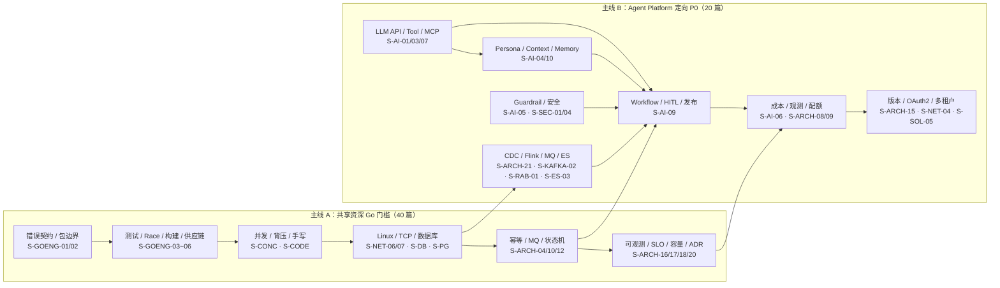
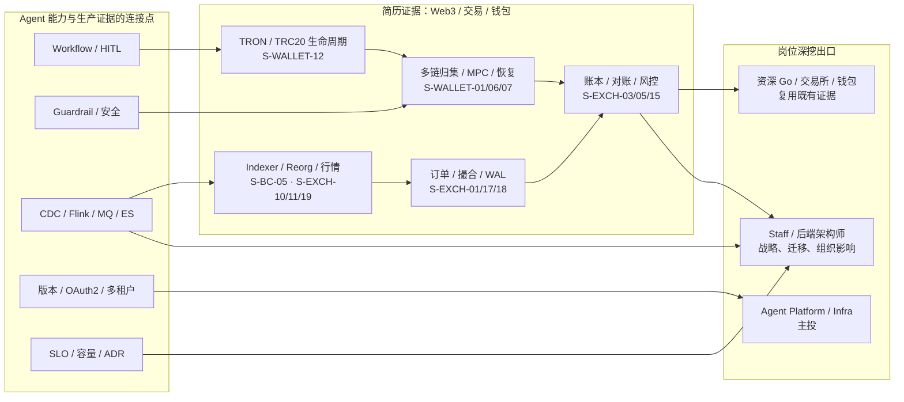

# 知识图谱：简历定向 P0 与岗位深挖

> 当前共 **219 篇**。实际 P0/P1/P2 以
> [七类岗位优先级](./role-priority-matrix.md) 为准。本简历的首选出口是
> **AI Agent Platform / Infrastructure**：先完成 40 篇共享 Go/生产工程门槛，再补 20 篇
> Agent 定向 P0；CEX/DEX、钱包和实时风控不是另一套平行简历，而是证明你能处理资金、副作用、
> 高吞吐和可恢复数据链路的差异化证据。
>
> 图中箭头表示学习与表达依赖，不表示线上系统只能按该拓扑部署。

### 学习主干：Go 门槛 → Agent Platform



### 差异化证据 → 岗位出口



## 简历定向 P0 怎么取舍

| 优先级 | 知识域 | 为什么进入 P0 | 必须避免的表达 |
|--------|--------|----------------|----------------|
| 1 | Go 生产工程与系统基础 | 目标仍是 Go 后端/平台岗位，语言、测试、SQL、网络不能失分 | “用了 Gin/GORM 就等于会 Go 工程化” |
| 2 | Agent 工作流与 HITL | OctoAgentFlow 最核心、最容易被深挖的 0→1 证据 | “加一个 pending 状态就是人工审核” |
| 3 | Persona / Memory / Guardrail | 区分普通 LLM API 接入和 Agent Platform | “把全部聊天记录塞进 prompt 就是 Memory” |
| 4 | 外部副作用、OAuth2、成本与观测 | 发布、支付、tool call 都涉及模糊成功和权限边界 | “框架 checkpoint 自动保证 exactly-once” |
| 5 | CDC/Flink/ES 实时风控 | 连接头部出行平台实时风控经验与 Agent 反馈/画像平台 | “Flink exactly-once 等于 ES 永不重复” |
| 6 | TRON/TRC20 与多链钱包 | 简历明确有 TRON USDT、CEX 钱包和 MPC/TSS | “TRON 就是换 RPC 的 EVM” |
| 7 | 交易所状态机与量化指标 | 证明高吞吐、账本、行情和故障恢复深度 | “只报 3k/20k QPS，不说明 workload 和持久化边界” |
| 8 | Staff 案例 | 架构师岗位需要跨团队决策、迁移和组织影响 | “把题库模板包装成自己做过的生产案例” |

## 20 篇 Agent 定向增量

```text
AI 核心（8）:
  S-AI-01/03/04/05/06/07/09/10

平台控制面（5）:
  S-ARCH-08/09/15/21 · S-NET-04

消息、检索与安全（5）:
  S-KAFKA-02 · S-RAB-01 · S-ES-03 · S-SEC-01/04

简历差异证据（2）:
  S-SOL-05 · S-WALLET-12
```

RAG、多模态、通用 Agent 框架 API 放在 P1：它们值得会，但不是这份简历最先要证明的能力。

## 建议刷题节奏

1. **第一阶段：共享门槛**
   过完 shared P0 的 30 秒版，重点闭卷讲 Go 并发、错误边界、测试、SQL、网络、幂等、MQ、
   状态机、可观测和容量。
2. **第二阶段：Agent 主线**
   `S-AI-01/03/09/10/05/06/07`，画出 proposal、review、execution、receipt 与 memory
   namespace；用 OctoAgentFlow 的真实模块逐一举证。
3. **第三阶段：平台与数据**
   `S-ARCH-08/09/15/21`、`S-NET-04`、Kafka/RabbitMQ/ES，回答版本、OAuth2、配额、
   CDC、回放和降级。
4. **第四阶段：差异化项目证据**
   `S-WALLET-12` 串 TRON USDT；再从交易所/钱包路径选择 6～10 篇与你简历项目最接近的题，
   准备 workload、指标口径、故障和取舍。
5. **第五阶段：架构师出口**
   用 OctoAgentFlow 0→1、CEX 钱包恢复、实时风控链路各准备一个 STAR/ADR 案例，明确本人职责、
   团队边界、失败方案和量化结果。

## 面试表达总原则

- 先说 **你实际负责的边界**，再说框架或组件；“熟悉 LangGraph”不能替代 Go 自建工作流的证据。
- 区分 **模型 proposal、人工 approval、执行 job、外部 receipt**，四者不是一个状态。
- `66% confidence` 说成项目策略阈值，并解释计算、校准、审批和回滚，不能说成通用可信概率。
- 区分 Flink 算子状态 exactly-once 与外部 sink 端到端语义。
- 区分 TRON 的 Bandwidth/Energy、permission、solidified 与 Ethereum nonce/gas/finality。
- 性能数字必须带 **时间范围、工作负载、并发、数据量、P95/P99、持久化边界和验证方式**。
