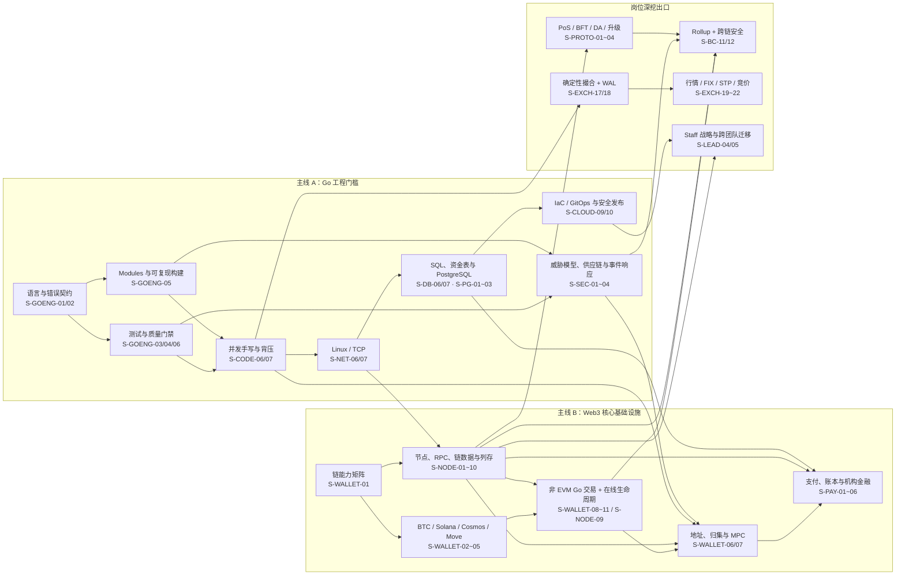

# 知识图谱：共享门槛与岗位深挖

> 当前共 **215 篇**。本图只表示学习依赖；实际 P0/P1/P2 已改为
> [六类岗位优先级](./role-priority-matrix.md)，不再使用一个全局 P0 覆盖所有岗位。
> 准备方式是 **共享 Go/生产工程门槛** 与 **一个目标岗位增量** 并行，再下钻签名控制面、
> canonical/列存链数据、非 EVM 在线可靠性、机构金融或 Staff 迁移。
> 图中箭头表示学习依赖，不表示线上系统只能这样分层。

## 为什么这样排

| 顺序 | 知识域 | 面试价值 | 典型错误表达 |
|------|--------|----------|--------------|
| 1 | Go 错误、接口、测试、构建 | 所有资深 Go 岗的硬门槛 | “接口应由实现方定义”“recover 后就安全了” |
| 2 | Linux/TCP/SQL/手写题 | 验证是否能处理真实线上问题 | “TIME_WAIT 越少越好”“金额用 float64” |
| 3 | 多链钱包与托管 | Web3 Go 岗的核心差异项 | “所有链都是 address + nonce” |
| 4 | 支付、账本、清结算、合规 | 支付/稳定币岗位关键缺口 | “链上成功就等于商户已结算” |
| 5 | 节点、RPC、Indexer、Relayer | 架构师与基础设施岗分水岭 | “多 RPC 轮询就是高可用” |
| 6 | 安全工程与机构金融 | Staff/架构岗位的控制面与业务深度 | “HSM 就能防盗签”“ISO 20022 就是结算网络” |
| 7 | PostgreSQL、IaC/GitOps、列存与迁移 | 把方案推进到生产与跨团队演进 | “Helm rollback 能回滚数据”“ClickHouse 主键唯一” |

## 建议刷题节奏

1. **第一周**：`S-GOENG-01~06`、`S-CODE-06~07`，每题先闭卷说 30 秒，再运行示例。
2. **第二周**：`S-NET-06~07`、`S-DB-06~07`、`S-PG-01~03`，用一次真实排障案例串起来。
3. **第三周**：`S-WALLET-01~11`，先画能力矩阵，再运行四条非 EVM transaction/capability 示例。
4. **第四周**：`S-PAY-01~06`、`S-NODE-01~09`，完成一套“稳定币支付 + 链数据平台”系统设计。
5. **第五周**：`S-SEC-01~04`、`S-CLOUD-09/10`，讲清证据边界与安全发布。
6. **岗位深挖**：交易所岗运行 `S-EXCH-17~22`；链基础设施岗口述
   `S-NODE-10`、`S-PROTO-01~04` 与 `S-BC-11/12`；Staff 岗准备 `S-LEAD-04/05`
   的真实案例数据。

## 面试表达总原则

- 先说 **适用范围和不变量**，再说实现细节；不要把某条链的语义泛化为所有链。
- 区分 **观察到、确认、安全、最终性、入账、结算**，这些不是同一个状态。
- 资金系统优先说 **不可变流水、幂等键、冲正、对账和审计**，不要只说最终一致。
- 性能结论必须带 **工作负载、指标和验证方法**，不要背固定倍率。
