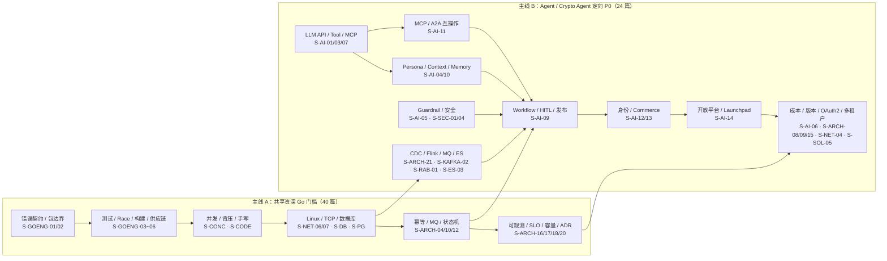
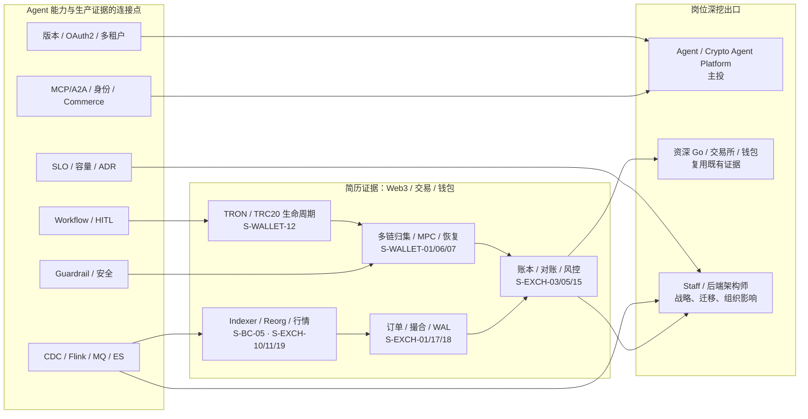

# 知识图谱：岗位定向 P0 与方向深挖

> 当前共 **228 篇**。实际 P0/P1/P2 以
> [七类岗位优先级](./role-priority-matrix.md) 为准。本知识库的首选方向是
> **AI Agent Platform / Crypto Agent Ecosystem**：先完成 40 篇共享 Go/生产工程门槛，
> 再补 24 篇 Agent 定向 P0；CEX/DEX、钱包和实时风控不是另一套平行体系，而是证明你能处理
> 资金、副作用、高吞吐和可恢复数据链路的差异化证据。
>
> 图中箭头表示学习与表达依赖，不表示线上系统只能按该拓扑部署。

## 共享 P0 口述卡索引（40/40）

以下链接直接进入各题正文开头的口述卡，正文后半部分保留 10 分钟原理、生产场景、排查与追问。

- **并发与调度（9）**：
  [S-CONC-01](../01-runtime-concurrency/S-CONC-01-gmp-overview.md#oral-card) ·
  [S-CONC-05](../01-runtime-concurrency/S-CONC-05-channel.md#oral-card) ·
  [S-CONC-06](../01-runtime-concurrency/S-CONC-06-channel-deadlock.md#oral-card) ·
  [S-CONC-08](../01-runtime-concurrency/S-CONC-08-sync-primitives.md#oral-card) ·
  [S-CONC-12](../01-runtime-concurrency/S-CONC-12-context.md#oral-card) ·
  [S-CONC-13](../01-runtime-concurrency/S-CONC-13-goroutine-leak.md#oral-card) ·
  [S-CONC-14](../01-runtime-concurrency/S-CONC-14-memory-model.md#oral-card) ·
  [S-CONC-18](../01-runtime-concurrency/S-CONC-18-goroutine-governance.md#oral-card) ·
  [S-CONC-19](../01-runtime-concurrency/S-CONC-19-netpoller.md#oral-card)
- **内存与 GC（7）**：
  [S-MEM-01](../02-memory-gc/S-MEM-01-tri-color-gc.md#oral-card) ·
  [S-MEM-03](../02-memory-gc/S-MEM-03-gogc-tuning.md#oral-card) ·
  [S-MEM-04](../02-memory-gc/S-MEM-04-escape-analysis.md#oral-card) ·
  [S-MEM-05](../02-memory-gc/S-MEM-05-slice-internals.md#oral-card) ·
  [S-MEM-06](../02-memory-gc/S-MEM-06-map-internals.md#oral-card) ·
  [S-MEM-09](../02-memory-gc/S-MEM-09-oom-debug.md#oral-card) ·
  [S-MEM-10](../02-memory-gc/S-MEM-10-pprof-heap.md#oral-card)
- **Go 生产工程（6）**：
  [S-GOENG-01](../16-go-production-engineering/S-GOENG-01-errors-contract-panic-boundary.md#oral-card) ·
  [S-GOENG-02](../16-go-production-engineering/S-GOENG-02-package-interface-di.md#oral-card) ·
  [S-GOENG-03](../16-go-production-engineering/S-GOENG-03-testing-table-fake.md#oral-card) ·
  [S-GOENG-04](../16-go-production-engineering/S-GOENG-04-fuzz-benchmark-race.md#oral-card) ·
  [S-GOENG-05](../16-go-production-engineering/S-GOENG-05-modules-toolchain-reproducible.md#oral-card) ·
  [S-GOENG-06](../16-go-production-engineering/S-GOENG-06-static-analysis-supply-chain.md#oral-card)
- **手写与并发组件（4）**：
  [S-CODE-03](../08-coding-senior/S-CODE-03-graceful-shutdown.md#oral-card) ·
  [S-CODE-04](../08-coding-senior/S-CODE-04-errgroup.md#oral-card) ·
  [S-CODE-06](../08-coding-senior/S-CODE-06-singleflight-cache.md#oral-card) ·
  [S-CODE-07](../08-coding-senior/S-CODE-07-bounded-batch-executor.md#oral-card)
- **Linux 与网络（2）**：
  [S-NET-06](../06-network-governance/S-NET-06-linux-fd-epoll-netpoll.md#oral-card) ·
  [S-NET-07](../06-network-governance/S-NET-07-tcp-lifecycle-queues-timewait.md#oral-card)
- **数据库与账本（4）**：
  [S-DB-06](../middleware/mysql/S-DB-06-advanced-sql.md#oral-card) ·
  [S-DB-07](../middleware/mysql/S-DB-07-financial-schema-locking.md#oral-card) ·
  [S-PG-02](../middleware/postgresql/S-PG-02-isolation-locking-ledger.md#oral-card) ·
  [S-PG-03](../middleware/postgresql/S-PG-03-wal-replication-pgx-ha.md#oral-card)
- **架构方法论（8）**：
  [S-ARCH-04](../03-system-design/S-ARCH-04-idempotency.md#oral-card) ·
  [S-ARCH-05](../03-system-design/S-ARCH-05-consistency-tradeoff.md#oral-card) ·
  [S-ARCH-10](../03-system-design/S-ARCH-10-mq-semantics.md#oral-card) ·
  [S-ARCH-12](../03-system-design/S-ARCH-12-order-state-machine.md#oral-card) ·
  [S-ARCH-16](../03-system-design/S-ARCH-16-observability.md#oral-card) ·
  [S-ARCH-17](../03-system-design/S-ARCH-17-slo-error-budget.md#oral-card) ·
  [S-ARCH-18](../03-system-design/S-ARCH-18-capacity-planning.md#oral-card) ·
  [S-ARCH-20](../03-system-design/S-ARCH-20-tech-decision-doc.md#oral-card)

### 学习主干：Go 门槛 → Agent Platform

### 差异化证据 → 岗位出口

## 岗位定向 P0 怎么取舍

| 优先级 | 知识域 | 为什么进入 P0 | 必须避免的表达 |
|--------|--------|----------------|----------------|
| 1 | Go 生产工程与系统基础 | 目标仍是 Go 后端/平台岗位，语言、测试、SQL、网络不能失分 | “用了 Gin/GORM 就等于会 Go 工程化” |
| 2 | Agent 工作流与 HITL | OctoAgentFlow 最核心、最容易被深挖的 0→1 证据 | “加一个 pending 状态就是人工审核” |
| 3 | Persona / Memory / Guardrail | 区分普通 LLM API 接入和 Agent Platform | “把全部聊天记录塞进 prompt 就是 Memory” |
| 4 | MCP/A2A 与 Agent 身份/Commerce | 目标 JD 明确要求跨框架互操作、ERC-8004、x402/8183 和 Agent Economy | “协议能力声明就是身份、授权和业务完成证明” |
| 5 | 开放平台、SDK 与 Launchpad | 技术经理岗位需要开发者生态、发布治理和商业闭环 | “接了几个框架就等于建成开放平台” |
| 6 | 外部副作用、OAuth2、成本与观测 | 发布、支付、tool call 都涉及模糊成功和权限边界 | “框架 checkpoint 自动保证 exactly-once” |
| 7 | CDC/Flink/ES 实时风控 | 连接头部出行平台实时风控经验与 Agent 反馈/画像平台 | “Flink exactly-once 等于 ES 永不重复” |
| 8 | TRON/TRC20 与多链钱包 | 简历明确有 TRON USDT、CEX 钱包和 MPC/TSS | “TRON 就是换 RPC 的 EVM” |
| 9 | 交易所状态机与量化指标 | 证明高吞吐、账本、行情和故障恢复深度 | “只报 3k/20k QPS，不说明 workload 和持久化边界” |
| 10 | Staff 案例 | 架构师岗位需要跨团队决策、迁移和组织影响 | “把题库模板包装成自己做过的生产案例” |

## Agent 定向 P0 口述卡索引（24/24）

以下链接直接进入正文口述卡；建议按组内顺序练习，每题先闭卷讲 30 秒，再展开 3 分钟。

- **AI / Crypto Agent 核心（12）**：
  [S-AI-01](../10-ai-engineering/S-AI-01-llm-api-integration.md#oral-card) ·
  [S-AI-03](../10-ai-engineering/S-AI-03-agent-tool-calling.md#oral-card) ·
  [S-AI-04](../10-ai-engineering/S-AI-04-prompt-context.md#oral-card) ·
  [S-AI-05](../10-ai-engineering/S-AI-05-llm-security.md#oral-card) ·
  [S-AI-06](../10-ai-engineering/S-AI-06-llm-observability-cost.md#oral-card) ·
  [S-AI-07](../10-ai-engineering/S-AI-07-mcp-server-go.md#oral-card) ·
  [S-AI-09](../10-ai-engineering/S-AI-09-agent-workflow-hitl-publishing.md#oral-card) ·
  [S-AI-10](../10-ai-engineering/S-AI-10-persona-memory-feedback-governance.md#oral-card) ·
  [S-AI-11](../10-ai-engineering/S-AI-11-mcp-a2a-vendor-neutral-interoperability.md#oral-card) ·
  [S-AI-12](../10-ai-engineering/S-AI-12-erc8004-agent-identity-reputation-validation.md#oral-card) ·
  [S-AI-13](../10-ai-engineering/S-AI-13-x402-erc8183-agent-commerce.md#oral-card) ·
  [S-AI-14](../10-ai-engineering/S-AI-14-crypto-agent-open-platform-marketplace-launchpad.md#oral-card)
- **平台控制面（5）**：
  [S-ARCH-08](../03-system-design/S-ARCH-08-rate-limiting.md#oral-card) ·
  [S-ARCH-09](../03-system-design/S-ARCH-09-circuit-breaker.md#oral-card) ·
  [S-ARCH-15](../03-system-design/S-ARCH-15-release-strategy.md#oral-card) ·
  [S-ARCH-21](../03-system-design/S-ARCH-21-realtime-risk-cdc-flink.md#oral-card) ·
  [S-NET-04](../06-network-governance/S-NET-04-jwt-auth.md#oral-card)
- **消息、检索与安全（5）**：
  [S-KAFKA-02](../middleware/kafka/S-KAFKA-02-producer-reliability.md#oral-card) ·
  [S-RAB-01](../middleware/rabbitmq/S-RAB-01-exchange-async-pipeline.md#oral-card) ·
  [S-ES-03](../middleware/elasticsearch/S-ES-03-sync-ops.md#oral-card) ·
  [S-SEC-01](../21-security-engineering/S-SEC-01-web3-threat-model-iam-trust-boundaries.md#oral-card) ·
  [S-SEC-04](../21-security-engineering/S-SEC-04-security-testing-incident-response.md#oral-card)
- **简历差异证据（2）**：
  [S-SOL-05](../11-solution-architecture/S-SOL-05-multi-tenant-saas.md#oral-card) ·
  [S-WALLET-12](../17-multichain-wallet/S-WALLET-12-tron-trc20-resource-transaction.md#oral-card)

RAG、多模态和逐框架 API 细节放在 P1；P0 是框架无关的工作流、协议、权限、商业状态和平台治理。

## 建议刷题节奏

1. **第一阶段：共享门槛**
   过完 shared P0 的 30 秒版，重点闭卷讲 Go 并发、错误边界、测试、SQL、网络、幂等、MQ、
   状态机、可观测和容量。
2. **第二阶段：Agent 主线**
   `S-AI-01/03/09/10/05/06/07/11`，画出 proposal、review、execution、receipt、memory
   namespace 以及 MCP/A2A 边界；用 OctoAgentFlow 的真实模块逐一举证。
3. **第三阶段：Crypto Agent 生态**
   `S-AI-12/13/14`，画出 identity、wallet policy、payment/job、Marketplace/Launchpad；
   明确 Draft、厂商扩展和“设计但未生产验证”的证据边界。
4. **第四阶段：平台与数据**
   `S-ARCH-08/09/15/21`、`S-NET-04`、Kafka/RabbitMQ/ES，回答版本、OAuth2、配额、
   CDC、回放和降级。
5. **第五阶段：差异化项目证据**
   `S-WALLET-12` 串 TRON USDT；再从交易所/钱包路径选择 6～10 篇与你简历项目最接近的题，
   准备 workload、指标口径、故障和取舍。
6. **第六阶段：架构师出口**
   用 OctoAgentFlow 0→1、CEX 钱包恢复、实时风控链路各准备一个 STAR/ADR 案例，明确本人职责、
   团队边界、失败方案和量化结果。

## 面试表达总原则

- 先说 **你实际负责的边界**，再说框架或组件；“熟悉 LangGraph”不能替代 Go 自建工作流的证据。
- 区分 **模型 proposal、人工 approval、执行 job、外部 receipt**，四者不是一个状态。
- 区分 MCP/A2A 能力声明、ERC-8004 身份锚点、钱包控制证明、业务授权和最终执行事实。
- ERC-8004/8183 要说 Draft；x402b 要说 Pieverse 厂商扩展，不能包装成通用正式标准。
- `66% confidence` 说成项目策略阈值，并解释计算、校准、审批和回滚，不能说成通用可信概率。
- 区分 Flink 算子状态 exactly-once 与外部 sink 端到端语义。
- 区分 TRON 的 Bandwidth/Energy、permission、solidified 与 Ethereum nonce/gas/finality。
- 性能数字必须带 **时间范围、工作负载、并发、数据量、P95/P99、持久化边界和验证方式**。
