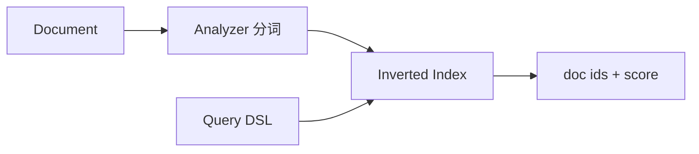

# Elasticsearch 倒排索引与基本原理

## 30 秒版（开场）

> ES 基于 **Lucene**，核心是 **倒排索引**：词项 → 文档 ID 列表，支持全文检索。数据按 **Index → Type(7.x 前) / 无 type → Document → Field** 组织；分片 **Primary + Replica** 水平扩展。面试关键词：**分片路由、近实时 NRT、segment merge**。

## 3 分钟版（一面深度）

1. **是什么**：分布式搜索与分析引擎，JSON 文档存储，REST/HTTP API；Go 用 `olivere/elastic` 或官方 `go-elasticsearch`。
2. **为什么**：MySQL `LIKE` 与复杂聚合弱；ES 适合 **全文、日志、多维筛选、聚合报表**。
3. **怎么做**：写文档 → 分析器分词 → 写倒排表 + 正排/列存；查询走 **Query DSL**；协调节点 scatter-gather 各分片再 merge。

## 10 分钟版（原理 + 图示）

| 概念 | 说明 |
|------|------|
| Index | 逻辑库，如 `orders` |
| Shard | 索引水平切分，每片独立 Lucene 实例 |
| Replica | 副本，读扩展与 HA |
| Segment | Lucene 不可变文件段，后台 merge |
| NRT | 默认 1s refresh 可见，非实时强一致 |

**与 MySQL 对比**

| | MySQL B+Tree | ES 倒排 |
|---|--------------|---------|
| 等值/范围 | 强 | 支持（keyword/numeric） |
| 全文模糊 | 弱 | 强 |
| 事务 | ACID | 无跨文档事务 |
| Join | 原生 | 慎用，用 denormalize |

## 生产场景

- 商品搜索：title/desc 全文 + 类目 filter
- 日志：ELK/EFK 栈
- 订单多维报表：aggregation

## 排查与工具

- `_cat/health`、`_cluster/health`
- 慢查询 log、`profile` API
- 分片过大：reindex 拆索引

## 架构取舍

| 方案 | 适用 |
|------|------|
| ES 做主搜索 | 读多、可接受秒级同步 |
| MySQL 唯一源 | 强一致写，ES 只读副本 |
| 仅 MySQL + 全文索引 | 数据量小 |

## 追问链

1. **refresh 和 flush？** → refresh 打开新 segment 可查；flush 落盘 translog。
2. **分片数怎么定？** → 单分片 20～50GB 经验；过多分片元数据开销大。
3. **脑裂？** → 7.x+ 用 master 选举；需 `minimum_master_nodes` 历史概念。
4. **Go 写入 bulk？** → `BulkProcessor` 批量、背压、失败重试。

## 反模式与事故

- **深度分页 `from+size` 过大** → 内存爆，用 `search_after`
- **mapping 动态爆炸** → 字段过多，磁盘与 mapping 元数据问题
- **把 ES 当主库** → 丢数据、无事务

## 延伸阅读

- [Elasticsearch Index modules](https://www.elastic.co/guide/en/elasticsearch/reference/current/index-modules.html)
- 下一篇：[Mapping 与查询](./S-ES-02-mapping-query-agg.md)
