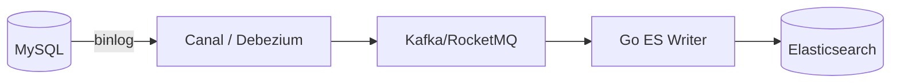

# Elasticsearch 数据同步与运维

## 要点卡

[返回 P0 知识图谱](../../_meta/p0-knowledge-graph.md)

!!! abstract "30 秒回答"

    Elasticsearch 应作为可重建的搜索投影，数据库或事件日志才是事实源。同步通常是
    snapshot + CDC + MQ + bulk writer：先确定快照高水位，再无缝接增量；每条文档携带源版本/位置，
    防止旧事件覆盖新状态。Bulk HTTP 200 仍可能有 item 失败，必须逐项分类重试，全部安全落地后
    才提交消费位点；删除/tombstone、对账、重建和 alias 切换都要进入状态机。

**3 分钟展开**

1. `_id=业务主键` 只解决重复目标，不解决乱序；使用可比较的源版本、external versioning 或条件脚本阻止旧更新覆盖新文档。
2. batch 按文档数、字节、内存与目标延迟联合调节并做背压；429/局部失败只重试失败 item，毒数据进入可审计停车区。
3. 搜索可见性受 refresh 影响，写入成功不等于立即可搜；业务读己之写可回源或使用明确策略，不能承诺固定秒数。
4. 新 mapping 用新索引回填、shadow 校验，再用一次 aliases API 操作切读写；原子切别名不代表 schema/query 一定兼容。

| 记忆槽 | 内容 |
|--------|------|
| 三个不变量 | ES 不是事实源；同 `_id` 不防乱序；Bulk 成功看每个 item |
| 手画图 | `DB snapshot@W + CDC>W → MQ → version-aware bulk → ES alias` |
| 项目落点 | 风控/Agent 检索讲可重建 projection、lag、DLQ、范围 checksum 和双索引升级 |
| 一个取舍 | 更频繁 refresh 提高可见性但增加资源成本；更大 bulk 提升吞吐却增加内存和失败重放范围 |

**错误表达**

- ❌ “同 `_id` upsert 就能保证 CDC 幂等有序；Bulk 返回 200 就可以 commit offset。”
- ✅ “重复与乱序是两件事；必须检查 item 结果并保存源版本/删除语义。”

**自测追问**：全量扫描期间发生 UPDATE/DELETE，如何保证切到增量后既不漏也不被旧快照覆盖？

## 10 分钟版（同步架构）

| 方式 | 优点 | 缺点 |
|------|------|------|
| 双写 | 简单 | 不一致、难回滚 |
| CDC + MQ | 解耦、可重放 | 链路长 |
| Logstash JDBC | 配置快 | 增量能力弱 |

**Go Consumer 要点**

- Bulk 按 docs、bytes、内存与等待时间自适应；吞吐/可见性策略按 workload 压测，不背固定条数。
- 文档 `_id` 使用稳定业务主键，并携带源版本/位点；以 external versioning 或条件更新拒绝旧事件。
- 逐项检查 Bulk `items[].status/error`；只重试可重试 item，确认批内状态安全后再提交 offset。
- DELETE/tombstone 与 update 使用相同的版本顺序规则；poison item 进入带原始事件和错误原因的 DLQ。

**与分库分表**（见 [S-DB-04](../mysql/S-DB-04-sharding.md)）

- 跨片列表：ES 聚合检索
- 或 ES 存宽表冗余字段，避免 join

## 生产场景

- 商品库 MySQL，搜索走 ES；大促前 **全量 reindex** 预热
- 用一次 aliases API 操作切换读/写 alias；上线前验证 mapping、查询、排序、写兼容和回滚条件，
  才能把它作为低停机迁移方案

## 排查与工具

- `_cat/shards` 未分配分片
- `_cluster/allocation/explain`
- 同步延迟：MQ lag + ES 写入 TPS

## 架构取舍

| 方案 | 适用 |
|------|------|
| 可重建 ES | 接受丢索引从 MySQL 全量恢复 |
| 跨集群复制 CCR | 异地灾备 |
| 冷热架构 ILM | 日志历史降冷节点 |

## 深挖问答

1. **同步丢消息？** → MQ 持久化/可重放 + 至少一次 + version-aware projection；offset、DLQ 和源数据对账共同闭环。
2. **删除怎么同步？** → binlog DELETE 事件删 ES doc。
3. **mapping 变更？** → 新 index + reindex + alias 切换。
4. **集群红了？** → 未分配副本、磁盘满、版本不兼容；先扩盘/删旧索引。

## 反模式与事故

- **双写无对账** → 搜索有货 DB 无货
- **bulk 无背压或只看 HTTP 状态** → ES 过载 429，或 item 局部失败被当成整批成功
- **单 giant shard** → 无法恢复、迁移慢

## 延伸阅读

- [Elasticsearch 数据写入](https://www.elastic.co/docs/solutions/search/ingest-for-search)
- 关联：[S-DB-04 分库分表](../mysql/S-DB-04-sharding.md)
