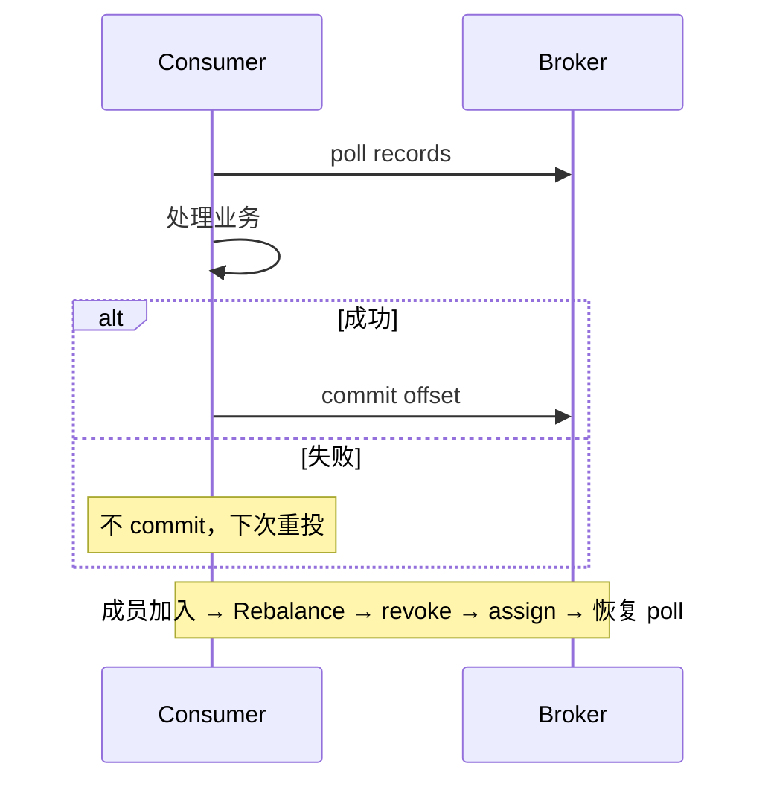

# Kafka 消费语义与 Rebalance

## 30 秒版（开场）

> Kafka 消费分 **at-most-once / at-least-once / 近似 exactly-once**（事务 + idempotent producer）；Consumer Group 通过 **Rebalance** 分配 partition。**Rebalance 期间停止消费**，是 P99 毛刺常见根因。生产关键词：**手动 commit、cooperative-sticky、处理幂等**。

## 3 分钟版（一面深度）

1. **是什么**：Consumer Group 内多个 consumer 分摊 topic partition；offset 提交决定语义；Rebalance 在成员增减、订阅变化、session 超时时触发 partition 重分配。
2. **为什么**：水平扩展消费吞吐；partition 内有序、跨 partition 无序；错误 commit 策略导致丢消息或重复。
3. **怎么做**：业务侧 **幂等 + 去重表** 实现 effectively-once；`enable.auto.commit=false`，处理成功后 `CommitMessages`；减少 Rebalance：`session.timeout.ms`、`max.poll.interval.ms` 与处理耗时匹配；Kafka 2.4+ **CooperativeStickyAssignor** 增量 rebalance。

## 10 分钟版（原理 + 图示）

**三种语义**

| 语义 | 做法 | 风险 |
|------|------|------|
| At-most-once | 先 commit 再处理 | 处理前 crash 丢消息 |
| At-least-once | 先处理再 commit | 重复消费 |
| Exactly-once | 事务 + 幂等 producer + read_committed | 复杂、跨系统仍要幂等 |



**Rebalance 流程（Range/RoundRobin/Sticky）**：Group Coordinator 收到 join/sync；停止消费 `onRevoked`；重新分配；`onAssigned` 恢复。Eager 模式下全部分区先 revoke 再 assign，**停消费窗口可达秒级**。Cooperative（sticky）只动必要 partition。

**Go 客户端**：`segmentio/kafka-go` Reader 自动 commit 可关；`IBM/sarama` ConsumerGroup 实现 `Setup/Cleanup/ConsumeClaim`，在 claim 内 mark offset。

## 生产场景

- **订单创建 MQ**：消费写 DB + 发通知，at-least-once + `order_id` 唯一索引幂等。
- **发布 consumer 扩缩容**：K8s HPA 触发 rebalance，短暂 lag 飙升 → 用 cooperative + 限制并发扩缩。
- **长任务消费**：处理 > `max.poll.interval.ms` 被踢出组 → 拆小消息或 pause + 异步 + 手动 heartbeat（sarama 需调整）。

## 排查与工具

| 工具 | 用途 |
|------|------|
| `kafka-consumer-groups.sh --describe` | lag、consumer 状态 |
| Broker JMX / UI (AKHQ) | rebalance 速率 |
| 消费端日志 | rebalance 原因、revoke 耗时 |
| OpenTelemetry | 端到端延迟 |

路径：lag 堆积 + P99 尖刺 → 是否频繁 rebalance → 看 `MAX_POLL_INTERVAL` 超时日志 → 消费逻辑是否同步阻塞。

## 架构取舍

| 方案 | 适用 | 不适用 |
|------|------|--------|
| 手动 commit + 幂等 | 默认首选 | 无幂等存储 |
| 自动 commit | 日志采集、可丢 | 订单/支付 |
| Cooperative rebalance | 大 partition 数 | 老版本 broker |
| 单 partition 单 consumer | 严格顺序 | 吞吐不足 |
| 死信队列 DLQ |  poison message | 无运维回放 |

## 追问链

1. **partition 数怎么定？** → 目标并行度 ≥ consumer 数；过多增加文件句柄与 rebalance 成本。
2. **重复消费怎么防？** → 业务唯一键、Redis SETNX、DB upsert。
3. **Rebalance 为何慢？** → Eager 全量 revoke；消费端 `onRevoked` 同步 commit 阻塞。
4. **消费顺序？** → 仅 partition 内有序；key 相同进同 partition。
5. **Go 里 graceful shutdown？** → SIGTERM → 停止 poll → 处理 in-flight → commit → LeaveGroup。

## 反模式与事故

- 消费逻辑里同步调 HTTP 30s，`max.poll.interval` 默认 5min 仍可能超——被踢反复 rebalance。
- 自动 commit + 批处理 halfway crash——丢一批消息无感知。
- 扩 consumer 超过 partition 数—— idle consumer 浪费且增加 rebalance。
- 忽略 `context.Cancel`——Pod 终止时 offset 未提交大量重复。

## 代码示例

```go
// segmentio/kafka-go：处理成功后再 commit
reader := kafka.NewReader(kafka.ReaderConfig{
    Brokers:     []string{"kafka:9092"},
    GroupID:     "order-worker",
    Topic:       "orders",
    CommitInterval: 0, // 手动 CommitMessages
})
for {
    msg, err := reader.FetchMessage(ctx)
    if err != nil {
        break
    }
    if err := handleOrder(msg.Value); err != nil {
        continue // 不 commit，稍后重试
    }
    _ = reader.CommitMessages(ctx, msg)
}
```

## 延伸阅读

- [Kafka Consumer Configs](https://kafka.apache.org/documentation/#consumerconfigs)
- [Cooperative Rebalancing](https://www.confluent.io/blog/cooperative-rebalancing-in-kafka-streams-consumer-ksqldb/)
- [kafka-go Reader](https://github.com/segmentio/kafka-go#reader)
- [S-KAFKA-01 架构与 ISR](./S-KAFKA-01-architecture-storage.md)
- [S-KAFKA-02 Producer 可靠性](./S-KAFKA-02-producer-reliability.md)
- [S-KAFKA-03 交易事件总线](./S-KAFKA-03-trade-event-bus.md)
