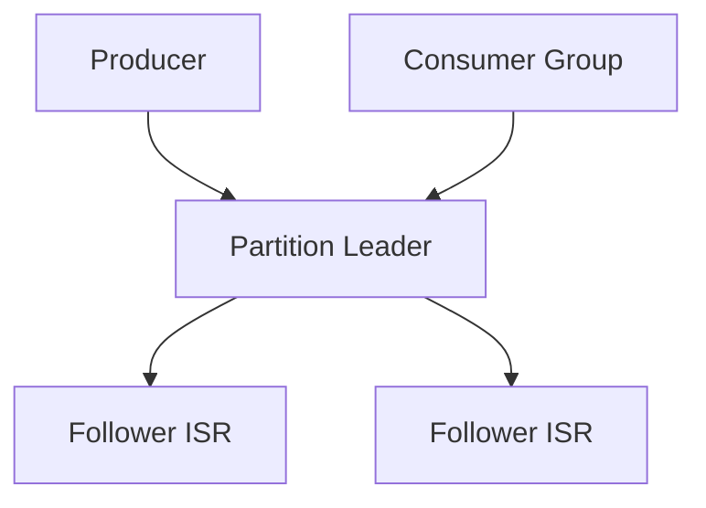

# Kafka 架构与存储：Topic、Partition、ISR

## 30 秒版（开场）

> Kafka 是 **分布式 commit log**：Topic 按 **Partition** 水平切分，每条消息追加到分区末尾；**Leader + ISR 副本** 保证可用与一致性。消费并行度 = partition 数；**分区内有序、跨分区无序**。生产关键词：**ISR、HW/LEO、replication.factor、min.insync.replicas**。

## 3 分钟版（一面深度）

1. **是什么**：Broker 集群存储 Topic；每个 Partition 是一个有序日志（Segment 文件）；Producer 按 key hash 或轮询写入 partition；Consumer Group 按 partition 分配消费。
2. **为什么**：高吞吐顺序写 + 零拷贝；适合 **日志流、事件总线、CDC**；交易所成交、审计流水常见选型。
3. **怎么做**：`replication.factor=3`；`min.insync.replicas=2` + `acks=all` 防丢；partition 数按目标吞吐与 consumer 并行度规划；监控 ISR 收缩与 under-replicated partitions。

## 10 分钟版（原理 + 图示）



| 概念 | 说明 |
|------|------|
| Topic | 逻辑主题，如 `trade.matched` |
| Partition | 物理分片；顺序日志；并行单元 |
| Offset | 分区内单调递增位置 |
| Leader | 读写入口；Follower 从 Leader 拉取 |
| ISR | 与 Leader 同步足够的副本集合 |
| HW | High Watermark；消费者可见的最大 offset |
| Segment | 日志分段文件 + 索引，便于 retention 删除 |

**写入路径**：Producer → Leader 追加 → Follower replicate → ISR 全部 ack（`acks=all`）→ 返回成功。

**Partition 数规划**

| 因素 | 建议 |
|------|------|
| 目标吞吐 | 单 partition 约 MB/s 级（视消息大小） |
| Consumer 并行 | partition 数 ≥ 峰值 consumer 实例数 |
| 顺序要求 | 需顺序的 key 固定进同一 partition |
| 过多 partition | 文件句柄、rebalance 成本、端到端延迟上升 |

## 生产场景

- **CEX 成交事件**：`symbol` 作 key → 同交易对顺序；多 partition 水平扩展
- **充提审计流水**：高持久、可回放；retention 7～30 天或 compact
- **风控特征流**：多 consumer group 各自读全量（账务组 / 风控组 / 大屏组）

## 排查与工具

| 工具 | 用途 |
|------|------|
| `kafka-topics.sh --describe` | partition、leader、ISR |
| `kafka-reassign-partitions` | 均衡、扩 partition |
| Broker metrics | under-replicated、offline partitions |
| AKHQ / UI | 可视化 ISR、lag |

## 架构取舍

| 方案 | 适用 | 不适用 |
|------|------|--------|
| 多 partition | 高吞吐、并行消费 | 强全局顺序 |
| 单 partition | 严格全序 | 吞吐瓶颈 |
| RF=3, minISR=2 | 生产默认 | 测试环境可降 |
| Log compaction | changelog、KV 状态 | 纯事件流全量保留 |

## 追问链

1. **Leader 挂了？** → Controller 从 ISR 选新 Leader；非 ISR 副本不能自动当选（`unclean.leader.election=false` 防丢数据）。
2. **HW 和 LEO 区别？** → LEO 是副本自身末尾；HW 是已 commit、对消费者可见的位置。
3. **和 RocketMQ CommitLog？** → 思想类似顺序写；Kafka 以 partition 为并行单元（见 [S-RMQ-01](../rocketmq/S-RMQ-01-architecture.md)）。
4. **能否减少 partition？** → 不能直接减；只能新建 topic 迁移。

## 反模式与事故

- partition=1 扛全站成交 → 单点吞吐瓶颈
- `min.insync.replicas=1` + 磁盘故障 → 丢已 ack 消息
- ISR 长期 shrink 未告警 → 故障时无法选 Leader
- 按天建 topic 而非 partition → 运维碎片化

## 代码示例

```go
// segmentio/kafka-go：指定 key 保证同 symbol 进同 partition
writer := &kafka.Writer{
    Addr:     kafka.TCP("kafka:9092"),
    Topic:    "trade.matched",
    Balancer: &kafka.Hash{}, // 按 Message.Key 哈希
}
_ = writer.WriteMessages(ctx, kafka.Message{
    Key:   []byte("BTC-USDT"),
    Value: payload,
})
```

## 延伸阅读

- [Kafka Replication](https://kafka.apache.org/documentation/#replication)
- [S-KAFKA-02 Producer 可靠性](./S-KAFKA-02-producer-reliability.md)
- [S-DIST-04 消费语义](./S-DIST-04-kafka-semantics.md)
