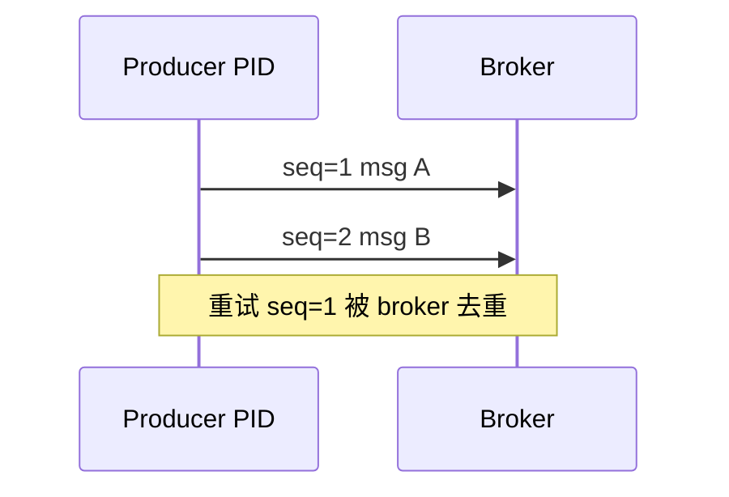

# Kafka Producer 可靠性：acks、幂等与分区键

## 30 秒版（开场）

> Producer 可靠性靠 **`acks` + `retries` + 幂等 Producer**；与 [S-ARCH-04 幂等](../../03-system-design/S-ARCH-04-idempotency.md) 配合才能端到端不重复。**Partition Key** 决定消息进哪个 partition，影响 **顺序与热点**。生产关键词：**acks=all、enable.idempotence、max.in.flight、key 设计**。

## 3 分钟版（一面深度）

1. **是什么**：`acks=0/1/all` 控制 broker 确认深度；幂等 Producer（PID + sequence）防 **单分区重复**；Key hash 绑定 partition。
2. **为什么**：网络抖动、broker 切换会导致重试重复；交易所 **orderId / symbol** 的 key 选错会破坏顺序或打爆单 partition。
3. **怎么做**：生产常用 `acks=all` 并配置合适的 `min.insync.replicas`；选择能明确启用幂等/事务 producer 的客户端。Java/librdkafka 可在协议允许范围内使用多 in-flight；Sarama 的幂等配置通常要求 `Net.MaxOpenRequests=1`。`kafka-go` 高层 Writer 目前不暴露等价的 `enable.idempotence`/完整事务配置，核心事件仍要 outbox 与消费幂等。

## 10 分钟版（原理 + 图示）

**acks 语义**

| acks | 行为 | 延迟 | 丢消息风险 |
|------|------|------|------------|
| 0 | 不等 broker 确认 | 最低 | 最高 |
| 1 | Leader 写入即返回 | 中 | Leader 宕机未同步 |
| all/-1 | 当前 ISR 全部复制；若 ISR 数低于 minISR 则拒绝写 | 较高 | 较低（仍取决于刷盘、选主和客户端处理） |

**幂等 Producer**


```mermaid
sequenceDiagram
  participant P as Producer PID
  participant B as Broker
  P->>B: seq=1 msg A
  P->>B: seq=2 msg B
  Note over P,B: 重试 seq=1 被 broker 去重
```

- 启用后，客户端会校验/调整 `acks`、重试和 in-flight 等约束
- broker 按 producer ID/epoch 和每 partition sequence 去重 producer 的协议级重试；它不去重应用主动发送的两条相同业务消息
- 普通幂等 producer 的会话重建边界与 transactional ID 不同，不能替代业务 idempotency key
- 与 **事务 Producer** 区别：事务可原子写多 partition（流处理场景）

**默认值必须带客户端与版本**：以 Kafka 4.1 的 Java producer 为例，在没有冲突配置时 `acks=all`、`enable.idempotence=true`，`max.in.flight.requests.per.connection=5`，`linger.ms=5`；这些不是 Kafka 协议强制的“所有客户端默认值”。Sarama、kafka-go、librdkafka 的默认值和可用开关不同，面试时应说出客户端与版本，并对关键配置显式设置和启动校验。

**Partition Key 策略**

| 场景 | Key | 效果 |
|------|-----|------|
| 同订单全生命周期 | `orderId` | 顺序 + 局部热点可接受 |
| 同交易对撮合 | `symbol` | 行情/成交顺序 |
| 均匀打散 | null / random | 最高并行，无顺序 |
| 用户维度 | `userId` | 注意大 V 热点 partition |

## 生产场景

- **成交上报**：key=`symbol`；value 含 `tradeId` 供消费幂等
- **充提状态变更**：key=`withdrawId`；配合 Outbox 发消息（[S-SOL-03](../../11-solution-architecture/S-SOL-03-event-driven-cqrs.md)）
- **批量 flush**：`linger.ms` + `batch.size` 换吞吐，监控 P99 延迟

## 排查与工具

| 现象 | 排查 |
|------|------|
| 消息丢失 | acks 配置、minISR、broker 日志 NOT_ENOUGH_REPLICAS |
| 重复消费 | 消费端幂等表；Producer 是否未开幂等 |
| 单 partition lag 高 | key 热点；考虑 salt `userId#shard` |
| 发送超时 | `delivery.timeout.ms`、broker 负载、网络 |

## 架构取舍

| 方案 | 适用 | 不适用 |
|------|------|--------|
| acks=all + 幂等 | 资金/订单 | 纯日志采集 |
| acks=1 | 可容忍极少丢失的 metrics | 核心账务 |
| 无 key 轮询 | 高并行埋点 | 顺序业务 |
| 事务 Producer | Kafka Streams EOS | 简单 Go 微服务（过重） |

## 追问链

1. **幂等 Producer 和 DB 唯一键？** → Producer 幂等主要去掉同一 producer 会话内协议重试造成的重复记录，不会识别两次独立业务调用是同一笔订单；消费重投和业务重复仍要靠 idempotency key、DB 唯一约束/inbox 等处理。
2. **max.in.flight 与顺序？** → 未开幂等时，失败重试与多个 in-flight 可能乱序；开启幂等后上限和约束依客户端而异，不能把 Java 的 “≤5” 直接套到 Sarama。
3. **Go 客户端？** → `confluent-kafka-go`/librdkafka 支持幂等与事务；Sarama 支持幂等但配置约束更严格；`kafka-go` 高层 Writer 更简洁，但不提供同等的幂等/事务开关。
4. **和 [S-DIST-04](./S-DIST-04-kafka-semantics.md) 关系？** → 本题 Producer；DIST-04 消费 + rebalance。

## 反模式与事故

- `acks=1` 发资金事件 → Leader 宕机丢消息
- 全用 `userId` 作 key，头部用户打满单 partition
- 只开 Producer 幂等、消费无去重 → 仍重复入账
- 超大 message 超过客户端、topic 或 broker 限制会被拒绝；只有调用方忽略同步错误，或异步发送不观察 completion/error，才会变成“业务侧静默丢失”。

## 代码示例

```go
w := &kafka.Writer{
    Addr:                   kafka.TCP("kafka:9092"),
    Topic:                  "withdraw.status",
    Balancer:               &kafka.Hash{},
    RequiredAcks:           kafka.RequireAll,
    AllowAutoTopicCreation: false,
}
err := w.WriteMessages(ctx, kafka.Message{
    Key:   []byte(withdrawID),
    Value: payload,
})
if err != nil {
    // 同步发送必须处理错误；重试仍需受 deadline 与业务幂等约束。
    return err
}
// kafka-go 高层 Writer 无等价的 enable.idempotence 配置；
// 资金类还应使用 transactional outbox。若使用 Sarama：
// config.Producer.Idempotent = true; config.Net.MaxOpenRequests = 1
```

## 延伸阅读

- [Kafka 4.1 Producer Configs](https://kafka.apache.org/41/configuration/producer-configs/)
- [Kafka Message Delivery Semantics](https://kafka.apache.org/41/design/design/)
- [S-KAFKA-01 架构与 ISR](./S-KAFKA-01-architecture-storage.md)
- [S-ARCH-04 幂等设计](../../03-system-design/S-ARCH-04-idempotency.md)
